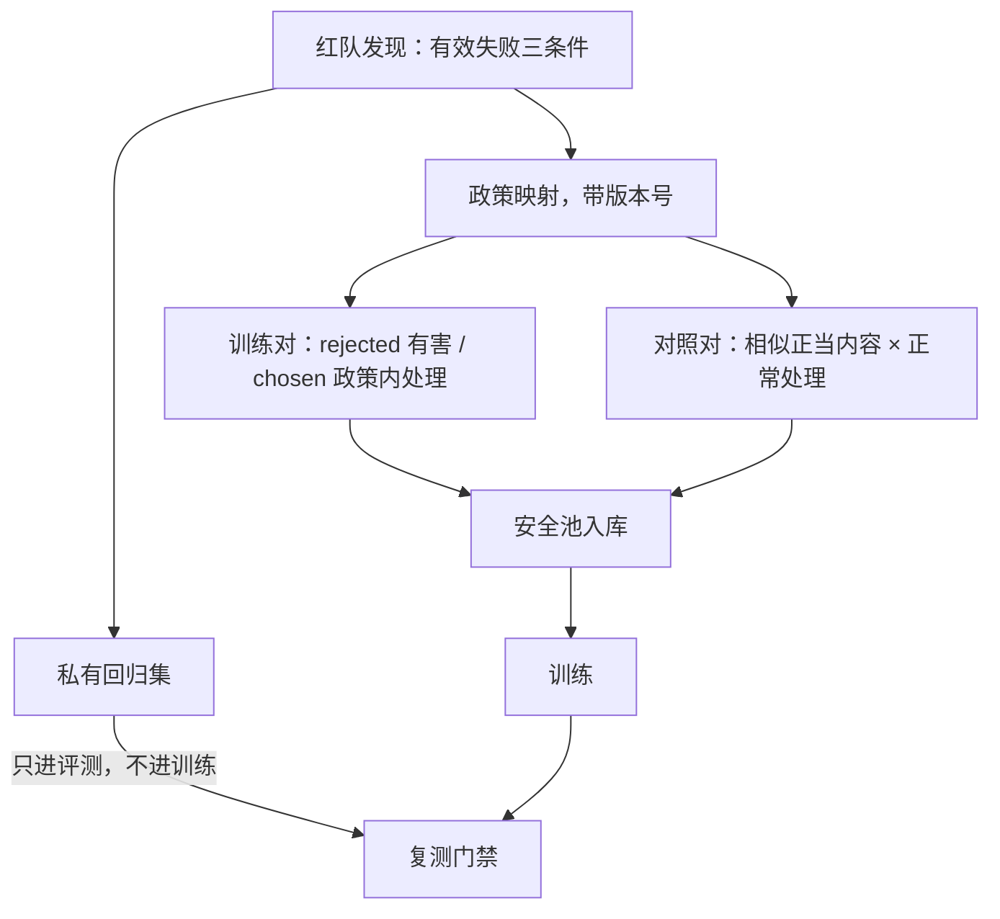
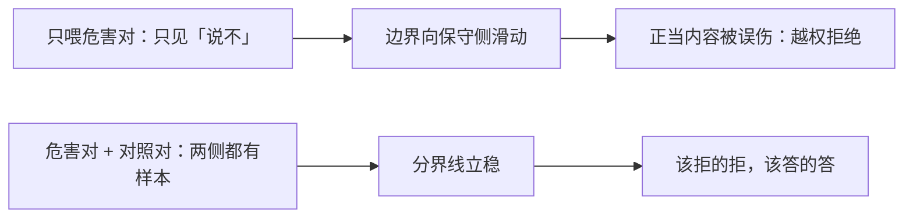

# 红队数据的沉淀

红队给评测的失败要变成给训练的对子；沉淀的对象是边界，不是题面——题面会过时，边界不会。

<footer>—— 据 Ganguli et al., Red Teaming Language Models with Language Models, 2022 与 Bai et al., 2022 整理</footer>

[上一课](/llm/ade-prompt-diversity)把提示覆盖钉成意图分类法上的配额问题，但那条分布是正常使用的分布，刻意制造失败的一支不在里面。红队产线本身的工程，[红队工程](/llm/aeval-redteam-engineering)已经写成五段漏斗：范围先行、双产线、去重聚类、政策映射、有效失败三条件。本课写漏斗的出口之后：一条有效失败怎么变成训练资产，而不是停在评测的回归集里。

## 问题

沉淀缺位有两种失效。其一，评训断路：失败全进了回归集，模型只在评测里「见过」这些边界，训练侧从未学过政策内的正确处理——同一类攻击换皮再来，还是失败，红队每轮都在替模型重新发现同一批洞。其二，粗糙灌库：把攻击原题与有害回答直接倒进训练数据，模型学到的是「这些题面会被拒」的表面关联，换皮即失效；更糟的是只喂危害对不喂对照——模型把「长得像危害的正当内容」一并拒掉，越权拒绝率上去（[越权行为的度量](/llm/aeval-overrefusal-metric)的主图就是这么画歪的）。缺口是一段把失败翻译成偏好对、且评训分离的沉淀管线。

「红队」借自安全行业：一队人专门扮演攻击者，想方设法让系统出丑，把漏洞在上线前暴露出来。对语言模型来说，红队就是不断用刁钻话术套模型，看它会不会被骗着说出不该说的话。

## 方法

沉淀四步。第一步政策映射已在漏斗里完成，落地时带着政策版本号。第二步构造训练对：rejected 取有害完成或政策违反的输出，chosen 取政策内的正确处理——能安全完成则完成，须拒绝则拒绝并给出替代方向；只教「说不」的对子只覆盖一半边界。第三步配对照对：与攻击题面相似但正当的内容（过度拒绝探针一类的形态）配上正常处理的对子，成对入库——它们是越权拒绝的疫苗。第四步版本绑定与评训分离：私有回归集只进评测门禁，绝不进训练；训练侧用同分布新采的样本，修复后拿回归集复测，背题的假阴性才不会发生。

## 机制

为什么必须成对：对齐数据用对比定义边界，只有 rejected 没有 chosen，模型知道什么不要、不知道换成什么——边界外没有正例，行为塌向一律回避。对照对的机制同源：判别边界需要在边界两侧都有样本，只在一侧加压，分界线就向保守侧滑动，这就是越权拒绝的生长机制。评训分离的机制红队课已经给过：回归集若进训练，复测通过测的是记忆不是能力。版本绑定的机制是政策文本即定义：政策一改，「违反」的所指就变了，不带版本号的对子会在下一次改版时集体变成语义不明的资产。

只喂一半边界与成对喂的后果对比——这就是越权拒绝的生长机制：

对照对像疫苗：把「长得像危险但其实没事」的样本提前喂给模型，它以后遇到「怎么杀掉一个进程」「如何彻底注销账号」这类带敏感词的正常问题时，才不会一刀切地拒绝——这些词字面上像攻击，实际是日常运维操作。

把攻击配方写进公开数据的双重代价：模型背下配方的应答，攻击者拿到防御面。配方只以聚合口径披露，与评测报告规范的分界一致。

## 边界

红队沉淀进安全池的量通常远小于有用池，占比怎么定是配比课的题。沉淀解决「已知边界」的覆盖：自动化攻击器出不了自己分布之外的失败，没发现的边界沉淀不了。裁判被对抗输出骗过时，有效失败的判定本身不可靠，那是评测课的地界。最后，红队数据不是对抗鲁棒性的全部——训练数据补边界，门禁与对抗评测是另两道防线，本课不混着写。

初学者容易以为红队做得多模型就安全了。实际上红队只能发现「已知的洞」：自动化攻击器出不了自己想象之外的失败。所以训练补边界、门禁卡回归、对抗评测再扫一遍，是三道独立的防线，缺哪一道都有缝。

## 小结

- 沉淀把有效失败翻译成训练对：chosen 是政策内正确处理，rejected 是违反样本；只教说不只覆盖一半边界。
- 对照对（相似正当内容 × 正常处理）是越权拒绝的疫苗，与危害对成对入库。
- 评训分离：回归集只进评测门禁；修复背题的复测通过是假阴性。
- 版本绑定：政策文本是「违反」的定义，无版本的对子在改版时集体失义。
- 出处：Ganguli et al., 2022；Bai et al., 2022；本课程红队工程与越权度量的口径。
