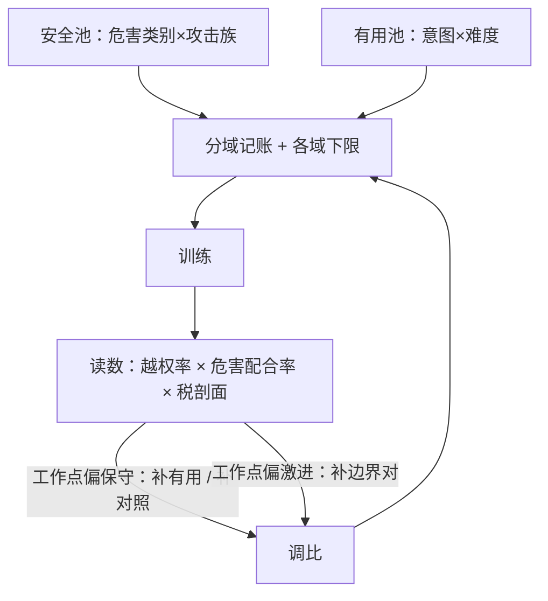
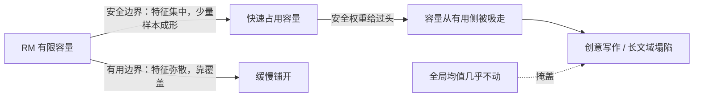

# 安全与有用数据的配比

安全与有用不是两个可以各自最大化再相加的目标；配比是把帕累托上的工作点，写进数据卡的那个数。

<footer>—— 据 Touvron 等 Llama 2, 2023 与 Bai et al., 2022 整理</footer>

[上一课](/llm/ade-dedup-cleaning)收在「每条丢弃规则都是一次无声的再配比」；本课正面写配比，只写安全与有用这一条轴。配比的三轴总论（来源、域、难度）与分域下限验收，[偏好数据的配比与域覆盖](/llm/rm-data-mix)已经讲过，口径直接搬过来用；本课补的是这条轴特有的张力。

## 问题

这条轴上配比失误的两种形态都见过：安全池不足，危害配合率下不来；安全池过重或只教说不，越权拒绝率上去，能力损失摊进对齐税——[对齐税的测量](/llm/aeval-alignment-tax)的分层消融显示税集中在创意写作、长文这些敏感域。麻烦在于两类数据不对等：安全边界集中，拒答短语与危害关键词附近的表面特征，样本效率高；有用边界弥散，覆盖全部意图域，靠覆盖不靠权重。一个全局占比数既不反映两边的样本效率，也不反映产品要的工作点。而「全拒赢榜」的作弊在数据侧同样成立——只堆安全数据，基准分数好看，产品不可用；[安全基准的设计原则](/llm/aeval-safety-benchmark-design)用成对指标封的是评测侧的同一个洞。

「危害配合率」是模型被攻破、顺着有害请求作答的比例；「越权拒绝率」是反过来把正常请求也当有害拒掉的比例。好模型要两个都低：既不当帮凶，也不当惊弓之鸟——成对报这两个数，就是为了不让一头掩盖另一头。

## 方法

配比按三步走。第一步分域记账：安全池内部按「危害类别 × 攻击族」切——红队覆盖矩阵的同一张表；有用池按意图分类法切。占比定在格子上，不在池上定。第二步分域下限验收：沿用配比课的口径，验收对象是各域下限，不是加权平均；危害每类、意图每类各设下限。第三步工作点读数：越权率与危害配合率成对报（[越权行为的度量](/llm/aeval-overrefusal-metric)的主图），在帕累托上先指定工作点再回头调比；每轮迭代后用对齐税的分层消融定位税落在哪层——权重、提示还是门，把「安全多了」与「安全做法糙了」分开。对照对计入有用侧：它们同时服务两个池。

## 机制

为什么配比是工作点不是权重：混训损失是两类对比结构之和，RM 容量有限，梯度竞争决定哪类边界先被拟合。安全边界特征集中、便宜，权重稍给就成形；权重给过头，容量就从有用侧被吸走——所以配比失误的表现是某域塌陷而全局均值不动，配比课的机制原话在这里原样生效。工作点的语义由此清晰：占比决定的是容量分配的优先序，工作点决定的是停在哪；前者是手段，后者是产品决策，两件事不能互相替代，也不能用一个数同时管两件事。

容量竞争如何让「某域塌陷而均值不动」，机制上是这样一串因果：

把 RM 的容量想成一块固定大小的黑板：安全边界笔画少，几笔就画清楚；有用边界要画满整面墙。安全内容写得太多，黑板就没地方写有用的部分——而且在不重训细看的前提下，平均分上看不出哪块被挤掉了。

Llama 2 约 141 万条比较对中安全与有用几乎各半。「各半」不是道德表态而是样本效率的账：安全边界特征集中、便宜，有用边界要覆盖、贵；两边在「边界成形」上的成本接近时，池子大小才接近对半。

## 边界

配比不解决单条质量，那是上一课的账。帕累托前沿随基座与解码配置移动，工作点每轮重估——所以配比是下一课轮次策略的输入，不是常量。对齐税的读数必须走因果消融，能力榜上的前后差值不算税。政策改版会移动「危害类别」的定义本身，安全池要按版本重映射——红队课的版本绑定在这里收利息。

「对齐税」指为了安全付出的能力代价：安全做得越多，写作、长文这类能力掉得越多。测它要靠「因果消融」——只换掉安全数据、其他一切不动再重训一次，前后分差才是税；只拿两个版本模型的榜单相减，里面混着无数别的改动，不算数。

## 小结

- 配比失误两形态：安全不足则危害配合率下不来；安全过重则越权拒绝与对齐税上去。
- 占比定在格子上（危害类别 × 攻击族、意图 × 难度），验收对象是各域下限而非加权平均。
- 越权率与危害配合率成对报，先指定工作点再调比；税走分层消融定位。
- 机制是梯度竞争与样本效率差：安全边界便宜，有用边界靠覆盖。
- 出处：Touvron 等 Llama 2，2023；Bai et al., 2022；配比与分域下限口径见配比课。
