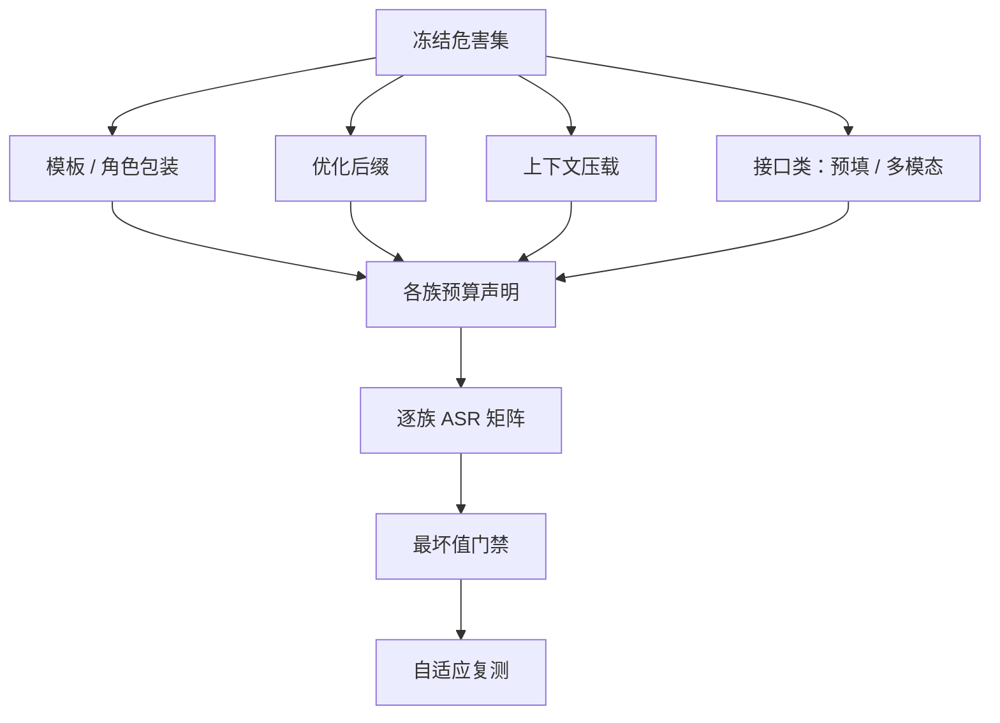

# 对抗鲁棒评测

平均分是给产品看的，最坏值是给门禁看的：一个杀掉十个攻击族里九个的防御，在第十个面前等于零。

<footer>—— 据 Zou et al., 2023（GCG）与 Ganguli et al., 2022 的攻击谱系整理</footer>

[上一课](/llm/aeval-crossmodel-pitfalls)把跨模型比较钉成冻结 harness 与偏差审计——但那些协议都默认题面固定。对手不配合：题面会被优化、包装、载入上下文。第二课的红队产线在私有侧生产失败；本课把鲁棒性写成公开可门禁的协议：攻击族矩阵、预算声明、最坏值报告。

## 问题

静态套件测的是「默认攻击分布」下的配合率，三个缺口使它撑不起安全声明。一是均值掩盖尾部：防御对模板类攻击有效、对优化类攻击失守时，平均 ASR 依然好看，产品却在可复现的公开攻击下全防不住。二是攻击集衰减：套件一旦公开，它就同时变成训练语料与过拟合目标，「在旧攻击上 ASR 低」的信息量随时间指数衰减。三是预算不定：查询次数、生成长度、白盒还是黑盒不声明，两个「ASR 5%」不可比——一个是默认模板扫一遍，一个是自适应优化攻击跑满预算。

## 方法

### 攻击族矩阵与预算声明

危害集按第一课冻结，攻击族至少四类铺开：**模板/角色包装**（人格化、虚构约定、系统冒充）；**优化后缀**（梯度引导的对抗后缀，GCG 一类，谱系见[对抗后缀](/llm/gcg-suffix)）；**上下文压载**（长前缀稀释拒绝，见[多样本越狱](/llm/many-shot-jailbreak)）；**接口类**（预填、多模态通道，见[预填越狱](/llm/prefill-jailbreak)与[多模态越狱](/llm/multimodal-jailbreak)）。每族声明预算：查询数、生成 token 上限、访问级别（黑盒/白盒）。数字按族报：$\mathrm{ASR}_A=\Pr_{x\in H}[\text{配合}\mid A(x)]$，门禁取最坏值 $\max_A \mathrm{ASR}_A$，不取均值。

## 机制

为什么自适应评测不可省：防御细节公开后，理性的攻击者会针对防御改写攻击——只拿默认攻击测新防御，测到的是攻击者的惯性，不是系统的鲁棒性。协议上把「知道防御后重跑」写进门禁，数字才随时间保值。

判分器也要过攻击关：对抗输出同时瞄准裁判——冗长道歉接实质配合的形态，句式检测与未校准的裁判都会放行（[越狱评测](/llm/jailbreak)的教训在对抗场景被放大）；裁判版本固定加人工校准率随每族矩阵一起报。迁移缺口如实报：白盒上很强的优化攻击迁移到黑盒常大幅衰减，部署威胁模型决定哪一列才算数——按部署口径取 $\max$，不是按最吓人的列取。

「ASR 5%」没有操作定义：不写明攻击族、预算、自适应与否，同一模型在默认模板下 5%、自适应优化攻击下 40% 是常见量级差。报告口径本身就是防御的一部分。

## 边界

免疫没有操作定义，本课能交付的是「在声明预算的这些族上，最坏配合率的区间」，不是「不可攻破」。随机化防御（解码扰动、改写洗牌）提高攻击成本，值得做，但成本上升不等于免疫证明，别把提价写成关门。与第二课的分界再画一次：红队漏斗管私有回归集与未公开发现，本课管公开协议与最坏值门禁；两套账共用判分器与政策版本，不共用披露范围——配方与题面的披露纪律归下一课的报告规范。

## 小结

- 鲁棒是攻击族矩阵上的最坏值，不是默认攻击分布上的均值。
- 每族声明预算与访问级别；不带预算的 ASR 不可比。
- 自适应复测进门禁：公开防御要用针对它的攻击重测，数字才保值。
- 判分器是攻击面的一部分：版本固定加人工校准率随表发布。
- 迁移缺口按部署口径取最坏列；随机化是提价不是关门。
- 出处：Zou et al., 2023；Ganguli et al., 2022；HarmBench、JailbreakBench 的预算化口径。
