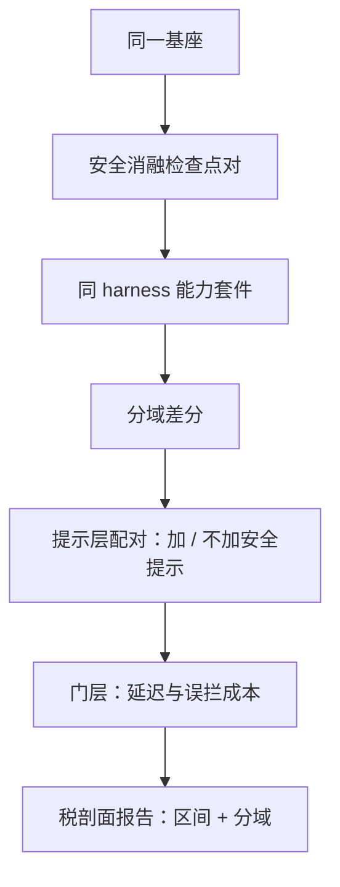

# 对齐税的测量

安全不是免费的，但「税」要先证明因果：对齐前后各跑一遍能力榜，量到的只是混着换数据、换步数、换提示的总账，不是税。

<footer>—— Bai et al., 2022 与 Askell et al., 2021 都报告了有用/无害的权衡口径</footer>

[上一课](/llm/aeval-multiturn-safety)把安全评测从单轮扩到会话路径与首违轮。安全工作点每收紧一格，产品侧都会问同一句：模型变笨了吗？本课把这句质问变成测量：对齐税的定义、配对与归因。第一课的三元组 $S(\theta,P,J)$ 在这里再入口：冻结 $P$ 与 $J$，看 $\theta$ 的哪一部分改动交了多少能力。

## 问题

「对齐后数学掉两分」不是对齐税。从基座到发布，中间可能同时变了预训练数据配比、训练步数、检查点选择、系统提示、解码配置；能力评测自己有方差（口径见[评测方差与种子](/llm/eval-variance-seed)），两分的差常常只是采样噪音。更隐蔽的是协议混入：输出变长后撞上截断、格式偏好变了导致抽取失败——评测协议吃掉的分数被记在安全头上。缺口是把「安全干预的因果贡献」从总变化里隔离出来，并且分域报告：税不是均匀的，均匀假设会让免税的域替交税的域背书。

## 方法

### 三层配对

**权重层**：同一基座，只加安全数据或偏好训练的消融检查点对，同 harness、同解码跑能力套件，逐域差分 $\Delta_c = S_{\text{aligned}}(c) - S_{\text{base}}(c)$。**提示层**：同一权重，加/不加安全系统提示各测一遍——提示税常比权重税大，而且免费可调。**门层**：输入/输出过滤器的误杀已在[越权度量](/llm/aeval-overrefusal-metric)计入行为侧，这里补延迟与吞吐的税。三层各自单独消融，才有 $\Delta_c = \Delta^{\text{数据}}_c + \Delta^{\text{提示}}_c + \Delta^{\text{门}}_c + \epsilon_c$ 的可加分解；一次只测首尾两点，因子混在一起，归因无从谈起。

## 机制

税为什么集中：安全监督偏短、偏模板、偏拒答与说教，它把输出长度与风格分布整体推移；能力评测若奖励长而全的作答，风格移动会被读成能力下降，反之亦然——所以税必须与判分表的风格敏感性一起解读。拒答与谨慎泛化到共享特征的机制，正是第一课引入、[过度拒绝](/llm/over-refusal)机制课展开的那条捷径，能力侧的税与安全侧的越权是同一枚硬币。

提示税为什么反而大：权重改动可以局部，系统提示影响全分布——每一条请求都背着它。Bai et al. 2022 的原始口径就点破了比较对象：有用与无害在数据上互相挤压，税的大小取决于你在帕累托上比的是哪两点；不指定工作点的「对齐税」没有操作定义，扫一遍工作点各报一数，才是可辩护的口径。

## 边界

税可为负：对齐同时提升指令跟随与格式稳定，有的域分数是涨的，剖面必须完整公布，挑着报就是用测量做宣传。能力评测与安全评测共用同一解码配置，否则又是第一课警告过的两套不可比数字。多次采样取区间，不报单次贪心；报告绑定检查点谱系，让下一任能复现这套消融。最后，不要用单一总分宣布「对齐让模型变笨」——总分里交税的域与涨分的域互相抵消，抵消后的数字不归因于任何人。

## 小结

- 对齐税是安全干预的因果贡献，不是对齐前后能力榜的差值。
- 三层配对消融：权重、提示、门；只有分层才能分解，只测首尾只能吵架。
- 分域剖面是主表：税集中在创意写作、长文与敏感域，数学代码基本免税。
- 与判分表的风格敏感性一起解读：长度与文风移动会伪装成能力变化。
- 工作点指定在先：帕累托上不指明比哪两点，税就没有定义。
- 出处：Bai et al., 2022；Askell et al., 2021；本课程的消融口径整理。
