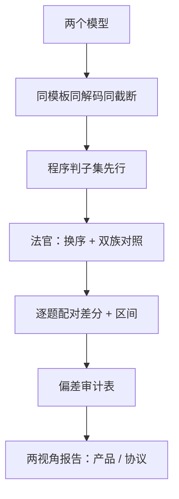

# 跨模型比较的陷阱

两张榜的差值里，大半不是模型差，是协议差：裁判版本、解码配置、对话模板、题目泄漏，每一个都能搬动名次。

<footer>—— Zheng et al., Judging LLM-as-a-Judge with MT-Bench and Chatbot Arena 的偏差测量；据公开评测复现报告整理</footer>

[上一课](/llm/aeval-alignment-tax)把对齐税钉成配对消融与分域剖面——配对是同源比较，混淆可控。对外叙事要的是跨模型比较：不同实验室、不同检查点、不同榜单。混淆从「可控」升级成「四面八方」。本课写陷阱清单与一份把它们逐项钉死的比较协议。

## 问题

跨模型比较里的每个「显然」都藏着混淆。**法官偏差**：位置、长度、自我偏好，[LLM 裁判偏差](/llm/llm-judge-bias)已列为一等系统误差；裁判升级等于换尺子，时间序列当场断裂。**解码配置**：温度与 top-p 改「偶尔配合」的频率，[越狱评测](/llm/jailbreak)量过 ASR 对解码的敏感度；两个模型用不同温度比安全分，比的是采样器。**对话模板与提示格式**：同一权重换模板掉分是常态（见[聊天模板](/llm/chat-template)与[提示格式敏感度](/llm/prompt-format-sensitivity)），「产品视角」与「协议视角」的数字能差出一个名次。**污染与饱和**：后发布的模型可能背过题，旧榜通胀（见[评测污染](/llm/eval-contamination)与[基准饱和](/llm/benchmark-saturation)）。**风格混淆**：更长、更自信、更新式文风的输出系统性赢——而这些恰好与新模型相关，名次移动被读成进步。**方差**：不报区间的名次差多半是噪音。缺口不是发现新坑，是把坑变成协议字段。

## 方法

### 协议：冻结、换序、双族、区间

冻结 harness：模板、解码、截断、判分五件套固定，比较里只换权重。程序判子集先行：有答案键的（数学、代码、抽取）不用法官。法官层双保险：成对换序，不一致记平；换一个家族的法官复算一遍，剖面大洗牌说明原表在奖某一家文风。统计层逐题配对：$d_i\in\{-1,0,1\}$，胜率 $\hat w=\frac{1}{n}\sum[d_i{=}1]$，区间 $\hat w \pm 1.96\sqrt{\hat w(1-\hat w)/n}$。最后随结果发布一张偏差审计表：每项混淆，是否控制、怎么控制、没控制的声明。

## 机制

这些混淆为什么有共同方向：法官的审美（长、全、自信、流利）与新模型的训练趋势相关，偏差不是白噪音而是单向斜坡——每一代都白捡几分，若干代累积出的「进步曲线」里，分不清哪一段是模型、哪一段是尺子。这决定了对策必须是结构性的：换序消灭位置项，程序判消灭风格项，双族对照暴露同族项；[风格控制](/llm/style-control)一类后处理能再剥一层，但任何「在提示里写忽略长度」的自然语言禁令都被证明无效。

区间感的具体数字：$n=100$ 的成对比较，55% 对 45% 的胜率差，95% 区间宽约 $\pm 10$ 个百分点——多数「新模型又赢了八个点」的头条在统计上站不住；$n$ 到四百，同样的差才勉强出噪音。

## 边界

完全公平不可达：每个模型在自己的最优模板上才发挥全部能力，统一模板对某一方必然是降维——所以两视角分列（各自最优 vs 统一协议），并声明选了哪种。内部门禁与对外宣传分开：门禁可以钉死协议拿可复现的差，宣传若要引用外部榜单，审计表一起引用。最后，[MT-Bench](/llm/mt-bench) 的教训重申一遍：零点几分的总分差没有意义；本课的协议不保证你比出「谁更好」，只保证比出来的差能被解释。

## 小结

- 跨模型比较的可信度取决于协议字段，不取决于题目难度。
- 冻结 harness 只换权重；程序判子集先于法官。
- 换序、双族、逐题配对加区间：四个统计件缺一，名次不可解释。
- 偏差有方向：长、自信、新文风单向加分，进步曲线要过尺子这一关。
- 两视角分列：各自最优模板与统一协议，声明选择，别混表。
- 出处：Zheng et al. 的法官偏差测量；公开套件与复现报告口径；本课程协议整理。
