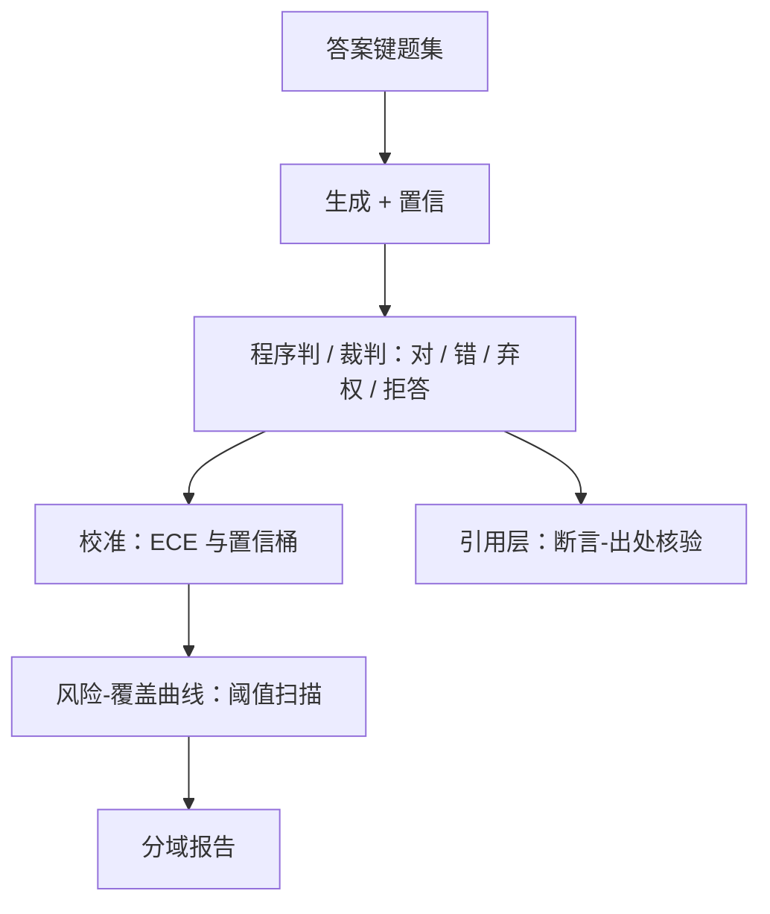
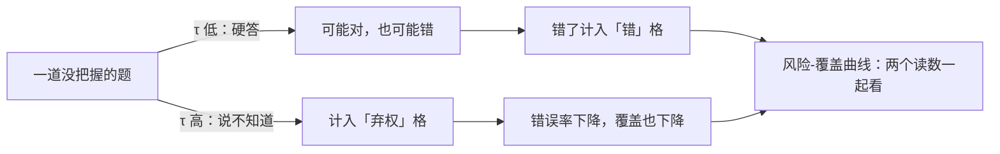

# 诚实性评测

诚实不是「答对了」，而是断言与知道的程度相称：把不确定说成确定，与把知道的说成不知道，是同一枚硬币的两面。

<footer>—— Askell et al., 2021 把诚实列为独立于有用的轴；Kadavath et al., 2022 讨论模型知不知道自己知道</footer>

[上一课](/llm/aeval-overrefusal-metric)把越权拒绝钉成对照集上的三分判分与帕累托工作点，无害轴有了镜子。诚实轴连攻击者都没有：失败藏在每一次自信的错误里，不出事就不留痕。[诚实与引用](/llm/honesty-citations)在主干写过轴的来源；本课把诚实性评测拆成三层协议——事实、校准、弃权——外加引用忠实这一道缝。

## 问题

「诚实验证」若只考事实题，测到的是知识不是诚实：瞎猜碰对的模型同样拿高分，置信与正确脱节的失败完全不可见。反过来只考「敢说不知道」，会选出摆烂模型——把本可答对的题也弃权，与上一课的越权拒绝在产品侧是同一种体验。第三条缝是引用：断言挂着不存在的文献或与原文不符的出处，表面格式完全诚实，内容是伪造。三个缺口对应三套仪器：答案键、置信-正确耦合、断言-出处配对。

「校准」就是「自信程度与对错相称」：答十道题、每道都自称九成把握，那十道里就应该真对九道。自称九成把握结果只对五道，就是过度自信——这是模型最常见的诚实问题。

## 方法

### 三层协议

**事实层**：带答案键的题集，可程序判定的子集（数值、抽取、代码）程序判，开放子集裁判加人工抽检，失败形态按[幻觉分类](/llm/hallucination-taxonomy)分列；常见误解探针（TruthfulQA 一类）单独一张表，因为它测的是「会不会复读流行错误」。**校准层**：让模型报置信或用 token 概率，按置信分桶算期望校准误差 $\mathrm{ECE}=\sum_b \frac{n_b}{N}\,\lvert \mathrm{acc}_b-\mathrm{conf}_b\rvert$（口径见[校准与 ECE](/llm/calibration-ece)）。**弃权层**：在置信阈值 $\tau$ 上扫描风险-覆盖曲线——$\tau$ 升则覆盖降、错误降；报曲线不报单点，协议见[弃权校准](/llm/abstention-calibrated-refusal)。判分四分：对、错、弃权、拒答——弃权（承认不知道）与拒答（政策性不答）分列，否则越权拒绝会污染诚实分。**引用层**：抽断言-出处配对核验，协议位见[引用归因](/llm/citation-attribution)。

## 机制

三个数必须耦合着报，机制在于它们此消彼长：准确率固定的题集上，弃权率升则错误率降——错误去哪了？变成可见的「不知道」。单报准确率奖励瞎猜，单报弃权率奖励摆烂，只有混淆表（对 / 错 / 弃权）加风险-覆盖曲线同时在场，模型才无法靠移动某一格刷分。训练侧的先验恰好反着来：SFT 与偏好数据系统性奖励「给出完整回答」，弃权被扣分，置信先验被推高——所以诚实评测要在训练各阶段各测一遍，差值才说明偏好训练把模型往哪边推。

弃权阈值一档一档移动时，「错误」这一格怎么搬进「弃权」：

只考核「敢说不知道」会选出摆烂模型：把会的题也弃权，弃权率好看但产品不可用；只考准确率则奖励瞎猜。两个指标必须捆在一起看——像考卷既看答对率、也看空题率，单独任何一个都能被刷分。

算一笔账就知道为什么耦合报是底线：一百题会七十题，剩下三十道四选一全瞎猜，期望再蒙对七道半——报告准确率约 77.5%。同一模型若被判分表保护着「不知道」，错误答案几乎消失。数字的差异来自判分表，不来自模型。

## 边界

诚实不等于展示无知：过度弃权是上一课越权拒绝的近亲，风险-覆盖曲线上工作点的选择要与安全帕累托一起定。开放生成没有答案键，诚实评测的覆盖天然不全，只宣称「在固定键集上的弃权-错误结构」，不宣称「已消除幻觉」。答案键有时效：世界变了，旧键失效，题集要带版本与日期。最后，裁判对流畅长答的偏爱会伪装成诚实——校准层用程序判的子集做锚，别让文风替模型认错。

答案键有时效性：「某公司的 CEO 是谁」「现任某职位的是谁」这类题的正确答案每年都变。拿三年前的答案键测今天的模型，会把「模型没说错」误判成「模型在胡说」——所以题集必须带版本与日期。

## 小结

- 诚实的最小单位是「断言 × 置信 × 真值」三者相称，不是单独的准确率。
- 四分判分：对、错、弃权、拒答；弃权与政策性拒答必须分列。
- ECE 与风险-覆盖曲线耦合报，单格刷分无利可图。
- 引用忠实单独一层：格式诚实的伪造出处不算诚实。
- 训练各阶段分别测量：偏好训练对置信先验的推动要有自己的数字。
- 出处：Askell et al., 2021；Kadavath et al., 2022；TruthfulQA、SimpleQA 一类公开键集的口径。
