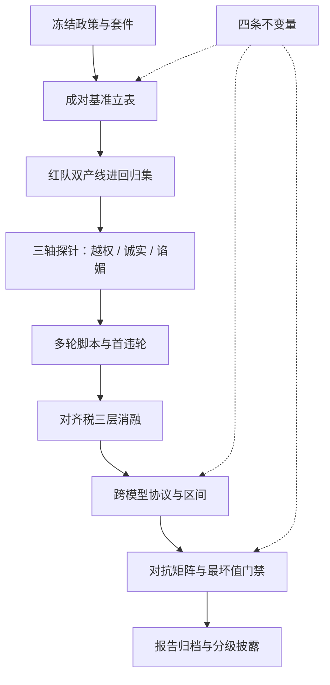
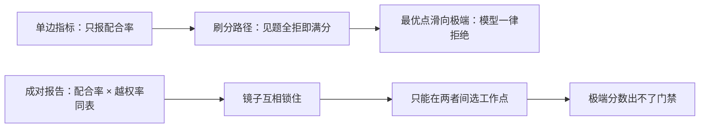

# 对齐评测收束

评测的全部产出不是一堆分数，而是一张工作点地图：模型在哪、门禁画在哪、下一个失败大概从哪来。

<footer>—— 据 Bai et al., 2022、Ganguli et al., 2022、Perez et al., 2022、Sharma et al., 2023 与公开套件口径，按本课程整理</footer>

[上一课](/llm/aeval-reporting-standard)把数字收成可审计的报告。至此零件齐了：设计原则与红队产线管失败从哪来，过度拒绝、诚实、谄媚三根轴的度量管软失败怎么计数，多轮路径、对齐税、比较协议、对抗门禁管真实负载与公平叙事，报告规范管交付。本课把它们装配成一张地图和一张决策单。**本课程到此收束。**

## 问题

对齐评测的决策散在十处：先建基准还是先红队、三根轴先测哪根、多轮脚本何时上、税怎么归因、跨模型比较怎么站得住、报告给谁看。各自局部最优会互相拆台：没有设计原则的红队产出进不了回归集；没有比较协议的「进步」是尺子换了的假象；没有成对报告的优化滑向单边极端。收束要给的是先后顺序与跨版本不动的部分。

决策单按依赖排序，就像装修先水电后瓦工：顺序反了不是不能干，而是返工——没冻结政策就开测，政策一改全部数字作废；没有对照集就上红队，产出的失败只能看、进不了回归集。

## 方法

**决策单**，按依赖排序：

1. **冻结政策与套件**：类别映射表先行，数字还没有，资格先有。
2. **成对基准立表**：危害集与对照集同表，配合率与越权率互为镜像。
3. **红队两条产线**：自动化铺广度、人工下深度，漏斗产出私有回归集。
4. **三轴探针**：越权三分判分、诚实耦合报、谄媚盲判配对基线。
5. **多轮脚本**：逐轮判分加首违轮分布，接口范围显式声明。
6. **对齐税配对消融**：权重、提示、门三层分账，分域剖面。
7. **跨模型钉协议**：冻结 harness、换序、双族、区间、偏差审计表。
8. **对抗矩阵**：攻击族 × 预算声明，最坏值进门禁，自适应复测。
9. **报告归档**：五件套加分级披露，负结果入库。

## 机制

地图的骨架是四条不变量。**政策先行**：分数是 $S(\theta,P,J)$，政策不动，数字没有资格说话。**成对报告**：每个安全数字配一面镜子——配合对越权、准确对弃权、附和对纠正——单边指标的最优点总在极端上，镜子让它出不了门。**版本冻结**：模型、裁判、解码、套件四位一体，比较才是差分；缺任何一位，所谓进步只是换尺。**最坏值思维**：均值给产品看体验，最坏值给门禁看边界，安全声明永远取后者。套件会换代、攻击会演化、政策会收紧——参数全换，这四条不动。

成对报告为什么能挡住单边刷分，镜子机制画出来是这样：

$S(\theta,P,J)$ 读作「分数取决于三件事」：模型 $\theta$、政策 $P$、评测器 $J$。就像成绩取决于考生、考纲和判卷人三方——只盯着考生苦练，考纲和判卷人一换，分数照样大变，所以政策不动数字没有资格说话。

若只做三件事：冻结政策与套件版本；把每个安全数字和它的镜像放进同一张表；给每个对外数字绑五件套与区间。本课程见过的大多数评测翻车，在这三步就被拦住。

## 边界

这张地图有保鲜期：探针会背题、攻击族会扩容、政策会改版，所以每张表都带版本与日期，过期不续命。地图之外有它不覆盖的两翼：训练侧怎么把工作点移过去——[拒答训练](/llm/refusal-training)与[宪法式对齐](/llm/constitutional-ai)接棒；线上怎么看着它漂——部署监控接棒。评测交付的始终是同一件事：把「感觉安全」换成「在声明的工作点上，失败率的区间与最坏值可被任何人审计」。数字有资格说话的时候，对齐才谈得上工程。

「探针背题」指评测题混进训练数据后被模型背下来：分数涨了，真实能力没变。所以地图上每张表都带版本和日期——就像试卷定期换题，否则「考得好」只是「背过原题」。

## 小结

- 决策单九步，依赖排序：政策冻结 → 成对基准 → 红队 → 三轴 → 多轮 → 税 → 协议 → 对抗 → 报告。
- 四条不变量：政策先行、成对报告、版本冻结、最坏值给门禁；参数换代，顺序不动。
- 每个安全数字有镜子；单边披露是作弊策略的重新放行。
- 比较需冻结协议，进步曲线要过尺子这一关。
- 声明口径止于「工作点上的区间与最坏值」，免疫与绝对安全没有操作定义。
- 出处：Bai et al., 2022；Ganguli et al., 2022；Perez et al., 2022；Sharma et al., 2023；Zheng et al., 2023；HarmBench、JailbreakBench、XSTest 官方口径，按本课程整理。
