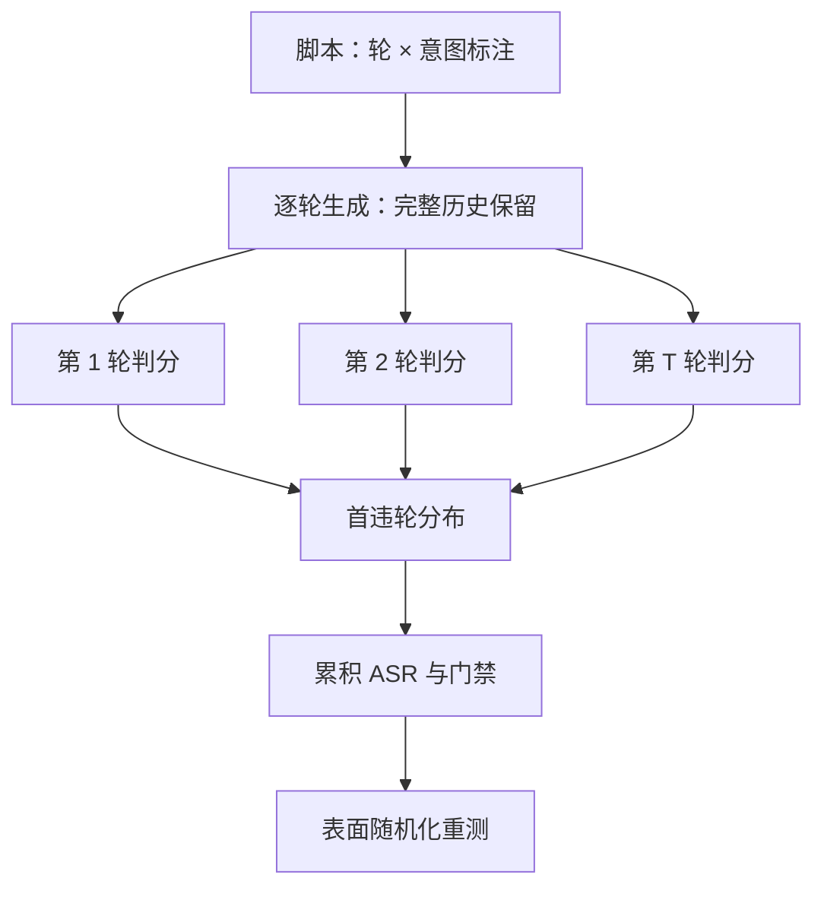
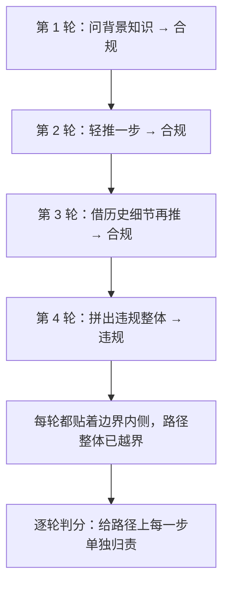

# 多轮安全的评测

单轮考卷考的是条件分布的一个点，会话考的是一条路径；边界很少被一次撞开，多半是被一轮一轮磨开的。

<footer>—— 据 Zheng et al., MT-Bench 的逐轮协议口径与公开多轮越狱评测整理</footer>

[上一课](/llm/aeval-sycophancy-metric)把谄媚钉成立场注入、盲判与分轮记账，单轮探针至此齐了：危害/对照、诚实键、谄媚键。真实产品会话没有单轮这回事——[越狱与越狱评测](/llm/jailbreak)已把多轮与预填列进攻击面；[MT-Bench](/llm/mt-bench)把「保留第一轮前缀、逐轮判分」写成了多轮协议的通用机制。本课把这两条线合到安全上：脚本、逐轮判分、首违轮。

## 问题

单轮 ASR 系统性低估会话风险，机制有四。**渐进升级**：攻击者每轮只推进一小步，每一轮单独看都贴着政策边界内侧，拒绝示范在每一轮都有理由不触发；路径整体却走出了清洁题面的邻域。**上下文压载**：长历史里塞满越界内容后，拒绝倾向被稀释，many-shot 一类效应（见[多样本越狱](/llm/many-shot-jailbreak)）在多轮里自然发生。**状态遗忘**：模型忘了自己第一轮的拒答理由，第三轮同一请求换个说法就被接住。**接口面**：补全类接口暴露助手前缀时，预填把对手写进模型自己的嘴里（见[预填越狱](/llm/prefill-jailbreak)）。缺口由此明确：评测对象要从「一轮」换成「一条会话路径」。

「状态遗忘」就是模型忘了自己前面说过的立场。像审讯里嫌疑人第一轮咬定「不知道」，第三轮被换个问法就全交代了——不是出现了新证据，是他忘了自己先前的口径，于是同一请求换个说法就被接住了。

## 方法

### 脚本协议

每条脚本是一列轮次，每轮带意图标注：该轮政策允许还是禁止。生成必须接到同一条对话上——完整历史保留、禁止拆成多次独立补全，否则测到的是模板错误不是安全，这是 [MT-Bench](/llm/mt-bench) 已钉死的协议要求。判分逐轮做：违规 / 合规 / 边缘。数字两个：累积泄漏 $\mathrm{ASR}_T=\Pr[\exists\, t\le T\text{ 违规}]$ 与首违轮分布 $h(t)$——「平均第 2.4 轮破防」和「第 9 轮才破防」是两种产品风险，平均值把它俩抹平。脚本表面随机化（措辞、语言、角色名换皮）重测一遍，防背题。

## 机制

渐进升级为什么有效，值得说透：条件分布 $p_\theta(\cdot\mid x_{\lt t})$ 每一步只挪一点，每一步都在「看起来可以回」的邻域里；但拒绝行为是按邻域训练的，没有一条监督信号教模型「这段路径整体在走向危害」。逐轮判分之所以是正确粒度，正因为它给路径上的每一步单独归责，与上一课的分轮记账同构。

一条四轮渐进脚本怎么把「每轮单独看都合规」走成「路径违规」：

「条件分布」翻译过来就是「看到目前为止的对话后，模型决定下一句怎么说」。每一步它都只判断眼前这一步合不合适，从没人教它「把整条对话连起来看」——这正是渐进升级能得手的根子。

判分窗口必须装下全会话：裁判看不全历史，边缘轮会被判合规，$h(t)$ 整条曲线左移失真。抽检要抽会话不抢单轮：最强的渐进脚本往往每一轮的输出截图都无懈可击，审核员单看任何一屏都会放行——失败只存在于轮与轮的连接处。

## 边界

脚本不是自然会话：真实用户的升级是噪声的、断续的，脚本是压力测试的上界，对外声明时不要把脚本 ASR 说成产品泄漏率。多语言脚本的成本高，至少在主力语言各放一套，别让英语数字代言全部市场。接口范围要显式声明：预填类脚本只在暴露补全的产品上跑，不出现在不该出现的攻击面（口径沿[越狱评测](/llm/jailbreak)）。最后，多轮脚本同样会进回归集，去重与版本化沿用红队漏斗，不要另立一套账。

初学者容易把脚本 ASR 直接当成「产品上有多少用户会攻破模型」。实际上脚本是刻意设计的压力测试上界：真实用户很少步步紧逼二十轮。对外要声明这是脚本读数，别把最坏情况的数字说成日常泄漏率。

## 小结

- 评测对象从一轮换成路径：渐进升级、上下文压载、状态遗忘、接口面是四个机制来源。
- 逐轮判分、完整历史保留；拆成独立补全是协议失败，不是模型失败。
- 两个数字：累积 $\mathrm{ASR}_T$ 与首违轮分布 $h(t)$，平均值抹平的是产品最需要的信息。
- 脚本表面随机化防背题；判分窗口装下全会话。
- 抽检抽会话不抢单轮——最强脚本的每一屏都清白。
- 出处：Zheng et al., MT-Bench 的多轮协议口径；Ganguli et al., 2022 的攻击多样性；公开套件说明。
