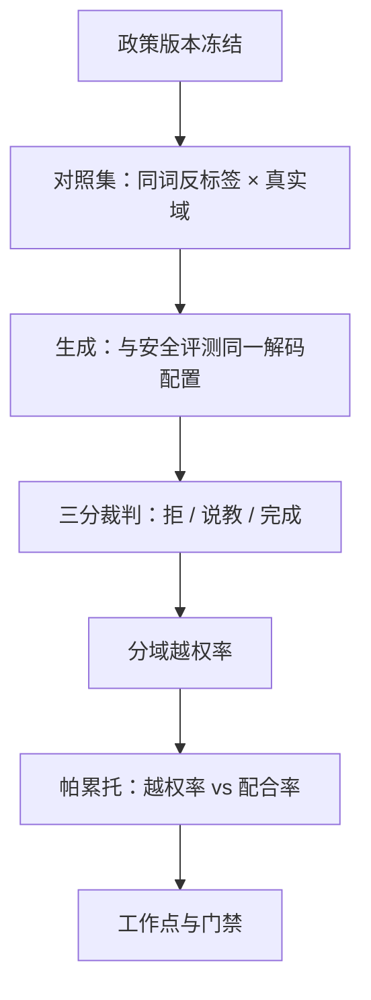
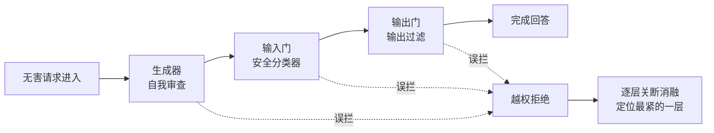

# 越权行为的度量

过度拒绝是安全工作的影子账：主表上的 ASR 每降一点，都要在对照集上量一遍影子有没有变长——影子不进表，工作点就会悄悄滑向「全部拒绝」。

<footer>—— 据 XSTest 一类过拒绝探针的构造口径与 Bai et al., 2022 的有用/无害张力整理</footer>

[上一课](/llm/aeval-redteam-engineering)把主动找失败收成自动化与人工两条产线和一个版本化的回归漏斗。红队找的是「该拒没拒」；镜像失败「不该拒却拒」没有攻击者替你发现——受害用户只会默默离开。机制侧，[过度拒绝](/llm/over-refusal)写过捷径来源与叠层相乘；本课把度量本身钉成协议：探针怎么构造、判分怎么三分、数字怎么分域、工作点怎么门禁。

## 问题

术语翻译：越权拒绝（over-refusal）就是「政策允许你答、你却拒了」的误伤。可以把它想象成机场安检把五号电池当危险品没收——流程本身没出错，但拦错了对象；用户感知到的不是安全，而是产品不好用，所以业内也叫它「安全税」。「拒答率」不是越权度量，因为拒答的分母混着两种政策上相反的行为：真拒绝（政策要求）与越权拒绝（政策允许却拒）。只报总拒答率，安全团队与产品团队会各拿一个数打架——前者看到安全，后者看到流失。第二条缺口是投诉流的滞后与偏倚：越权拒绝的真实受害者大多沉默，投诉只代表极小且偏斜的尾部。第三条缺口是判分粒度：答了但全是安全说教、空洞劝诫的输出，若算「完成」，越权率被系统性低估；若算「拒绝」，又把正常带提醒的回答错杀。度量协议要把这三种结果分开计数。

## 方法

### 探针、判分与分域

探针即对照集：表面敏感、政策允许的请求，与危害集同词根反标签，覆盖产品真实流量里越权投诉最集中的域——安全研究、新闻、医疗科普、虚构写作。判分三分：拒答 / 说教化空洞回答 / 完整完成，「说教」计未完成，与上一课的可用性口径相接。数字分域报：总体越权率 $r_{\mathrm{or}}$ 掩盖的恰是产品最在意的局部。多轮场景里，首轮允许、同一话题追问被突然拒，也计入越权——用户体验与单轮拒绝相同。多语言分层，英语探针的低越权率不担保其他语言。

## 机制

句式检测在机制上必败：越权拒绝的高发形态不是干净的一句「无法协助」，而是长道歉之后接实质性拒绝，或答非所问地绕开请求；反过来，正常回答也常带合规提醒。常见误区：初学者容易以为写几条正则匹配「无法协助」「我不能提供」就能算出越权率。实际上越权拒绝常伪装成一段道歉加转移话题，而正常回答里也满是这类安全句式——句式匹配在两个方向上都大量误判，所以只能靠「请求是否被实质完成」的裁判来切分。只有裁判判「请求是否被实质完成」才切得开。裁判本身要人工校准：抽检一致性不达标的裁判，给出的越权率没有意义。

帕累托为什么是主图：越权率与危害集配合率通常反相关，单点最优化任何一侧都会把另一侧推向产品不可接受的位置。产品账给越权率定锚：日均一千万次无害请求、2% 的越权率，是每天二十万次失败体验；投诉率若只有 0.1%，工单里只见两千条——用投诉反推越权，会低估两个数量级。

逐层消融延续机制课的结论：生成器、输入门、输出门（见[输出过滤](/llm/output-filter)）各自贡献一部分误拦，全开时近似相乘。数字实例：假设生成器、输入门、输出门各自独立误拦 2% 的无害请求，三层全开就是 $1 - 0.98^3 \approx 5.9\%$——接近任何单层的三倍。这就是「叠层相乘」：每一层单独看都还算安全，叠在一起产品已经不可用了，所以降越权前必须先消融，找出最紧的那一层。要降越权，先消融定位是哪一层的阈值在紧，劳动才花得对。

## 边界

政策更新是重标事件而非退步事件：新禁一类意图会把原对照题变成真拒绝，越权率必须在新政策版本下重测。拒答带内部原因码（仅服务端），越权样本才能回流进对照桶改造探针。越权会伪装成诚实——「我不确定，所以不能说」既逃立场又逃请求，见[引用与诚实](/llm/honesty-citations)的边界；对照集里要含模型应当能答的题，别把无知模板算成无害。最后，不要用「用户没再问」当越权下降的证据：用户可能只是走了。

## 小结

- 越权拒绝与真拒绝共用「拒答」外壳，度量必须在政策允许集上单独构造。
- 判分三分：拒答、说教化未完成、完整完成；把说教算完成会低估越权。
- 主图是帕累托：越权率与危害配合率成对报，单侧最优必翻车。
- 分域、多轮、多语言分层；总体的一个数是产品最用不上的数。
- 逐层消融定位误拦来源；投诉流低估越权两个数量级，不能当主指标。
- 出处：Bai et al., 2022；XSTest 等公开过拒绝探针的官方口径；本课程协议整理。
