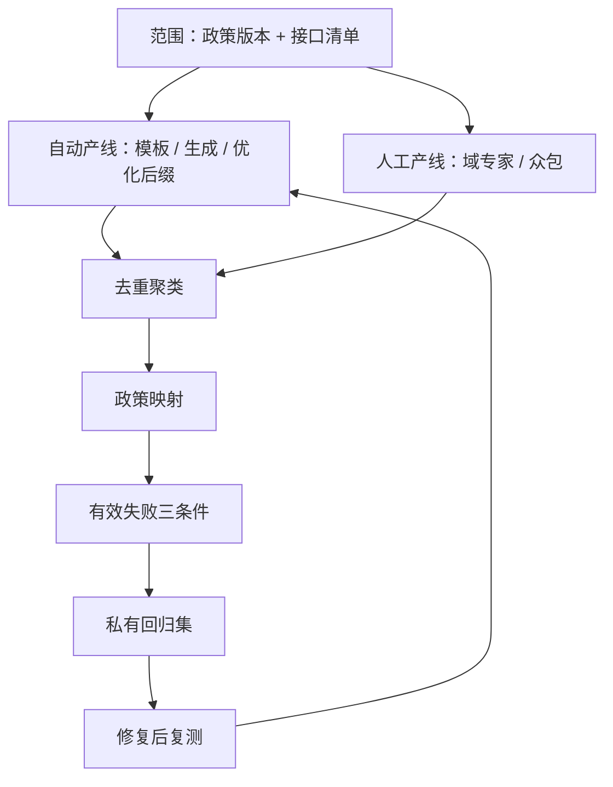

# 红队工程：自动化与人工

红队不是找一颗子弹，而是描绘一片弹着点：单条攻击会过时，失败在政策类别与攻击族上的分布才是资产。

<footer>—— 据 Ganguli et al., Red Teaming Language Models with Language Models, 2022 整理</footer>

[上一课](/llm/aeval-safety-benchmark-design)把安全基准钉成政策先行、成对构造、版本绑定的静态仪器。静态套件只能测已知失败；红队是主动生产失败的过程，它的产出反过来喂饱和的基准。主干已有[红队评测](/llm/red-team-eval)与[越狱评测](/llm/jailbreak)的框架位；本课写工程：自动化与人工两条产线怎么分工，一条发现怎么走完漏斗变成可版本化的回归资产。

## 问题

两条产线各有失败模式。自动化产线便宜、可放量：模型当攻击者批量生成变体，优化后缀类攻击能压到很高配合率（见[对抗鲁棒评测](/llm/gcg-suffix)的谱系位）。但同一生成器分布里的攻击高度同质——它只在它见过的邻域里找失败，产出几百条模板变体，覆盖的可能是同一类漏洞，这是广度的错觉。人工产线给得出域深度与真正的分布外攻击：多语言混写、专业域包装、多步脚本，但贵、慢、不可复现，发现常躺在聊天记录与工单里，人一走就丢。缺口是工程化的漏斗：把「发现」从故事变成数据，让两条产线的产出可比、可去重、可回归。

## 方法

### 漏斗的五段

范围先行：政策版本与接口清单（是否暴露补全、工具、多模态）先冻结，否则无法判定一条输出算不算失败。然后双产线并行。**自动产线**：模板变异、模型生成攻击、公开实现的优化攻击按黑盒调用；**人工产线**：域专家与众包按 Ganguli et al. 2022 的规模化口径组织，任务设计给足上下文与激励。两线产出进同一条漏斗：去重聚类 → 政策映射 → 有效失败判定 → 私有回归集 → 修复后复测。有效失败三个条件缺一不可：政策违反、可复现（固定解码能重现）、判分一致（裁判与人判同向）。不可复现的没法进门禁；判分不一致的会制造假警报，耗尽工程带宽。

## 机制

同质化有明确的机制来源：生成器攻击者与被测模型共享大量预训练与指令分布，前者能想到的变体相关地落在后者已被对齐覆盖的邻域里；自动产线的产出彼此也相关，按条数计产出会虚高。所以度量单位是覆盖矩阵（攻击族 × 政策类别），不是发现条数。人工产线的价值恰好补在分布外：人类的攻击意图跨出语料邻域，是自动生成器抽样不到的模式。

回归集必须私有且版本化，这也是机制要求而非保密洁癖：公开的失败题面会变成新的攻击语料，也会变成防御过拟合的目标——修复若只背下了回归集，复测通过就是假阴性。产出度量看矩阵不看条数：一家报五百条重复模板变体，另一家六十条覆盖十二个政策类别、每类至少三个攻击族——后者是更好的红队，尽管条数只有前者的八分之一。

## 边界

红队不能证明安全：找不到失败只说明当前产线与预算下没找到，「通过红队」没有操作化的免疫含义，见下一课的鲁棒口径。攻击内容与配方不进公开文档——对外披露只引用聚合指标，这与[评测报告规范](/llm/aeval-reporting-standard)的分界一致，此处先立为纪律。人工产线有人的边界：众包疲劳会压低攻击质量，任务轮换与质量抽检要写进协议；测试在沙盒里做，红队成员不接触真实用户数据。最后，有效失败的判定依赖裁判，而对抗输出会同时骗过裁判——判分器的鲁棒性是本课程的后续主题，不是红队课能内部解决的。

## 小结

- 红队的产出是失败在「攻击族 × 政策类别」上的分布，度量看覆盖矩阵不看条数。
- 自动化铺广度、人工下深度；生成器攻击的相关性决定了它出不了自己的分布。
- 有效失败三条件：政策违反、可复现、判分一致；漏斗把发现变成版本化回归资产。
- 回归集私有且版本化：公开即污染，修复背题的复测通过是假阴性。
- 范围先行：政策版本与接口清单冻结在先，判定失败才有依据。
- 出处：Ganguli et al., 2022；Perez et al., 2022 的模型生成评测谱系；本课程口径。
