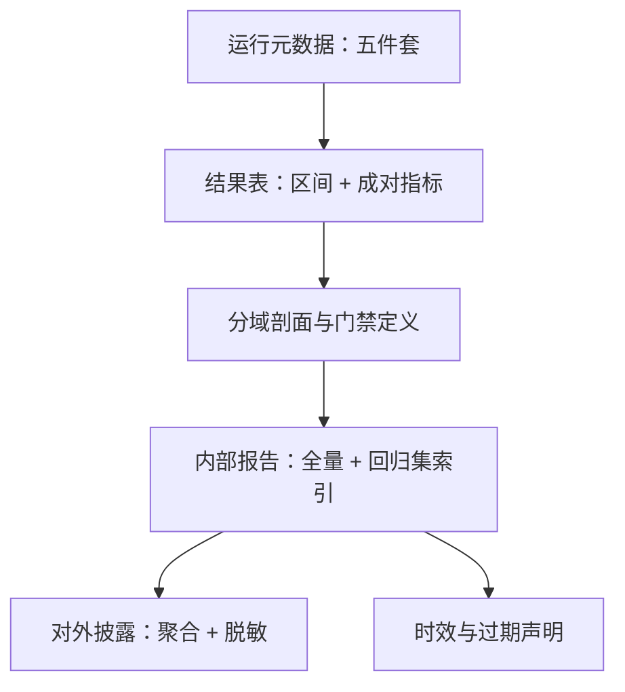

# 评测报告规范

一个不能被第三方复现的分数不是证据，是广告；报告的任务是把广告变成证据，同时不把它变成攻击手册。

<footer>—— 据公开模型卡与安全套件（HarmBench、JailbreakBench）文档的披露口径整理</footer>

[上一课](/llm/aeval-adversarial-robustness)把鲁棒评测收成攻击族矩阵与最坏值门禁。数字跑齐了，最后一公里是报告：让分数可审计、可复现、可比较，又不外泄配方。本课程前九课产出的每一类数字，都要能落进这一课的字段标准。

## 问题

没有规范的报告怎么失效，每条都有真实形态。「我们的模型 ASR 降低六成」——相对什么基准、什么裁判、哪版政策、什么解码，全部缺失；下一任拿到的是一句无法质疑也无法复现的话。裁判升级后，新旧数字混排成一条假时间序列，模型没动，尺子动了。安全数字单边披露（只报 ASR 不报过拒绝），优化沿着披露的那一侧滑向极端工作点——第一课封顶的作弊策略，被不完整的报告重新放行。最后，负结果不上墙：只有成功案例可见，防御的「复测失败」这类最有价值的知识沉底。

## 方法

### 五件套与结果规范

每个数字绑五件套：**检查点哈希、政策版本、套件版本、裁判版本与提示哈希、解码与 harness 配置**。[模型卡](/llm/model-cards)是公开载体，内部报告是全量源。结果规范四条：区间不报点；成对指标同表（ASR 与过拒绝、准确与弃权、附和与纠正，沿本课程三根轴）；分域剖面不报单一总分；门禁定义写明——回归阈值、最坏值口径、判分一致率下限。披露分级：内部报告全量并索引私有回归集；对外披露聚合指标与套件名，不含未公开失败题面全文与攻击配方。时效声明：每个数字带日期与依赖版本，过期即声明失效。

## 机制

版本绑定为什么等于可复现性：分数是三元组 $S(\theta,P,J)$，报告本质上是把三元组连同采样过程一起钉下来；上一课的「尺子换了」事故，在字段层就是裁判版本缺失。成对同表为什么防博弈：任何单边指标的最优点都在极端工作点上（全拒、全弃权、全附和），同表让每个极端都顶着它的镜像数字，读者与门禁都看得见滑动。负结果归档为什么是知识而不是丑闻：红队复测失败、消融不显著、探针失效，这些记录直接决定下一轮劳动花在哪——只在墙上放成功，等于给幸存者偏差发工资。

一行自检：任何安全数字，若拿掉五件套中任何一项就不能解释，它还没到能写进报告的程度。反过来，能从内部报告逐字段导出对外版本，两套事实才不会分叉。

## 边界

报告不是监控：写报告时模型在变、用户在变、攻击在变，线上漂移归[部署监控](/llm/deployment-monitoring)，报告绑定的是当时的静态证据。透明与滥用的权衡没有完美解，分级披露是折中而非原则问题：对外少披露不是隐瞒，是把配方留在私有回归集里。内外两版必须同源——对外数字若不能从内部报告导出，审计时两套事实会当场打架。最后，报告里给结论留位置时克制一点：本课程交付的口径是「在声明的工作点上，失败率的区间与最坏值」，超过这句的「安全」承诺都超出了测量的边界。

## 小结

- 五件套随每个数字发布：检查点、政策、套件、裁判、解码；缺一即不可复现。
- 结果规范四条：区间、成对同表、分域剖面、门禁定义。
- 披露分级且同源：对外可从内部逐字段导出，配方留在私有回归集。
- 负结果归档：复测失败与探针失效是下一轮劳动的路标。
- 每个数字带日期与版本，过期声明失效；报告是静态证据，不是线上监控。
- 出处：公开模型卡与 HarmBench、JailbreakBench 文档口径；Bai et al., 2022 的工作点报告方式。
