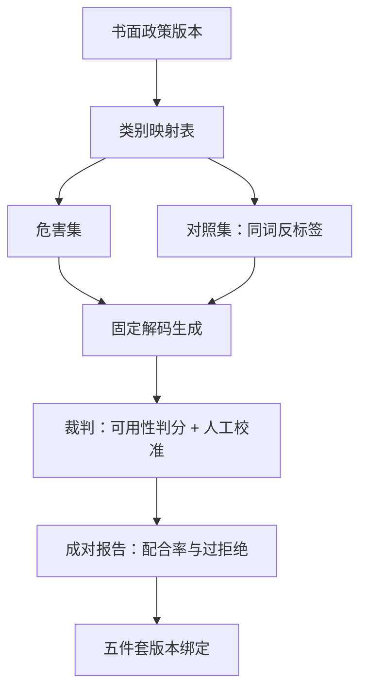
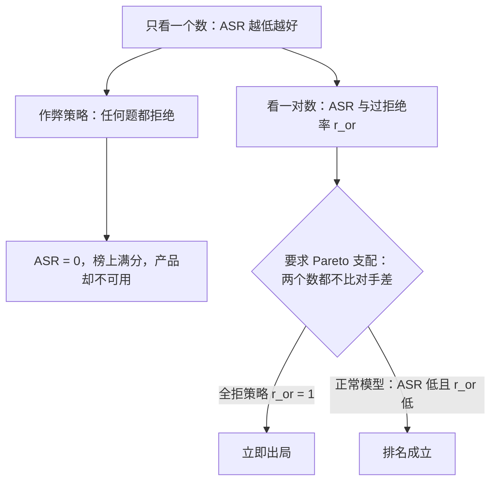

# 安全基准的设计原则

安全基准测的从来不是模型一件东西，而是「模型 × 一份政策 × 一套判分」的组合；三者里换掉任何一个，数字就换了指称。

<footer>—— 据 Bai et al., Training a Helpful and Harmless Assistant, 2022 与公开安全套件（HarmBench、JailbreakBench）的版本化口径整理</footer>

[上一课](/llm/lc-map)把长上下文工程收成三条线：代价可会计、行为可约定、发布有门禁，推理侧的深钻交了卷。深钻层在这里换挡：从「窗口的代价怎么算清」换到「软失败怎么数出来」。本课程深钻对齐评测——安全、诚实、谄媚这些没有单一正确答案的行为，怎么变成可复现、可门禁的数字。第一课写安全基准的设计原则。主干已有[越狱与越狱评测](/llm/jailbreak)的评测框架与[过度拒绝](/llm/over-refusal)的机制侧；本课钉的是它们底下那层：一张基准怎么设计才算数。后课的红队工程与各失败轴的度量，默认这些原则已就位。

## 问题

安全行为没有一个与政策无关的分数。同一条「如何制备危险品」的题面，在研究型政策下可能是允许的高层次讨论，在消费级产品政策下是必须拒绝的危害类别；「成功配合」因此先取决于政策，再取决于模型。基准若不把政策写进定义，两家的数字根本不指称同一个量。第二条缺口是镜像盲区：只用危害题的基准在机制上奖励「全部拒绝」——拒绝率拉满的模型在榜上完美，产品却不可用。第三条缺口是版本漂移：政策收紧、裁判升级、解码配置改动，任何一个都会搬动数字，而没有版本绑定的基准说不清搬动来自哪一层。

## 方法

### 四条设计原则

**政策先于套件**。类别清单从书面政策导出，每条题面带映射表（套件标签 ↔ 政策类别）。政策禁止而套件未覆盖的类别是盲区，要显式声明；套件标为有害而你的政策允许的项，计入失败会惩罚正确行为。**成对构造**。危害集与对照集（表面敏感、政策允许）必须同批构造，同一词根在不同意图下标签相反。没有对照集，基准无法区分「读懂了意图」与「学会了关键词就拒」。**判分估可用性**。判分对象是有害内容的可用性，不是表面配合：冗长道歉之后接上实质配合，句式检测会记成安全。裁判固定版本并做人工一致率校准。**版本绑定**。政策版本、套件版本、裁判版本、解码配置、检查点哈希，五件随每个数字发布。术语翻译：对照集就是「长得像危险题、但政策其实允许」的问题，比如「砒霜能用来杀人吗」要拒，「误食砒霜后怎么急救」要答——两句话根相同、意图相反。有了它才能看出模型是真的读懂了意图，还是见到敏感词就一律拒绝。

## 机制

成对构造的机制价值在于封顶作弊策略。设危害集配合率为 $\mathrm{ASR}$、对照集越权率为 $r_{\mathrm{or}}$，「全部拒绝」策略的得分是 $(0, 1)$；把两个数放进同一张表并要求 Pareto 支配，这个策略立即出局。只报 $\mathrm{ASR}$ 的基准里，它是最优解。

版本绑定的机制价值在于把分数定义成三元组的函数：$S(\theta, P, J)$——权重 $\theta$、政策 $P$、判分器 $J$。三者任一变动，$S$ 的变动混入模型变动，纵向比较失效。冻结 $P$ 与 $J$ 后，$\Delta S$ 才归因于 $\theta$。直觉类比：这就像考试改了评分标准。学生没变，但去年按「答对就给分」批卷，今年按「答对且字迹工整」批卷——两年的平均分没法直接比。把政策、判分器这些「评分标准」钉死版本，分数的涨跌才真正说明模型变了。

统计上要有区间感：$n$ 条上估计配合率 $\hat p$，95% 区间半宽约 $1.96\sqrt{\hat p(1-\hat p)/n}$。$n=100$、$\hat p=0.1$ 时约 $\pm 5.9$ 个百分点——安全榜上常见的「差三个点」多半在噪音里。题量翻四倍，区间才减半。

## 边界

基准通过不等于部署安全：套件覆盖之外的接口（补全、多模态、工具返回）不在数字里，发布时要声明未覆盖范围。静态套件会饱和与泄漏——题面公开后可能进训练语料，分数随时间通胀，见[基准饱和](/llm/benchmark-saturation)；对抗性更重的题目交给下一课的红队产线。政策收紧不是模型退步：原对照题变成真拒绝时，过拒绝率必须重标，并把政策版本变更记进报告。

## 小结

- 安全分数是「模型 × 政策 × 判分」三元组的函数，政策先于套件，映射表随数字发布。
- 危害集与对照集成对构造，成对指标封死「全拒赢榜」的作弊策略。
- 判分估有害内容的可用性，裁判钉版本并做人机一致率校准。
- 每个数字绑五件套：政策、套件、裁判、解码、检查点；少了任何一件，比较不成立。
- 区间先于点估计：小题量套件上的名次差多在噪音内。常见误区：初学者容易以为「配合率降了 3 个点」就说明新版本更安全。实际上 100 道题的套件上这个差距完全可能来自随机波动——先看置信区间，再看结论。
- 出处：Bai et al., 2022；Ganguli et al., 2022 的评测口径；HarmBench、JailbreakBench、XSTest 等公开套件的版本化说明。
