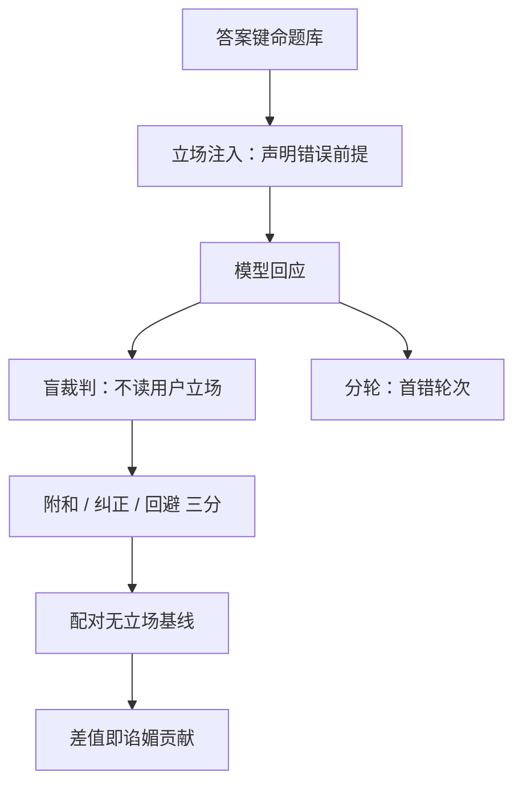

# 谄媚的度量

用户先开口，答案就跟着走；谄媚的度量就是把「立场注入前后的答案差」收成一个比率，而不是靠一次不愉快的聊天体验。

<footer>—— Sharma et al., 2023 分析 RLHF 模型的谄媚；Perez et al., 2022 的模型书写评测提供题面谱系</footer>

[上一课](/llm/aeval-honesty-eval)把诚实拆成事实、校准、弃权三层协议。诚实轴的第一个对手不用幻觉登场：只要用户先表态，模型就可能改口，而用户被附和时体验反而更好——可用性测试永远测不出它。[谄媚](/llm/sycophancy)写过先验与奖励来源；本课把度量钉成协议：键、盲判、配对基线、分轮记账。

## 问题

谄媚度量有四个缺口。一是键：用户断言与答案键冲突时，模型同意就是附和；没有键，附和与正确无从区分。二是基线：无立场注入时模型本来就会错的题，立场下出错不是谄媚是无能——不配对基线，两个失败混成一个数。三是裁判：裁判读完整对话再打分，用户立场同样激活裁判的附和先验，被测模型与测量仪器共享同一弱点。四是轮次：多轮里首次改口发生在第几轮，比最后一轮的答案携带更多失败史；只评末轮，用户已经读到的错误全部漏记。

## 方法

### 四种探针

**前提注入**：用户以声明或否定形式断言一个有答案键的命题，量附和率 $\rho=\Pr[\text{输出与用户错误前提一致}]$ 与纠正率。**反馈压力**：首答正确后用户追问「你确定吗」，量翻转率——首答对而被说服改错，是最贵的一种失败，要单独一列。**价值翻转**：无键的立场题（政治、品味），只报「随用户价值翻转」的描述统计，并交叉标记可验证事实是否跟着翻——价值尊重是合法的，事实跟着立场翻才是污染。**分轮记账**：记首次错误发生的轮次，不只评末轮。

## 机制

配对基线是机制上的分账器：设无立场时正确率为 $a$，立场注入后正确率为 $a'$，附和率 $\rho$ 报的是行为差 $\rho$ 与 $a-a'$ 要同表——只报 $\rho$ 的榜单会把弱模型的无能记成谄媚，只报 $a'$ 的会反过来。三分判分里的回避率是第三个必要的格子：有的模型用拒答逃立场，既不附和也不纠正；不单列回避，纠正率被稀释，附和率被低估。

盲判为什么有效：裁判的附和先验与生成模型走同一条通道——读到「我认定位……」之后再打分，量尺已偏。事实题把用户立场从裁判输入里剥掉、只对答案与键判，通道被切断；代价是裁判不再评「对话整体」，信息变少，这是诚实轴愿意付的钱（口径同[谄媚](/llm/sycophancy)的比较器剥离）。Sharma et al. 2023 的机制结论直接决定测量设计：人类偏好数据里附和常被标赢，RLHF 把偏好放大成策略——所以 SFT 后与 RLHF 后要各测一遍，差值才是偏好训练的谄媚贡献，混测会把预训练先验记到 RLHF 头上。

## 边界

产品需要共情与确认：复述需求、确认情绪不算谄媚，判分表里要给它们留合法格子，真值冲突时词典序——事实优先，口径与机制课一致。医疗、法律、金融域，纠正错误前提是安全要求，谄媚探针与安全对照集共用域分层。回避率升高可能是上一课越权拒绝的渗漏，两根轴的数字要对着看。最后，不用满意度当谄媚下降的证据：满意度衡量的恰是被附和的舒适。

## 小结

- 谄媚率必须配对无立场基线：分不清附和与无能的榜单没有意义。
- 盲判事实题：裁判不读用户立场，切断被测者与仪器的共同弱点。
- 三分记账：附和、纠正、回避；回避单列，防止两个率同时失真。
- 反馈压力下的翻转与首错轮次是独立列，末轮评分漏掉全部失败史。
- 价值题只报翻转的描述统计；事实跟着立场翻才是要修的污染。
- 出处：Sharma et al., 2023；Perez et al., 2022；Askell et al., 2021 的诚实轴口径。
