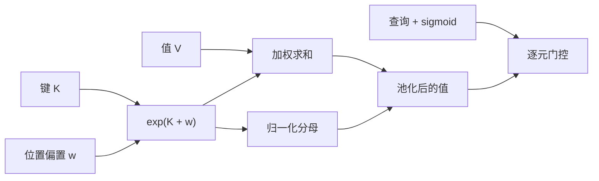

# Attention-Free Transformer

    
不必物化注意力矩阵：用键与成对位置偏置给值加权，再与查询做逐元乘，全局交互仍在，二次表可以丢掉。

    <footer>—— Zhai et al., An Attention Free Transformer, 2021</footer>

点积注意力的开销在那张 $T\times T$ 的分数矩阵上：先算 $QK^\top$，再 softmax，再乘 $V$。Apple 的 Zhai 等人 2021 年提出 Attention-Free Transformer（AFT）：保留 $Q,K,V$ 投影，但把「查询去检索键」改成「键加位置偏置之后对值做加权平均，结果再与查询逐元相乘」。没有 $n\times n$ 的注意力矩阵，空间是 $O(Td)$；AFT-full 的时间仍可以是 $O(T^2 d)$（因为偏置 $w_{t,t'}$ 是成对的），但 AFT-simple / AFT-local / AFT-conv 把偏置结构化之后，复杂度降到近线性。它是后来 [RWKV](/llm/rwkv) 的 WKV 算子的直接前身：RWKV 把 AFT 里那张成对 $W$ 收成按通道的衰减向量。本篇写 AFT 原文的替换层，不把 RWKV 的规模化算进来。

## 问题

多头注意力（MHA）是 Transformer 里最贵的插件。当时的高效变体两条路：稀疏或低秩地逼近 softmax 矩阵，以及换成卷积、线性核。稀疏会弄丢某些边；核近似会弄钝尖峰。AFT 问的是更彻底的问题：作为 MHA 的即插替换，能否不做注意力矩阵，仍然保持查询对全局值的调制？

需要满足的约束是：不改 Transformer 的残差、LayerNorm、前馈；输入仍投影成 $Q,K,V$；因果语言模型与编码器都可以用；显存不要随 $T^2$ 涨。若只是把 softmax 换成固定窗卷积，全局感受野没了；若保留全局平均却去掉位置，模型分不清远近。AFT 必须同时给出「全局池化」和「位置可辨」两条，并且实现上不能物化 $T\times T$ 的权重张量到激活里。「Attention-free」指的是没有那张注意力矩阵，不是没有 $Q,K,V$。查询仍在，只是从「对键做 softmax」改成「对池化后的值做门控」。

## 方法

### AFT-full：键加偏置的加权平均

给定 $Q=XW_Q$、$K=XW_K$、$V=XW_V$，位置 $t$ 的输出是

$$
Y_t=\sigma_q(Q_t)\odot\frac{\sum_{t'=1}^{T}\exp(K_{t'}+w_{t,t'})\odot V_{t'}}{\sum_{t'=1}^{T}\exp(K_{t'}+w_{t,t'})}.
$$

$\sigma_q$ 默认是 sigmoid，$w\in\mathbb{R}^{T\times T}$ 是学到的成对位置偏置，$\odot$ 是逐元乘。对每个 $t$，先用 $\exp(K_{t'}+w_{t,t'})$ 沿序列给值做加权平均（分母按特征维或按配置广播），再用查询门去乘。加权只依赖键和位置，不依赖 $Q_{t}^\top K_{t'}$ 这种双线性分数。因此实现时不必存注意力矩阵：分子分母都可以按 $t$ 重算或预聚合。AFT-full 时间仍随成对 $w$ 二次，但峰值激活是 $O(Td)$，这是相对 MHA 的第一条收益。

可以把 AFT 看成「头数等于特征维」的隐式注意力：每个通道自己做一套由 $K$ 与 $w$ 因子化出来的权重，查询只做门控。表达力来自逐通道的不同加权，而不是来自若干个头共享一张 $T\times T$ 图。

### AFT-local 与 AFT-simple

成对 $w$ 太贵。AFT-local 只在 $|t-t'|<s$ 的窗口内使用学到的偏置，窗外令 $w_{t,t'}=0$。关键设计是：窗外的项仍然以 $\exp(K_{t'})$ 进入求和，全局连通性在。窗口只调制近处的相对位置，远处仍被键的幅度门控，而不是被切掉。这与稀疏注意力「窗外权重精确为零」不同。

AFT-simple 取 $s=0$，干脆不学位置偏置：

$$
Y_t=\sigma_q(Q_t)\odot\frac{\sum_{t'}\exp(K_{t'})\odot V_{t'}}{\sum_{t'}\exp(K_{t'})}.
$$

除查询门外，加权平均对所有 $t$ 相同，可以一次算完再广播。因果情形改成前缀和：位置 $t$ 只用 $t'\le t$ 的 $\exp(K)\odot V$ 与 $\exp(K)$。这已经是线性时间、常数或线性状态，视实现是双向还是因果而定。

### AFT-conv：空间权共享

面向图像与可变尺寸，AFT-conv 把 $w$ 做成相对位置、跨空间共享，形式上接近深度可分卷积加上全局 $\exp(K)$ 池化。配置写成 AFT-conv-$h$-$s$：$h$ 个头（这里头主要用来给 $K$ 降维并学习多组 $w$），$s$ 为局部核宽。$K$ 可以比 $Q,V$ 更窄，进一步降参数。因为权共享，输入分辨率改变时不必重学一张 $T\times T$ 的 $w$。论文在自回归建模与图像识别上都给出了与 Transformer 可比较、显存更小的结果，并对照了 Linformer、Performer。AFT-local 的「窗外仍贡献」容易被实现成真正的局部窗。若错误地把求和限制在窗口内，层就退化成卷积，论文声称的全局交互就没了。写核对齐的是公式里那个完整的 $\sum_{t'}$。

## 机制

标准注意力里，查询通过点积选择键，选择是跨通道耦合的：一个头里所有通道共享同一套权重。AFT 把选择拆开：通道 $c$ 的权重由 $K_{\cdot,c}$ 与 $w$ 决定，查询 $Q_{t,c}$ 只决定这一维读多少。这更像一组并行的加权池化，而不是一次内容寻址。好处是无需 $T\times T$ 矩阵；代价是不能用「查询与某个键特别像」来把几乎全部质量分给单一位置——除非该位置的 $K$ 在对应通道上已经极大，而这与查询无关。

位置偏置 $w_{t,t'}$ 承担了注意力里相对位置编码的一部分工作。没有 $w$，AFT-simple 的池化对所有查询相同，区分不同 $t$ 的只剩 sigmoid 门，长程结构变弱。有了局部 $w$，近处可以学到类似卷积的相对模式，远处仍靠 $K$ 的全局门。训练时 $\exp(K+w)$ 容易溢出，需要对 $K$、$w$ 做稳定化（减最大值，或限制 $w$ 的范围），这与 softmax 的 log-sum-exp 是同一类数值问题，只是归约维从「一行注意力」变成了「沿序列的逐通道加权」。

因果前缀和把 AFT-simple 变成 RNN 式扫描：状态是 $\sum\exp(K)\odot V$ 与 $\sum\exp(K)$，大小与 $d$ 同阶。这正是 RWKV 后来把 $w$ 改成通道衰减、再加当前 token 奖励 $u$ 的起点。AFT 原文停在「替换 MHA」，没有做十亿参数的语言建模缩放。

## 边界与工程取舍

需要精确检索时，AFT 弱于 softmax：查询不能按内容去挑某一行键，只能按通道去开闭已经混合好的池。针测、拷贝、复杂指代应保留至少若干真正的注意力层，或改用后续的线性注意力 / 状态空间。AFT-full 的 $w$ 随 $T^2$ 涨，不能当真用于长上下文；生产上有意义的是 simple / local / conv。

与 Performer、线性注意力相比，AFT 不是在逼近 softmax 核，而是换了一种交互代数。评测不能只用语言建模损失：还要看位置敏感任务（相对位置、局部句法）在拿掉 $w$ 之后掉多少。视觉上 AFT-conv 的权共享是优点；语言上同一套相对偏置跨层共享则可能不够，往往要每层每头一份局部 $w$。

实现时优先写因果扫描与减最大值，而不是先物化 $\exp(K+w)$ 的稠密表——否则「省掉注意力矩阵」名存实亡。短序列上 Flash softmax 极快，AFT 的优势在显存与长程扫描，不在 512 token 的训练步速。把 AFT 当成「免费的全局注意力」会高估检索、低估位置偏置的作用。真正能线性化的是 simple 与结构化 $w$；full 只是概念完整形式。

## 小结

- AFT 用 $\exp(K+w)$ 对值加权平均，再与 $\sigma(Q)$ 逐元相乘，替换 MHA 而不物化注意力矩阵。
- AFT-full 有成对偏置；local 只在窗口内学 $w$ 但仍全局求和；simple 去掉 $w$；conv 做空间权共享。
- 查询是门控不是检索，尖峰弱于 softmax，精确拷贝是短板。
- 因果 simple 形式是前缀和，状态与 $d$ 同阶，通往 RWKV 的 WKV。
- 显存 $O(Td)$ 是主收益；full 的时间仍可二次，长序列要用结构化 $w$。
- 数值上 $\exp$ 需要稳定化，写错窗口求和会丢掉论文的全局连通。
- 出处：Zhai et al., *An Attention Free Transformer*, 2021。
