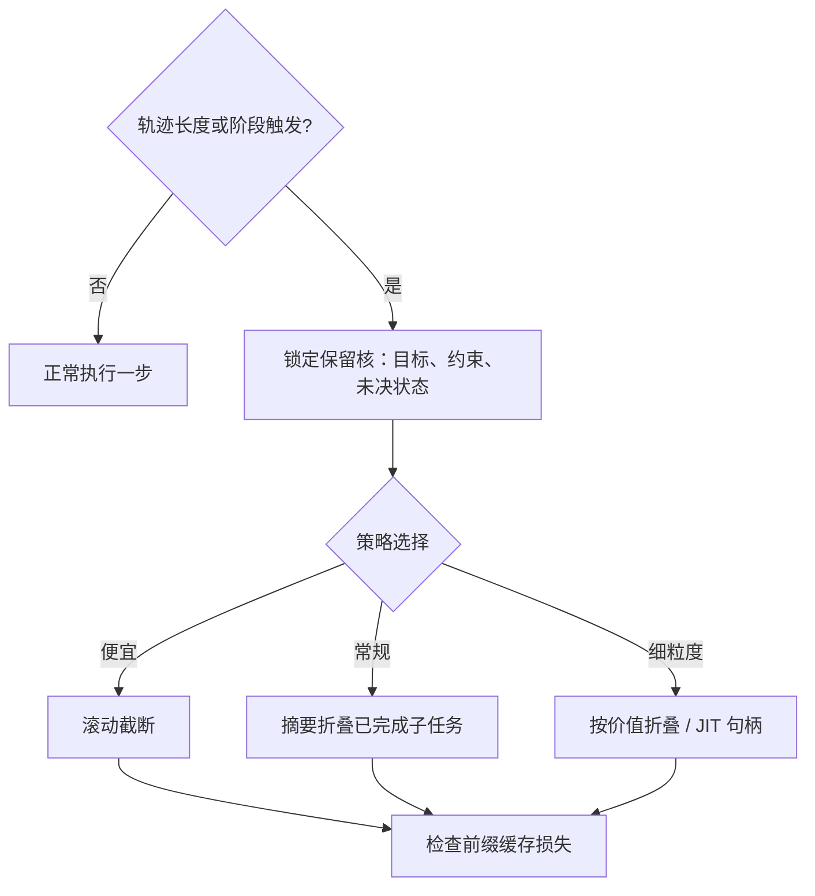

# 上下文管理策略

轨迹不是越长越好，也不是越短越好；上下文是注意力预算，管理策略决定每个 token 花在哪个任务上。

<footer>—— 据 Chroma，Context Rot 技术报告（2025）；Anthropic 关于代理上下文工程的博文整理</footer>

[上一课](/llm/agent-tool-protocol-deep)把动作写成协议事件，其中「结果回填」是轨迹增长的唯一入口。本课管增长本身：[长上下文收束](/llm/lc-map)的账本是静态部署的账，代理的账本每个任务自己重演一遍，而且增速由模型自己的行为决定。

## 问题

轨迹单调增长带来三个复合问题。成本上，每一步都重发全部历史，累计输入 token 随步数近似平方增长。质量上，输入变长后即使任务不难，表现也不稳定——[Context Rot 上下文腐烂](/llm/context-rot)把这命名为注意力预算的耗散；中部信息还会被挤到盲区（[Lost in the Middle](/llm/lost-in-middle)），第一步定下的约束到第二十步就像没说过。机制上，全量保留会让窗口被工具输出占满，模型反而找不到当前目标。所以策略不是「删不删」，是三个决策：何时触发、保什么、丢什么。做错的方向都很具体：从不压缩，长任务死在预算与腐烂上；乱压缩，关键约束被折叠掉，任务在中途换目标而不自知。

## 方法

**触发器**：token 阈值、轮数、或任务阶段边界；阈值触发便宜，阶段边界触发更安全。**保留核**：系统提示、未决状态（当前目标、已完成与待办、关键约束）、最近若干轮。**策略谱系**由粗到细：滚动截断最粗暴，丢掉的早期约束不会自己回来；[Compaction 摘要压缩](/llm/compaction-summarize)把已完成子任务折叠成摘要；[结构化记忆压缩](/llm/structured-memory-compaction)把工具输出抽成字段再存；[Mem1 递归上下文重写](/llm/mem1-context)把上下文从存储改成函数——每步按需重写；[AgentFold 上下文折叠](/llm/agentfold)按证据价值丢弃中间步骤；[Just-in-Time Context Retrieval](/llm/jit-context-retrieval)把工具结果落盘、只回句柄，要用再取。**缓存约束**反着压：[Prompt Cache](/llm/prompt-cache) 按前缀命中，压缩改前缀等于缓存全灭；工程解是把稳定段放最前、把可压缩段放后缀，并且只在阶段边界动手。

## 机制

为什么「保什么」以未决状态为准：任务是有向图，完成的子任务可以折叠成一行结论，未决分支折叠一行就丢一个出口——摘要丢的不是字，是选择权。为什么关键约束要周期性重述：腐烂发生在中部，重述等于把约束重新搬到注意力的高地，这比指望模型「记得开头」便宜。缓存与压缩的冲突是同一笔账的两面：缓存买的是前缀逐字节稳定的复利，压缩买的是注意力预算；策略的正确形状是分层——系统提示与规则文档（[AGENTS.md 项目规范](/llm/agents-md-spec)、[渐进式披露](/llm/progressive-disclosure)的加载方式）永远稳定吃缓存，易变的工作集放尾部随时折叠。

多轮前缀命中是复利：[多轮前缀命中](/llm/multi-turn-prefix)的机制与 [前缀缓存](/llm/kv-prefix-cache)相同——在压缩点之后，所有历史缓存作废，下一步的输入全部重算。把压缩点从「每次都压」改成「阶段边界才压」，缓存命中率的变化是数量级的。

## 边界

压缩后细节去哪是[记忆系统的实现](/llm/agent-memory-implementation)的问题，本课只管窗口内。提示压缩（[提示压缩 LLMLingua](/llm/prompt-compression)）是逐段降速率的技术件，与折叠是互补不是替代。多代理下每个代理各带一份上下文，隔离与传递的规则在[多 Agent 编排模式](/llm/agent-multi-orchestration)。显存的静态账不在此重复（[长上下文的显存账](/llm/lc-memory-account)已算）；本课是同一笔账在轨迹时间轴上的动态版。没有免费的策略：任何压缩都可能丢掉后来才显出价值的细节，评测要能捕捉这种「丢早了」的失败。

## 小结

- 上下文是注意力预算：轨迹管理的目标是把预算花在未决状态上，不是堆历史。
- 触发器、保留核、策略谱系三个决策分开定；阈值触发便宜，阶段边界更安全。
- 关键约束周期性重述，抵消中部遗忘；完成子任务折叠，未决分支不折叠。
- 缓存买前缀稳定，压缩买注意力；分层摆放让两者共存。
- 压缩有损且不可逆，评测必须能捕捉「丢早了」。
- 出处：据 Chroma Context Rot 报告（2025）与 Mem1、AgentFold 等方法的公开口径整理。
