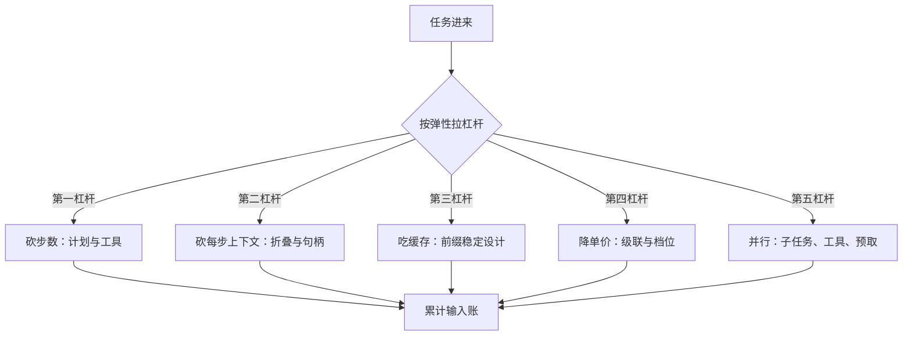
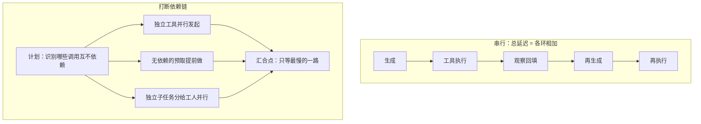

# 成本与延迟优化

代理的花费不与任务难度成正比，与轨迹形状成正比；最贵的杠杆常常最先被拉——降单价，而它恰恰是最慢的一根。

<footer>—— 据服务成本模型与代理产品的成本口径整理；token 单价见各厂商定价页</footer>

[上一课](/llm/agent-eval-success-process)把过程指标量了出来，其中步数与 token 成本在本课定价。单次调用的成本工程（[百万 token 成本](/llm/cost-per-mtok)、[服务成本模型](/llm/serving-cost-model)）已经是常数账；代理的账多了两个变量：步数由模型行为决定，历史由轨迹累积。

## 问题

代理成本结构的第一定律是平方律：n 步任务若每步轨迹增长 s 个 token，总输入约为 $s \cdot n(n+1)/2$——步数翻倍，总输入近四倍。第二定律是延迟串行：每步要等「模型生成 + 工具执行 + 观察回填」，n 步的墙钟时间是链条求和，没有并行就线性堆。术语翻译：墙钟时间就是「你拿秒表在旁边实测的等待时间」——用户从点击到看到结果的全部秒数，与 CPU 花了多少计算时间是两回事。用户只感知墙钟，所以串行链条再短的一环也是实打实的等待。工程上最容易犯的错是杠杆排序错误：第一步先去谈更便宜的模型单价，而单价是常数因子；轨迹形状是平方因子，砍错方向优化十倍单价也追不上多出的步数。另一个错是把缓存当免费午餐：缓存命中的前提是前缀逐字节稳定（[Prompt Cache](/llm/prompt-cache)），而上一课的压缩策略恰恰改前缀——两者不做协调，省下的 token 钱会以缓存全灭的方式还回去。

## 方法

杠杆按弹性排序。**砍步数**：更好的计划与更强的工具各抵几步——一次带过滤条件的查询抵五次翻页；规划质量的钱花在这里回报最高。**砍每步上下文**：[上下文管理策略](/llm/agent-context-strategies)的折叠与 JIT 句柄直接减小 s。**吃缓存**：系统提示与工具说明放最前并逐字节稳定；可变内容放尾部；[多轮前缀命中](/llm/multi-turn-prefix)让第 k 步只需为增量付费。**降单价**：[模型路由与级联](/llm/model-cascade-routing)让简单步（格式化、分类、抽取）走小模型，难步走大模型；级联判据要便宜，否则省的钱花在判据上。直觉类比：级联就像医院分诊——感冒发烧去社区门诊（小模型，快且便宜），疑难杂症才转专家门诊（大模型，贵但强）。分诊护士本身要快（判据便宜），否则排队做分诊比直接看病还慢。**并行**：独立子任务并行分派（[多 Agent 编排模式](/llm/agent-multi-orchestration)的工人并行）、同一轮的多个独立工具调用并行发起、无依赖的预取提前做。延迟侧另有一套：流式输出改善感知延迟（首 token 延迟见 [TTFT](/llm/ttft)，逐 token 体验见 [交错延迟 TPOT / ITL](/llm/tpot-itl)），工具并行化打断串行链。

## 机制

为什么步数杠杆最大：它作用在平方项上。算例：$s=2000$、$n=20$ 时总输入约 $2000 \times 210 = 42$ 万 token；步数砍到 10，直接降为 $2000 \times 55 = 11$ 万，省约 74%——同等努力下降单价或换小模型都拿不到这个比例。缓存与压缩的冲突是同一笔账的分配问题：缓存要求「已发生的不变」，压缩要求「没用的消失」；协调方案是分层摆放加阶段边界压缩（回指上一课），让缓存在阶段内复利、在边界一次性让路。延迟的机制解是打断依赖链：把「必须等上一步结果才能发起」的调用识别出来，其余全部并行或预取；串行链每多一环，尾部延迟就是乘法。

给成本模型留三列非模型支出：工具与沙箱的执行时长、外部 API 费、人工介入的工资折算。只算 token 的成本表会系统性高估自动化的便宜——长尾任务里人工接管才是最大单项。

## 边界

成本优化有三条不可越的线。恢复预算不能砍：重试上限、验证器、门禁检查是保险费（[错误恢复与重试](/llm/agent-error-recovery)），省掉它们把失败成本后移并放大。质量-延迟是帕累托前沿不是免费午餐（[延迟-吞吐帕累托](/llm/latency-throughput-pareto)）：每一次降延迟的选择都要问牺牲了哪个分位数。常见误区：初学者容易以为「命中缓存就是白拿钱」。实际上缓存省的是算前缀的钱，前提是前缀一个字节都不能改——哪怕在系统提示末尾加了句日期，从那以后的所有缓存全部作废，账单反而更贵。压缩太狠省的是 token、赔的是任务成功率——回到[评测：任务成功率与过程](/llm/agent-eval-success-process)把「省钱后成功率」测出来，成本优化才有验收标准。

## 小结

- 平方律先于单价：$n$ 步、每步 $s$ token，总输入 $\approx s \cdot n^2/2$；步数是第一杠杆。
- 杠杆顺序：砍步数、砍上下文、吃缓存、降单价、并行；单价是常数因子。
- 缓存与压缩协调：稳定段吃缓存复利，压缩只在阶段边界发生。
- 延迟优化=打断串行依赖链；感知延迟用流式补。
- 成本表要含工具、外部 API 与人工接管，不只算 token。
- 出处：成本口径据各家定价与服务成本模型整理；机制结论为本课程各课汇总。
