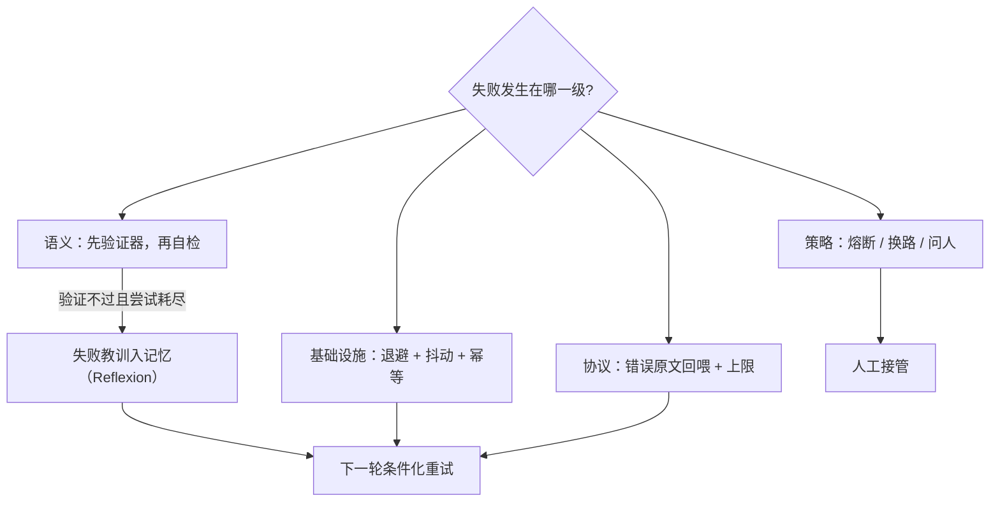

# 错误恢复与重试

「失败」不是一个类别；超时、坏 JSON、结果错误、原地打转是四种病，各有各的药，混着治只会越治越贵。

<footer>—— 据 Shinn et al., Reflexion, NeurIPS 2023 的语言化反思机制；工程口径按失败分级整理</footer>

[上一课](/llm/agent-multi-orchestration)把单环劈成多条，每条环各自会失败。本课把失败分级、给每级配恢复动作：不分级，恢复就是乱的——把瞬时错误当任务失败，成功率虚低；把语义错误当瞬时错误，无限重试烧穿预算。

## 问题

失败至少分四级，恢复动作互不通用。**基础设施失败**：超时、限流、5xx、断连——错不在任务，重试是正确动作，但要有退避与幂等前提。**协议失败**：JSON 解不开、参数违反 schema、调用名不存在——重试同样的输入几乎必然再错，正确动作是把错误原文回喂让模型改参数（[工具协议深钻](/llm/agent-tool-protocol-deep)的错误通道），或用 [JSON / 结构化输出](/llm/json-schema-decode)的约束通道在源头消灭。**语义失败**：工具执行成功、返回 200，但结果不对——检索漏了、补丁没修好、订错了日期；这一级模型自己往往不知道错，靠结果重试是空转，必须先有验证器。**策略失败**：死循环、同一调用反复、目标漂移——个体动作全对，轨迹在错误的整体方向上收敛，退避和回喂都无效，需要熔断与换路。评测口径要先钉住这四级怎么计入（[智能体与工具评测协议](/llm/agent-eval-protocol)），否则「成功率」里混着四种不同的死法。

## 方法

每级配最小恢复集。基础设施：指数退避加抖动，写操作带幂等键，重试次数与预算联动。协议：回喂上限两到三次，超限升级为策略失败处理。语义：验证器先行——任务自带的断言（测试、lint、对账）最硬；模型自检（[自我验证与回溯](/llm/self-verification-backtrack)、[自我批判与修订](/llm/self-critique-revise)）次之但会漏同源错误；判过仍失败，走跨尝试的教训沉淀：[Reflexion](/llm/reflexion) 把失败语言化成「哪里错、下轮改什么」存进记忆，让下一次尝试条件化于上一次的死因。策略：熔断——同一工具同一参数重复出现即熔断；检查点——轨迹可从分叉点重放，不必从头再来；换路——换工具、换分解、或把决策交还给人。

## 机制

重试有效的统计前提是失败相互独立：温度不动、提示不动地再采样一次，遇到的是同一个难点，失败高度相关。所以「重试」要么改条件（换提示、换参数、换工具），要么承认这不是重试是空转。语义级验证器是恢复体系的分水岭：没有验证器，代理对「错但成功」的状态无从察觉，后续每一步都建立在坏状态上；有验证器，语义失败才从不可见变成可触发。Reflexion 的机制价值在把失败从「噪声」变成「经验」：执行轨迹是情景记忆（[记忆系统的实现](/llm/agent-memory-implementation)），提炼出的教训是程序性记忆——同一任务第 k 次尝试应当比第 1 次聪明，这是代理与纯函数采样器的本质差别。

幂等键给重试授权：查询类工具天然可重试；写入类工具没有幂等键时，「超时后重试」可能在服务端成功两次。工具描述应写明幂等语义，编排器据此决定哪类失败允许自动重试。

## 边界

恢复不能掩盖系统性缺陷：重试成功次数要单独记账，占比高说明提示、工具或 schema 该修，而不是让重试兜底。验证器也有自己的失败模式：断言写得松，语义失败漏网；写得紧，正确解被误杀——τ-bench 用 $\mathrm{pass}^k$ 把「稳定做对」与「偶尔蒙对」分开（[τ-bench / AgentBench](/llm/taubench-agentbench)），恢复设计的最终目的正是把后者变成前者。人工接管不是失败：接管的触发点、等待时长与交接上下文都该是显式设计（[安全围栏](/llm/agent-guardrails)会把不可逆动作的卡点制度化）。

## 小结

- 失败四级：基础设施、协议、语义、策略；每级恢复动作不同，先分级再动手。
- 重试有效的前提是失败独立；不改条件的重试是相关失败上的空转。
- 语义失败的入口是验证器：没有验证器，代理在坏状态上继续盖楼。
- Reflexion 把死因语言化入记忆，让第 k 次尝试条件化于前 k−1 次。
- 熔断、检查点、人工接管是策略级的三件套，触发阈值显式化。
- 出处：失败分级与退避重试为工程口径；Reflexion 见 Shinn et al., NeurIPS 2023。
