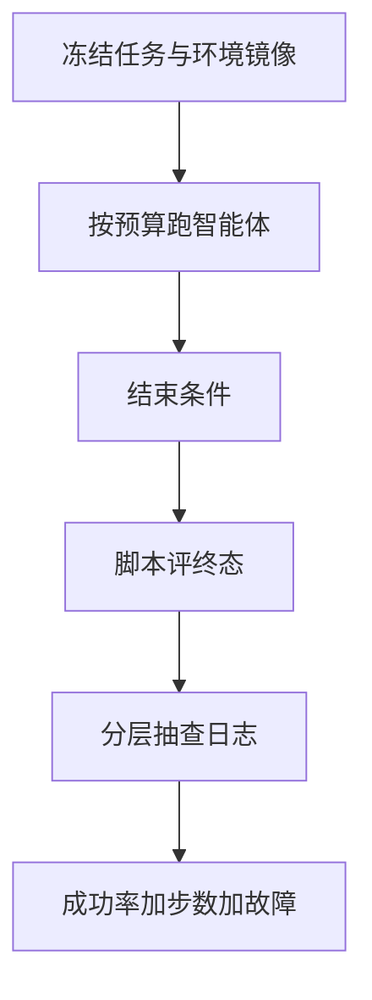

# 智能体与工具评测协议

一次成功率不是协议：还要规定环境是否重置、工具是否允许联网、失败是否可重试、以及轨迹哪一段算任务结束。

<footer>—— 对照 SWE-bench、OSWorld、WebArena 等把环境与评分写成可复现的试验</footer>

[人工 vs 自动](/llm/human-vs-auto-eval) 解决选仪器。智能体任务的仪器往往是 **环境 + 脚本评分 + 抽查**，比 GSM8K 多出时间、状态、副作用。本课写协议必须钉死的字段，使「工具用得好」这句话可复现。缺口来自产品演示无法回归：同一提示，浏览器状态、API 限额、页面改版都会改结果。[规划 vs 反应](/llm/plan-vs-react) 改的是控制流；本课改的是怎么量它。后课种子方差假定协议本身已经冻结。

## 问题

智能体评测的随机变量包括：模型解码、工具返回、环境初始态、墙钟超时、以及评分器。只固定模型种子，仍可能一周后网页变了、分数漂 10 个点。协议要把环境版本（镜像、网页快照、仓库 commit）、工具白名单、网络策略、步数 / 时间预算、重置规则写成试验的一部分。SWE-bench 用测试补丁与仓库快照；OSWorld 用虚拟机状态；WebArena 用自建站点。它们成功不是因为模型简单，而是因为 **世界被钉住**。

开放互联网上的 computer-use 演示几乎不可能成为科学数字，除非你承认测的是「今天的网页 × 今天的模型」。协议应显式选择：可复现沙箱，或活网加时间戳（后者不能跨周对比）。

### 评分器要对准任务完成，不是轨迹像不像

用 LLM 法官读 ReAct 日志打「是否合理」，测的是文风。应用终态：单测通过、文件是否存在、表单是否提交到沙箱数据库、是否停在目标 URL。过程分最多当诊断。这与可验证奖励课一致，只是环境更重。允许重试的协议必须规定最大尝试次数与是否计入步数。产品可以重试；论文若偷偷重试再报 pass@1，是在报 pass@k。k 要写出来。

## 方法

### 协议清单要进哈希

一份最小协议清单：

- **任务集版本**与拆分（dev 禁止调参到过拟合）。
- **环境镜像** / commit / 种子化初始态。
- **工具面**：函数 schema、浏览器是否可见、文件系统根、网络。
- **预算**：$N$ 步、墙钟、$L$ token、费用。
- **结束条件**：提交动作、显式 finish、或超时。
- **评分**：自动脚本；失败样例的人抽查比例。
- **随机性**：解码温度、环境种子（下一课展开）。

报告应分：成功率、平均步数、超预算率、工具错误率、以及「因环境故障作废」的数量。把环境故障算模型失败或算重跑，必须声明。

## 机制

智能体分数对协议极度敏感：多给一步预算，反应式循环可以多试一次检索；关掉网络，依赖搜索的 agent 归零。这不是噪声，是任务被重新定义。比较两个模型必须在同一协议哈希下。协议一改，旧分作废，与 Arena 换周不可比类似，但这里连「同一周」都不够——要同一镜像。

工具失败（超时、5xx）若让模型自由发挥「我猜结果」，评分应标环境错误，否则惩罚的是基础设施。协议里应允许有限次工具重试且不计入模型步数，或计入但单独报表。混在一个成功率里无法改进系统。

多步信用在训练里难，在评测里同样难：脚本只能看终态时，过程中误删文件再恢复仍算成功。若关心安全性，要另加不变量检查（是否访问了白名单外路径），不能只看最终答案对。

### 与人评的衔接

终态对但用户不可接受（删了无关文件、权限过大）必须人看轨迹。抽查应按失败模式分层：超时、循环工具、幻觉参数、越权。全随机抽查会把时间浪费在大量平凡成功上。人评 rubric 针对协议的不变量，而不是再打一遍「回答是否流畅」。

## 边界与工程取舍

活网评测可作为监测，不作为论文主表。内部 CI 应用沙箱快照。计算机使用（GUI）的像素与分辨率要钉，否则定位动作全部漂移。多语言站点、登录态、验证码应排除或用假凭证写进镜像，否则测的是验证码农场。

不要用聊天 Arena 代理工具能力。也不要用无环境的 function-calling JSON 语法正确率代理「会干活」——那只是 schema 解码，本单元后课会单独训，评测上它是必要非充分。

引用 SWE-bench、OSWorld、WebArena 时引用它们的环境与评分定义，不要只抄榜上百分比。换模型全家桶却换掉隐藏测例，数字不可比。

## 小结

- 智能体评测的对象是模型 × 冻结环境 × 预算 × 结束规则。
- 用终态脚本评分，过程法官只做诊断；重试次数即 $k$。
- 环境故障与模型失败分栏；安全性用不变量，不只看对错。
- 协议哈希一变，历史分作废。
- 活网可监测不可当主表；GUI 还要钉分辨率。
- 出处：SWE-bench、OSWorld、WebArena 一类环境化基准的协议精神。
