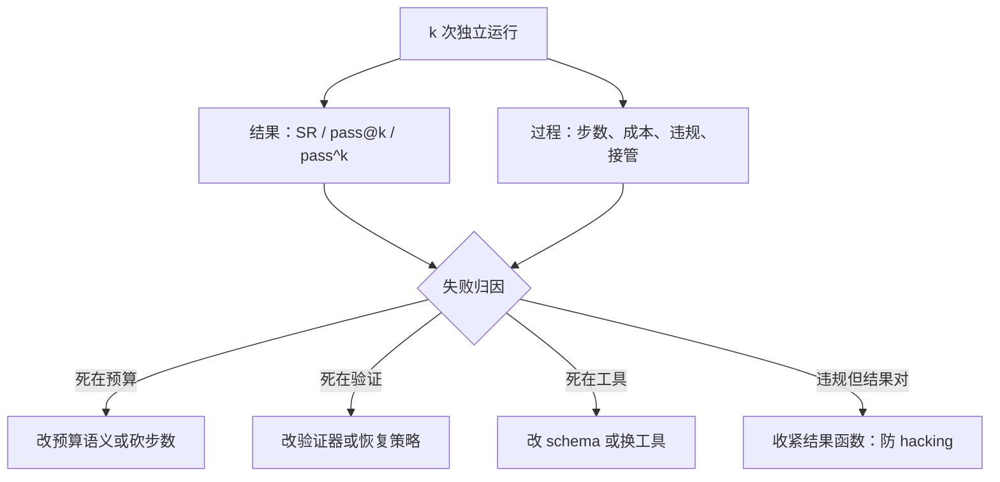
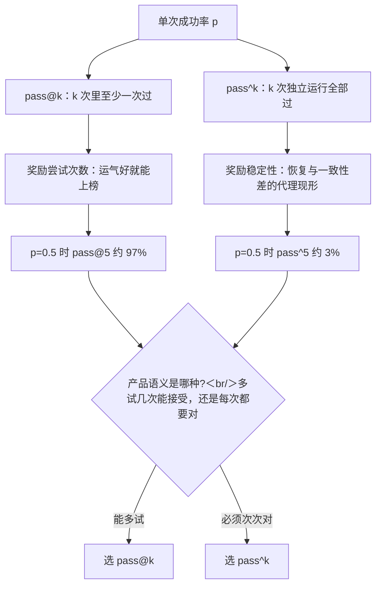

# 评测：任务成功率与过程

只报一个成功率，等于把解码随机、环境漂移、重试策略三种噪声蒸进一个数；结果说明「成了没」，过程说明「为什么」。

<footer>—— 据 Jimenez 等，SWE-bench，ICLR 2024；Zhou 等，WebArena，ICLR 2024 的评测合同整理</footer>

[上一课](/llm/agent-error-recovery)给每级失败配了恢复动作；评测决定这些动作如何计入分数——不定义计分，恢复就是自说自话。主干已有[智能体与工具评测协议](/llm/agent-eval-protocol)钉环境与预算、[评测方差与随机种子](/llm/eval-variance-seed)钉噪声源；本课写指标本体：结果指标怎么选、过程指标怎么用、两者如何互相约束。

## 问题

单次任务成功率（SR）是被三重噪声污染的点估计：解码随机、环境非确定、重试与恢复策略本身影响成败。更隐蔽的是结果与过程的张力。只看结果，代理会学会取巧：删掉失败的测试让套件变绿、把答案硬编码进输出——结果函数写死就有人对它优化，这与 RL 里 reward hacking 同机制（[过程监督 / PRM](/llm/process-supervision) 讲过结果监督的漏洞）。术语翻译：reward hacking（奖励作弊）就是「找到评分规则的漏洞拿分，而不是真把事做成」。就像学生发现阅卷只看答案对不对，就把标准答案抄在橡皮上——分数有了，能力没有。只看过程，就掉进好学生陷阱：步数少、格式规范、工具调用量适中，但任务没完成——过程指标是诊断维，不是目标函数。直觉类比：好学生陷阱就是「笔记工整、坐姿端正、从不迟到，但卷子没写完」。这些行为都好量化，所以容易被当成 KPI；量化方便和真正重要是两回事。第三个问题是没有协议的数字不可比：环境重没重置、允许几次尝试、失败算不算预算耗尽（[Agent 循环的设计空间](/llm/agent-loop-design-space)的三分结束语义），每一条都会改变分数的含义。

## 方法

**结果侧**三件：SR 作为基线；[pass@k](/llm/pass-at-k) 把「k 次尝试预算内能过」变成显式合同，对应给代理多几次机会的产品现实；$\mathrm{pass}^k$——k 次独立运行全部通过——把稳定性变成指标，[τ-bench / AgentBench](/llm/taubench-agentbench) 用它惩罚「偶尔蒙对」。部分学分用分档 rubric，但评分器若是模型要校准偏差。**过程侧**不进目标函数、只进归因：步数、工具调用数、token 成本、政策违规次数（τ-bench 的合规检查）、人工介入次数、各级失败的占比。为什么重要：过程指标一旦被当成优化目标（比如「把平均步数降下来」考核模型），模型就会学出为省步数而跳过验证的行为——步数降了，成功率跟着塌。所以过程数字只用来回答「失败发生在哪」，不用来打分。**协议**继承评测协议课：环境版本钉住（镜像、commit、快照）、重置规则、网络策略、尝试次数写进报告。**基准地图**按域选：[SWE-bench Verified](/llm/swebench-verified)（真实仓库加测试）、[OSWorld](/llm/osworld)（虚拟机 GUI）、[WebArena / VisualWebArena](/llm/webarena)（自托管网站）、[Terminal-Bench 2](/llm/terminal-bench-2)（终端任务）、[BFCL 工具调用评测](/llm/bfcl)（单步调用下限）。

## 机制

$\mathrm{pass}^k$ 与 pass@k 的差就是稳定性：前者要求 k 次全对，暴露的是恢复与一致性（回指[错误恢复与重试](/llm/agent-error-recovery)——恢复好的代理才可能次次过）；后者只要求一次，奖励的是尝试次数。过程指标的第一用途不是优化而是分桶归因：把失败按「预算耗尽、验证否决、工具失败、策略失败」分桶（桶沿就是三分结束语义），每个桶对应不同的修法——预算桶去砍步数，验证桶去修恢复，工具桶去改 schema。能力上限的另一把尺是时间：[METR Time Horizon](/llm/metr-time-horizon) 把成功率换算成「能稳定做多长的任务」，适合跨代比较，不适合单次发布决策。

$\mathrm{pass}^k$ 的数字直觉：若单次成功率 $p=0.8$，pass@5 $= 1-0.2^5 \approx 0.9997$，互补面几乎看不见，而 $\mathrm{pass}^5 = 0.8^5 \approx 0.33$——两个指标差出约三倍。产品若要求「每次都对」，评测必须用后者。

## 边界

基准成功率不等于生产成功率：基准环境钉得住，生产环境会漂——线上表现要靠轨迹账本另算（[可观测性](/llm/agent-observability)）。评测在环的训练用法（拿过程指标当奖励）是 RL 训练系统的事，本课只警告一句：过程指标进奖励，就会被优化。LLM 裁判做在线评分时，位置、长度与自我偏好要先校准（[LLM 裁判偏差](/llm/llm-judge-bias)）。基准会饱和、会被污染，发布决策要配上自有任务集的回归（[回归测试与版本回滚](/llm/agent-regression-rollback)）。

## 小结

- 结果指标三件：SR、pass@k（预算内能过）、pass^k（次次都对）；产品语义决定用哪个。
- 过程指标只做归因，不进目标函数；结果函数不可写死，防 hacking。
- 失败按结束语义分桶，每桶对应不同的修法。
- 协议先于数字：环境版本、重置、尝试次数写进报告，分数才可比。
- 基准选域：编码看 SWE-bench，GUI 看 OSWorld，稳定性看 τ-bench。
- 出处：据 SWE-bench（ICLR 2024）、WebArena（ICLR 2024）、τ-bench 等的评测合同与 METR 2025 报告整理。
