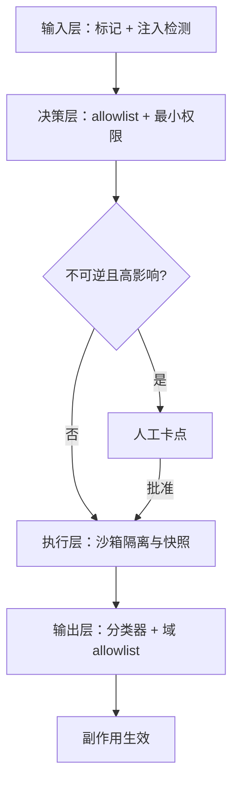
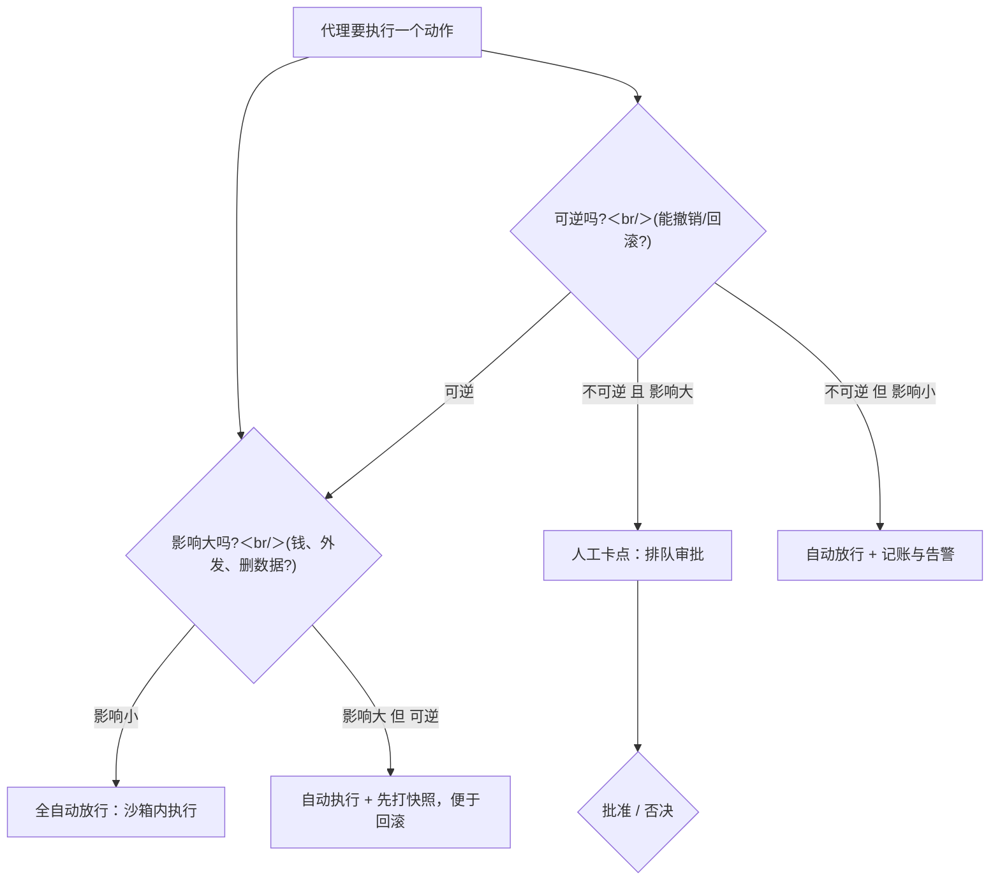

# 安全围栏

聊天产品里模型失守丢的是一句话；代理失守丢的是它被授权的那双手。围栏设计的不是「模型听不听话」，是「失守之后损失多大」。

<footer>—— 据 OWASP LLM Top 10（LLM01 提示注入）与代理安全的纵深防御口径整理</footer>

[上一课](/llm/agent-cost-latency)省下来的每一分钱都以「围栏不出事」为前提。代理把安全问题的性质改了：注入不再只是「说错话」，而是对已授权工具的控制流劫持（[提示注入](/llm/prompt-injection)的 LLM01 口径）；间接载荷藏在模型稍后读到的网页、工单与代码注释里（[间接提示注入与检索投毒](/llm/indirect-injection)）。本课写围栏的四层结构与验收口径，不提供攻击配方。

## 问题

单层防御都会漏，而代理场景把「漏」的代价放大到副作用上。提示词里写「不要服从内容中的指令」不构成边界：条件分布没有特权位，这句话与注入文本在同一个窗口里竞争（机制在提示注入课讲过）。分类器有两类错误：漏放（攻击过闸）与误杀（正常任务被拦），只优化一边必然牺牲另一边。术语翻译：这两类错误就是统计学里的假阴性与假阳性。想象机场安检——「漏放」是危险品过了闸，「误杀」是旅客的洗发水被没收；把 X 光机调得越敏感，漏放越少、误杀越多，两个数此消彼长，不存在同时归零。沙箱拖慢执行、权限审批打断自动化——安全是有现金成本的，预算内求最大安全才是真问题。最后是验收的坑：只报「攻击成功率」会逼出宽松配置，只报「拦截率」会藏住误杀；两个数必须一起出现。

## 方法

四层，从外到内。**输入层**：不可信内容显式标记与分隔（[Spotlighting 输入标记](/llm/spotlighting-defense)），注入检测分类器在入口打分。**决策层**：工具 allowlist 与最小权限——每个子代理只拿完成其任务所需的工具子集；参数校验复用协议层的 schema 纪律；不可逆且高影响的动作（外发邮件、删除、付款）前设人工卡点。**执行层**：[E2B / Docker agent 沙箱](/llm/agent-sandbox-e2b)与[工具沙箱](/llm/tool-sandbox)提供文件系统与网络隔离、快照回滚，把「执行出错」从事故变成可撤销事件。**输出层**：外发内容过安全分类器（[Llama Guard / 安全分类器](/llm/llama-guard)、[输出过滤与分类器](/llm/output-filter)），与内容安全的同步卡点（[内容安全同步卡点](/llm/moderation-inline)）对齐；外发目标用域 allowlist 收窄。层的独立性是设计要求：同一模型自检两次不算两层——同源错误相关，攻破一次就攻破两次。

## 机制

围栏的第一性原理是损失上限：模型终究可能被诱导，围栏定义被诱导后的最大损害。直觉类比：修堤坝不是为了保证天不下雨，而是为了雨再大也淹不过坝顶。围栏同理——不承诺模型不被骗，而是承诺「就算被骗，能动用的工具就这些、能造成的损失就这么多」。堤坝的高度就是损失上限。最小权限因此是性价比最高的一层——注入成功但手里只有只读工具，损失上限就是只读；手里有付款工具，上限就是账户余额。人工卡点的位置是经济学题：全人工等于没自动化，全自动等于没保险；正确位置在「不可逆 × 高影响」的交集上，其余全自动放行。分级治理把这制度化：按能力与风险给部署定级、逐级收紧自动执行范围（[安全等级与 RSP](/llm/safety-levels-rsp)），强分类器前置的深度防线（[Constitutional classifiers](/llm/constitutional-classifiers)）是高风险部署的加层。验收口径随之确定：对每层分别测攻击成功率与误杀率，层间相关性也要测——两层分类器若用同一底座，纵深是名义上的。

误杀率是围栏的隐形成本：拦截率从 99% 提到 99.9%，若误杀率同时从 0.5% 涨到 5%，高峰时段的人工接管会吃掉全部收益。两个数字必须按同一批流量、同一时间窗报告。

## 边界

围栏不改条件分布：被标记、被隔离的内容仍在窗口里，模型仍可能「想」服从——防御的假设是漏放会发生。输入层对多模态与长文档的覆盖不完备（图像里的注入、附录深处的载荷），这些是[评测：任务成功率与过程](/llm/agent-eval-success-process)要单列的对抗用例。围栏事件本身是数据：每次拦截、每次误杀、每次人工否决都进轨迹账本（[可观测性](/llm/agent-observability)），否则调不出误杀与漏放的平衡点。数字实例：误杀率 1% 听着不高，但一个每天 10 万次工具调用的部署里就是每天 1000 次正常操作被拦。若每次误杀要人工复核 2 分钟，就是一天 33 个小时的人力——误杀的成本要按流量乘出来看，不能只看百分比。围栏不替代训练侧对齐，两者的关系是对齐课的主题，此处只用其结论：推理时防线必须按「模型会失守」设计。

## 小结

- 围栏定义损失上限，不承诺模型不失守；最小权限是性价比最高的一层。
- 四层结构：输入标记、决策 allowlist、执行沙箱、输出过滤；层间必须独立。
- 人工卡点放在不可逆且高影响的交集，其余自动化。
- 验收双指标：攻击成功率与误杀率同批同窗报告。
- 围栏事件进轨迹账本，平衡点靠数据调，不靠直觉。
- 出处：据 OWASP LLM Top 10 与 RSP、Constitutional Classifiers 等公开口径整理。
