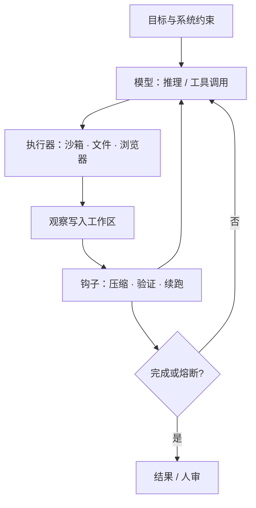

# Agent Harness 设计

    
智能在模型里，有用性在套件里：系统提示、工具、文件系统、沙箱、编排与钩子，才把一次补全变成能跨会话干活的代理。

    <footer>—— Trivedy，The Anatomy of an Agent Harness，LangChain，对照 LangChain Agents 文档把 harness 定义为环外的一切</footer>

把语言模型直接接到聊天框，得到的是补全；接到「能执行、能记、能停」的运行时，才得到代理。LangChain 把公式写成 **Agent = Model + Harness**：模型吃上下文、吐文本或工具调用；harness 是环上其余全部——提示、工具与技能描述、[MCP](/llm/mcp-design) 连接器、文件系统与沙箱、子代理编排、以及压缩、续跑、测试一类确定性钩子。文档里 `create_agent` 的职责被说成「在正确的时间把正确的上下文交给模型」。本篇写这套脚手架的设计问题，而不是某一家产品的默认提示词。与 [ReAct](/llm/react) 的差别是：ReAct 是环的推理—动作协议，harness 是让这个环能跑几天、能验、能隔离的工程边界。

## 问题

裸模型做不到四件事：跨轮次保存可恢复状态、真正执行代码、拿到训练截止日期之后的知识、以及给工作配好运行时与依赖。聊天产品用 while 循环把消息追加进上下文，已经是最薄的 harness。一旦任务变成「改仓库、跑测试、查文档、再改」，上下文会胀、工具输出会噪声化、模型会过早声称完成，而副作用若发生在宿主机上则不可接受。设计问题因此不是「再写一句你是资深工程师」，而是把期望行为翻译成环外机制：状态放哪、动作在哪执行、失败如何喂回、何时禁止继续。

能力越强的模型，越容易让人误以为 harness 可以变薄。实践上相反：产品级编码代理（Claude Code、Codex 一类）把文件系统操作、bash、规划、子代理并行写进后训练分布，于是**换一套工具语义分数会掉**——LangChain 文举 `apply_patch` 为例。Terminal Bench 一类榜单也显示：同一骨干换 harness，名次可以差一截。问题要从「模型够不够聪明」改成「这套先验与这台模型是否同分布」。

### 从期望行为反推套件，而不是从框架目录抄功能

可用的推导顺序是：想要的代理行为 → 模型单独做不到的缺口 → 补在环外的原语。要耐久存储，就给文件系统与 git，而不是把整仓塞进窗口。要通用动作而不是为每个 API 预注册 JSON 工具，就给受限的代码执行，让模型现场写脚本。要安全地跑不可信代码，就接沙箱而不是本机 shell。要对抗 [上下文腐烂](/llm/context-rot)，就做压缩、工具输出卸到磁盘、以及技能的渐进披露，而不是无限加 MCP。长程任务再叠加计划文件、验证钩子、以及拦截「过早退出」后用干净窗口续跑的循环。每一项都是 harness 决策，模型权重改不了这些接口。

框架（LangGraph 的图与检查点、OpenAI Agents SDK 的 handoff）提供积木；harness 是装配后真正在转的那一圈。安全团队能配置和打断的，几乎都在 harness 侧。把「用了某个 SDK」写成已经有完整 harness，会漏掉未实现的熔断与隔离。

## 方法

最小环仍是 [function calling](/llm/function-calling) 或 CodeAct：模型选动作，执行器跑，观察写回。harness 在环上叠加五类组件。**提示与技能**：系统提示规定角色与约束；技能用短目录加按需正文，避免启动时把全部工具 schema 灌满窗口。**工作区**：文件是中间产物、记忆（如 `AGENTS.md`）和多智能体共享账本；git 提供回滚与分支。**执行环境**：bash / 解释器跑在沙箱里，预装运行时、测试与浏览器，使代理能自验证。**编排**：子代理隔离上下文、模型路由、人审门。**钩子**：上下文将满时压缩；工具输出过长则只留头尾、全文落盘；测试失败则确定性回灌错误，而不是再问模型「你觉得过了吗」。

长程执行把上述原语叠在一起。文件系统让跨窗口的工作可恢复；计划文件把目标拆成可勾选步骤；验证把正确性锚在测试而不是自我评价。所谓 Ralph Loop 一类模式，是钩子拦住退出、用干净上下文重投原目标，同时从磁盘读上一轮产物——没有耐久存储，这种续跑只是重复幻觉。编排上，独立子任务应带独立上下文，主代理只收摘要，以免并行工具把主窗口打满。

### 工具表膨胀要用披露，而不是再用一个「超级工具」

MCP 与插件让工具发现变容易，也让启动上下文在代理动手前就已经腐烂。渐进披露的设计是：先给目录（名字、一句说明），模型点名后再注入全文与 schema。这与把所有服务器一次性 `tools/list` 进当轮请求相反。代码执行不能取消专用工具：高权限、需审计的副作用（发邮件、改生产、支付）仍应走窄 schema 与确认门；bash 覆盖的是「尚未预见到的只读或沙箱内计算」。两种原语并存，是 harness 的权限设计，不是实现懒惰。

## 机制

harness 不改 Transformer 内部公式。它改变的是**条件前缀从哪来、动作在哪发生、失败信号如何变成下一前缀**。压缩把旧轨迹收成摘要，等于用有损记忆换窗口；卸盘让模型按路径再读，而不是在 logits 里记住整份日志。后训练若在某套文件编辑工具上做，模型会把该工具的参数分布当先验——换等价但字段不同的补丁工具，调用会变脆。这不是「模型变笨」，是训练—套件耦合。评测必须冻结合：同一模型、不同 harness 是两行；同一 harness、换模型是另两行。不要把产品演示的流畅度写成通用智能。

与工作流图的关系：显式图（节点、边、检查点）把控制流从模型手里部分收回，适合审批链与崩溃恢复；纯 ReAct 环把控制流交给采样，适合开放探索。生产系统常混合：外层图管阶段与人审，内层环管某一阶段里的工具来回。harness 工程要声明哪一层说了算，否则超时重试会和模型的「再试一次」叠成双循环。

记忆文件被注入上下文，等于把上一会话的笔记变成这一会话的系统先验。它能纠正重复错误，也能把一次误记固化。harness 应版本化记忆、允许回滚，并避免把密钥写进会被送进模型的文件。

### 验证必须发生在环外才构成反馈

若「验证」只是再问同一模型是否做对，失败模式会自我强化。有效反馈是确定性的：测试运行器、类型检查、截图与日志、评测脚本读终态。钩子把这些信号格式化后写回，模型才有可学习的观察。这与强化学习里的环境奖励是同一角色，只不过多数产品 harness 并不更新权重，只更新这一轨迹的上下文。自验证提示可以作补充，不能当唯一门。

## 边界与工程取舍

### 套件会变薄，但环境与权限不会消失

模型在规划、自检、长程连贯上进步，部分今天靠提示硬塞的内容会进权重。提示工程并未消失，harness 也不会：工作目录、网络策略、密钥隔离、人审与审计仍必须由系统执行。把高权限 shell 暴露成「通用 MCP 服务器」是误用发现协议。内部单一运行时若永不复用连接器，直接函数分发更短。评测应拆开：互操作（工具能否被调用）、任务成功率、以及隔离是否在失败时仍成立。后一项常被演示省略。

不要默认「厂商自带 harness 最优」。榜单上的反例说明，针对任务重写压缩、工具描述与验证循环，可以在不换模型的情况下抬分。也不要把子代理数量当成能力：共享文件系统上的上百个并行写入，若无锁与分工协议，只是把冲突从窗口挪到 git。开放问题仍是：动态按任务装配工具与上下文，而不是启动时配死。

出处：Trivedy，*The Anatomy of an Agent Harness*（LangChain）；LangChain *Agents* 文档对 harness 与 `create_agent` 的定义。环协议对照 Yao 等 ReAct；平台对照 Wang 等 OpenHands。本篇不涉及绕过沙箱或越权执行。

## 小结

- Harness 是模型之外使代理能执行、能记、能验、能停的全部机制。
- 从期望行为反推原语：文件与 git、沙箱内代码执行、压缩与技能披露、计划与环外验证。
- 后训练与套件耦合，换工具语义会掉分；评测必须冻结模型与 harness。
- 控制流可部分收回工作流图；开放探索仍走工具环。
- 出处：LangChain harness 文与 Agents 文档；对照 ReAct 与开源开发代理平台。
