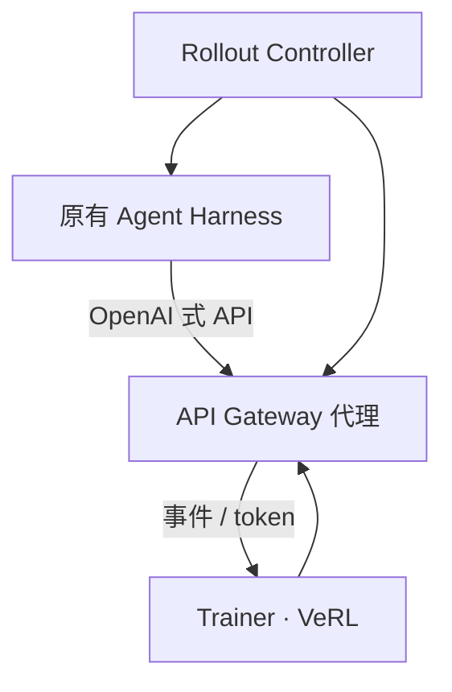

# Agent Lightning

    
部署时用的 harness 直接参加后训练：训练引擎只看见一串 LLM 请求–响应，循环、工具和上下文策略仍归 harness 所有。

    <footer>—— He 等，Agent Lightning v1.0: Towards Harnessed Agentic RL，arXiv:2608.17528</footer>

多数 RL 框架要求你把 agent 循环写进训练进程：ReAct 步、工具、拼 prompt 都在 rollout worker 里。真实产品里的循环已经写在 LangChain、AutoGen、OpenHands、Claude Code 一类 **harness** 里，再抄一遍既分叉又训用不一致。微软的 **Agent Lightning** 走代理注入：harness 仍打 OpenAI 式端点，端点其实是训练集群的代理，边转发边记轨迹。第一版 Luo、Zhang、He 等（arXiv:2508.03680）提出 Training-Agent Disaggregation 与 LightningRL。v1.0（He、Zhang、Zhou、Yang 等，arXiv:2608.17528，约 3500 行）把范式命名为 **harnessed agentic RL**，并诊断重分词、样本合并、优势与损失归一化。本篇钉「训练器注入 harness」指改的是 **LLM 基址**，不是把 VeRL 嵌进 agent 代码；钉 SWE-bench Verified 上 41.8%→56.4% 必须连着 6K 样本与 Qwen3.5-9B 读。

## 问题

传统 agentic RL 里，训练引擎拥有环境环：下一步 prompt 在 token 空间里是 $p_t=(p_{t-1},a_{t-1},o_t)$，一条 rollout 天然是一条线性 token 轨迹。Harness 介入后，潜在状态变成 $(s^{\mathrm{harness}}, s^{\mathrm{env}})$。Harness 每次**单独构造**发给模型的消息，策略只看见 API 上的 $(p_i,a_i)$ 序列。子 agent、摘要压缩、重试都会让一次任务对应动态数量的训练样本。若仍按「一条 rollout = 一条序列」做组内优势，长短任务的梯度权重会偏。

工程上，把 OpenHands 嵌进 Ray worker 会把依赖和调度绑死。Luo 等人的目标是 **几乎零改动**：agent 继续用原框架，只把 base URL 指到 Lightning。v1.0 发现代理范式被 verl Uni-Agent、AReaL 2.0、slime v0.3.0、Polar 跟进后，真正没写清的是：文本 API 与 token 训练之间如何拼样本。

### 重分词会拆掉「可合并」假设

框架常在 token 级检查 $p_{i+1}$ 是否以 $(p_i,a_i)$ 为前缀，是则并成一条长序列。但 harness 传的是文本；再 tokenize 一次后，即使字符串相同，$a_i$ 的 token 也可能与采样时不同（特殊符号、前后空白、chat template）。合并会把 logprob 对到错误 id 上。v1.0 把这列为 harnessed RL 的一等故障，而不是 tokenizer 边角。正确做法是训练只用**模型采样时返回的 token**，必要时放弃合并，改成多次调用、在 rollout 级做优势。见 [token 级 API](/llm/agentloop-server) 与 [loss mask](/llm/multiturn-loss-mask)。

v0.x 与 v1.0 是一次重构。引用实验时对版本。旧文的 text-to-SQL / RAG / 数学工具任务证明「能训」；v1.0 的 SWE 数字证明「harness 级编码代理能涨分」，不要混成同一张表。

## 方法

v1.0 三件套。**Trainer** 基于 VeRL + vLLM：登记 rollout、组装样本、更新策略。**API Gateway** 存 rollout 与事件，把 harness 的 LLM 调用转到当前模型端点并记录精确的 prompt/response token。**Rollout Controller** 在 Kubernetes Job 或本地进程池里拉起 harness，与训练集群可异地。Harness 只需把 endpoint 换成代理。样本适配器在 **rollout 级**算优势与损失归一，而不是按动态拆开的 sample 计数给长任务十倍权重。

LightningRL（2508.03680）把轨迹拆成转移：每步状态是该次 LLM 输入，动作是输出，再加信用分配，使现有单轮 PPO/GRPO 能吃多调用数据。AIR（Automatic Intermediate Rewarding）允许用工具返回码等监控信号给中间转移打分，缓解稀疏终点奖励。v1.0 强调这些选择现在必须在「调用序列」而不是「单条拼接序列」上定义。

SWE 实验：基于开源 SWE-smith 清洗出约 **6K** 训练例，Qwen3.5-9B，仅 RL，SWE-bench Verified **41.8% → 56.4%**（+14.6 个点）。作者同时指出现有 RL 框架对编码 agent 的数据与脚本支持弱、往往假设大规模算力；他们把清洗流水线与脚本公开，作为可复现的 harnessed 设定，而不是宣称通用 SOTA。第一版还在 text-to-SQL（LangChain）、RAG（OpenAI Agents SDK）、数学工具（AutoGen）上展示奖励曲线持续上升，用来证明「任意框架写出的 agent 都能接到同一训练服务」，任务分数应回引 2508.03680 的设定，不要与 v1.0 的 SWE 表合并。

### 注入点在端点，不在梯度公式

「零改动」指控制流、工具协议、上下文策略不在训练仓库里重写。梯度仍然要 mask、优势、归一化；这些在 Gateway 之后做。若 harness 自己再本地 tokenizer 一遍拿去比对，会把 Lightning 记的 token 弄乱。集成测试应断言：训练 batch 里的 response id 与推理引擎返回的 id 一致。

代码约 3500 行是 v1.0 的设计声明，用来强调可审计，不是与 verl 三万行比「更完整」。功能集故意窄：代理、记账、rollout 级统计。

## 机制

Disaggregation 把 GPU 训练与 CPU/K8s 上的 agent 执行解耦，环境安装、浏览器、仓库克隆不再占训练镜像。可观测性栈（OpenTelemetry）能接到同一事件流，AIR 才有信号可写。代价是：训练引擎对 harness 内部状态不可见，信用分配只能在调用边界上做，不能在 harness 私有的「计划树」节点上做——除非 harness 把那些节点也变成 LLM 调用。

Rollout 级优势针对的病是：一次 SWE 任务被拆成 20 次 sample，一次检索任务拆成 2 次，若按 sample 平均，编码任务梯度被放大。按 rollout 归约后，任务才是可比的 i.i.d. 单位。这与 GRPO 按「同一问题的 G 条输出」分组不冲突，但分组键必须是任务 id，不是拆开后的调用 id。损失归一化同样：batch 里 sample 数随 harness 动态变化，训练 GPU 数却是固定的，后端要把变长样本集切成 step 与 micro-batch。v1.0 把调度也列为 harnessed RL 的挑战，而不是只改损失公式。

### 和 VerlTool、AgentLoop 的分工

[VERLTool](/llm/verltool) 把工具放进 VeRL 可调用的服务器，循环仍在训练框架的 AgentLoop 里。[AgentLoop](/llm/agentloop-server) 是 VeRL 内部的多轮接口，假定你愿意实现 `run()`。Lightning 假定你**不愿意**实现第二份循环。三者都处理观察与 mask，所有权不同：工具服务器、框架内循环、框架外 harness。选错会重复造环境。

## 边界与工程取舍

不要把 14.6 个点写成「换框架就涨」。数据清洗、环境、基座模型都在条件里。不要假设任意 harness 的副作用（计费 API、写生产库）适合在 RL 里无沙箱滚动。代理增加一跳延迟；同步 RL 步可能被最慢的 K8s Job 钉住，需要超时与重试策略。Retokenization 未处理时，开异步只会让错误样本更多。多 agent 握手在 v1.0 里被列为与单 ReAct 不同的建模，实现深度以当时代码为准。

许可证 MIT；引用同时给 2508.03680 与 2608.17528，并写清实验来自哪一篇。

Luo 等 *Agent Lightning: Train ANY AI Agents with Reinforcement Learning*，arXiv:2508.03680。He 等 *Agent Lightning v1.0*，arXiv:2608.17528。Trainer 依赖 VeRL（Sheng 等 HybridFlow）。SWE-bench 协议应回引 Jimenez 等，不要把 Verified 子集分数与全量混报。

## 小结

- Agent Lightning 用 LLM 代理把原有 harness 接到 RL，训练与执行分集群，几乎不改 agent 代码。
- Harnessed RL 的样本是调用序列；必须处理重分词、动态 sample 数，以及 rollout 级优势与归一化。
- v1.0 在 Qwen3.5-9B + 6K 例上把 SWE-bench Verified 从 41.8% 拉到 56.4%。
- 出处：arXiv:2508.03680、arXiv:2608.17528；https://github.com/microsoft/agent-lightning。
