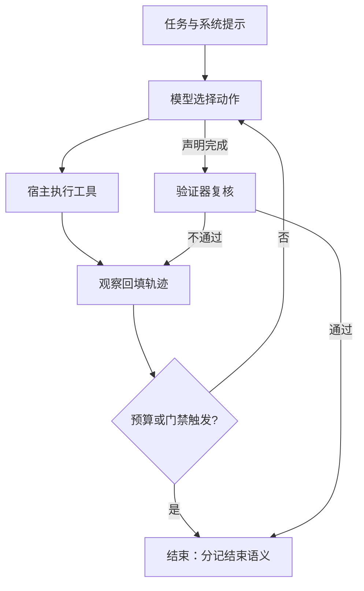

# Agent 循环的设计空间

循环本身不是产品；循环上每个可调的点——谁决定下一步、何时停、观察走哪条通道——加起来才是。

<footer>—— 据 Yao et al., ReAct, ICLR 2023；Wang 等，大模型自主代理综述，2024 整理</footer>

[上一课](/llm/xai-map)把可解释性应用收成五步决策单与三条不变量：干预优先于相关、读数不是判决、口径绑定一切。解释了模型单步为什么这么走，下一个对象是模型自己连走多步——代理轨迹。它的缺口不在看得见与否：轨迹里每个 token 由谁追加，是模型在每一步决定的。主干已有 [ReAct](/llm/react) 的推理—行动交错协议与 [Agent Harness 设计](/llm/agent-harness-design) 的环外机制清单；本课把两者之间的自由度排成几根轴，作为本课程的地图，后课逐轴下钻。

## 问题

最朴素的实现是一句 `while`：把任务与观察拼进上下文，调一次模型，执行它要的工具，把结果追加回去，直到它不再要工具。这层循环把三件必须显式决定的事都隐掉了。一是控制流：每一步是「看现状选动作」的反应式决策，还是先产出可修订的全局计划再执行——[规划 vs 反应式循环](/llm/plan-vs-react)给过取舍，这里要问的是给模型多大自由度。二是停止：模型声明完成、预算耗尽、外部门禁否决，三种停法语义不同，混成一个 `finished`，评测与运维都读不出区别。三是观察通道：工具结果全文回填还是截断落盘，直接决定轨迹形状。三处都不设计的代价，[AutoGPT 架构笔记](/llm/autogpt-arch)一类的早期自由循环已经演示过：目标漂移、空转、烧预算。

## 方法

把设计空间立成五根轴。**控制流**：反应式（ReAct：思考对观察条件化）、先规划后执行（计划可被中途修订）、显式状态机或工作流图（每步合法动作集被收窄）。经验方向是反直觉的：模型越弱，越要收窄动作集；模型越强，越可以放宽控制流，但把省下的自由度换成更严的门禁。**停止**：finish 动作、步数与 token 预算、验证器判定分开记账，各自给出独立的结束原因。**观察**：回填规则决定上下文账本，本课只立「结果可追责」的契约，策略留给[上下文管理策略](/llm/agent-context-strategies)。**状态与记忆**：放上下文里还是外部存储，留给[记忆系统的实现](/llm/agent-memory-implementation)。**人与权限**：哪几类动作前必须人点头，留给[安全围栏](/llm/agent-guardrails)。

## 机制

把循环读成马尔可夫链：状态是当前上下文，转移核是「模型选动作 × 工具给观察」。同一模型装进不同转移核，得到的是不同策略——这正是同一骨干换 harness 名次会掉的机制解释：改的不是模型，是策略所在的转移结构。设计选择因此不是品味，而是给转移核的约束强度定价：收窄动作集降低了走错步的概率，也封死了模型用非常规路径解决问题的可能。METR 把自主长度度量成时间视界：50% 完成视界约每七个月翻倍（[METR Time Horizon](/llm/metr-time-horizon)），工程含义是预算阈值要随视界重设，不是一次设死。评测协议也要按这个语义记账（[智能体与工具评测协议](/llm/agent-eval-protocol)），否则「失败」本身没有定义。

把结束原因分记为「模型声明完成」「预算耗尽」「门禁否决」三类，是循环设计里最便宜也最常被省掉的一件事。混报的代价：长任务成功率看似暴跌，实际大量轨迹死在预算上——那是预算语义错误，不是能力缺陷。

## 边界

本课立轴，不替后课做决定：观察回填的策略、记忆的分层、权限的卡点各有专课；多代理分叉（编排者—工人、辩论）留给[多 Agent 编排模式](/llm/agent-multi-orchestration)。单步动作如何进协议是下一课。训练侧如何把这条循环搬进 RL 环境（[工具整合推理 RL](/llm/tool-integrated-rl)、[Agent Lightning](/llm/agent-lightning)）是另一条课程：环内行为可被训练，但部署时的转移核若与训练分布不同构，分数会掉。

## 小结

- 循环有五根轴：控制流、停止语义、观察通道、状态位置、人的卡点；本课程逐轴展开。
- 结束原因必须三分：模型声明、预算耗尽、门禁否决；混报让评测与运维同时失明。
- 模型弱则收窄动作集，模型强则放宽控制流、加严门禁。
- 同一模型换转移核就是换策略；harness 差异是机制差异，不是玄学。
- 预算阈值按时间视界重设，不一次设死。
- 出处：据 Yao et al., ReAct, ICLR 2023 与 Wang 等自主代理综述（2024）的循环口径整理；时间视界数字见 METR 2025 技术报告。
