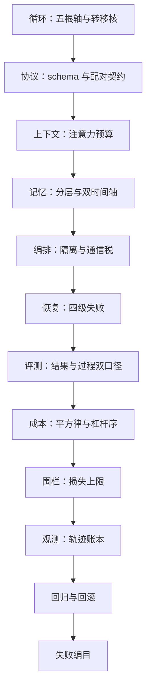

# Agent 工程收束

Agent 工程是把一次补全变成可审计、可恢复、可预算的劳动过程；模型负责决定，系统负责让每个决定都有账可查。

<footer>—— 据本课程整理；循环与代理谱系见 Yao et al., ICLR 2023 与 Wang 等，2024</footer>

[上一课](/llm/agent-production-cases)用失败编目给真实系统对账，十三课至此走完——本课程到此收束。收束做两件事：把课程收进几条线，把本课程放回大图，留给后课一个干净的接口。

## 问题

收束要防的仍是把课程读成技巧堆砌：循环、schema、压缩、熔断、围栏、影子流量，单看都是工程技巧，合起来才是一套方法。散着记，换一个模型、换一个任务域就全部重来；收进结构，重算的只有常数。所以收束的问题不是复述，是提炼：十三课里哪些是不随模型与任务域改变的结构，哪些只是本次部署的常数。

## 方法

三条线。**架构线**是「架构」单元四课：[Agent 循环的设计空间](/llm/agent-loop-design-space)立五根轴、把循环读成转移核；[工具协议深钻](/llm/agent-tool-protocol-deep)把动作写成有 schema、有配对、有错误通道的契约；[上下文管理策略](/llm/agent-context-strategies)把注意力预算花在未决状态上；[记忆系统的实现](/llm/agent-memory-implementation)给窗口外的细节安家。这条线回答「下一步由谁、按什么协议、看到什么地决定」。**质量线**是编排到成本四课：[多 Agent 编排模式](/llm/agent-multi-orchestration)按信息流与权限流切分、[错误恢复与重试](/llm/agent-error-recovery)给四级失败配四级药、[评测：任务成功率与过程](/llm/agent-eval-success-process)用 pass@k 与 $\mathrm{pass}^k$ 双口径量稳定性、[成本与延迟优化](/llm/agent-cost-latency)把杠杆按平方律排序。**生产线**是最后五课：[安全围栏](/llm/agent-guardrails)立损失上限、[可观测性](/llm/agent-observability)记版本化轨迹账本、[回归测试与版本回滚](/llm/agent-regression-rollback)守变更、[生产案例与失败模式](/llm/agent-production-cases)编目失败。三条线是同一句话的三种说法：Agent 工程是把一次补全变成可审计、可恢复、可预算的劳动过程。

## 机制

放回大图。往回接：[Agent Harness 设计](/llm/agent-harness-design)铸的环、[多步 ReAct](/llm/react) 立的协议，是本课程的地基；[长上下文收束](/llm/lc-map)的账本纪律在这里续写——轨迹是会自己变长的上下文，补账、立契、设门禁的次序原样适用。往前接：训练侧的闭环正在把本课程的账本变成原料——[工具整合推理 RL](/llm/tool-integrated-rl) 与 [Agent Lightning](/llm/agent-lightning) 把环内轨迹搬进训练循环，[自改进回路的解剖](/llm/self-improvement-loop)把线上失败接回数据引擎：部署即采集，观测课的轨迹账本是回路的第一环。模型换代时，常数全部重测：预算阈值、压缩触发点、围栏误杀率、级联判据；结构不变：五根轴、四级失败、双口径、四层围栏、三分结束语义。这就是收束留下的接口：后课遇到「更自主的东西」，先分轴，再立契约，后设门禁，最后记账。

一句自检：任何「代理方案」若说不清五根轴各取什么值、失败分几级各配什么药、轨迹记在哪本账上，它就还只是一个演示——演示在下一个任务域失效，结构不会。

## 边界

本课程是工程侧的收束：训练侧如何造出更会走环的模型（RL 训练系统一线）、评测基准的内部构造、多代理的理论分析，各有其课，这里只接口。案例数字随产品与模型过期；结构跨域复用。深钻层在此收束一门课，不收束一个领域：模型的时间视界还在涨，这本账会一直写下去。

## 小结

- 三条线收束：架构线分配「下一步」的决定权，质量线给失败与成本定价，生产线守住发布。
- 核心句式：Agent 工程是把一次补全变成可审计、可恢复、可预算的劳动过程。
- 往回接 harness 与长上下文两课，往前接 RL 轨迹闭环：账本既是运维证据，也是训练原料。
- 常数随模型与任务域重测，结构（五根轴、四级失败、双口径、四层围栏）跨域复用。
- 遇到「更自主的东西」：先分轴，再立契约，后设门禁，最后记账。
- 出处：本课程各课口径汇总——Yao et al., ICLR 2023；Schick et al., 2023；Shinn et al., 2023；Wang 等，2024；其余见各课小节。
