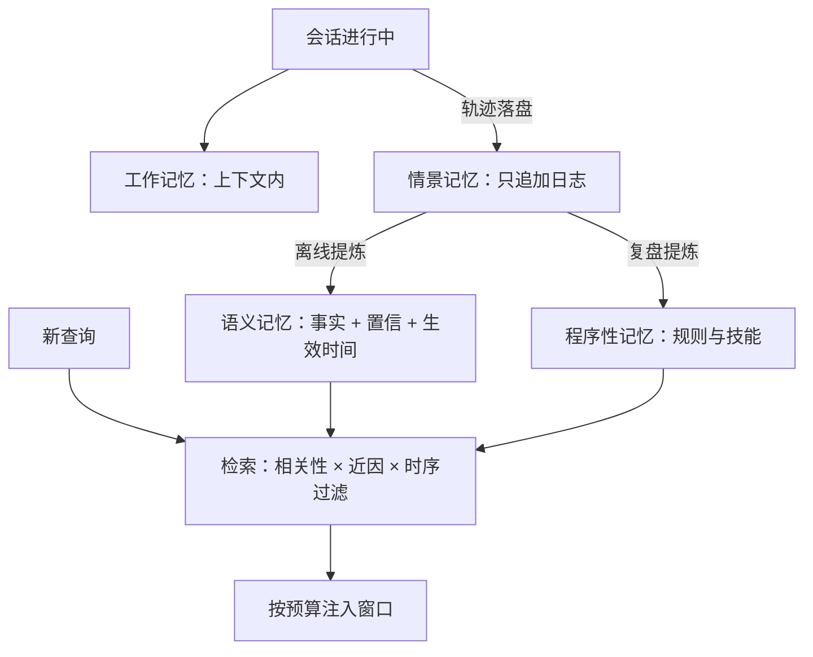
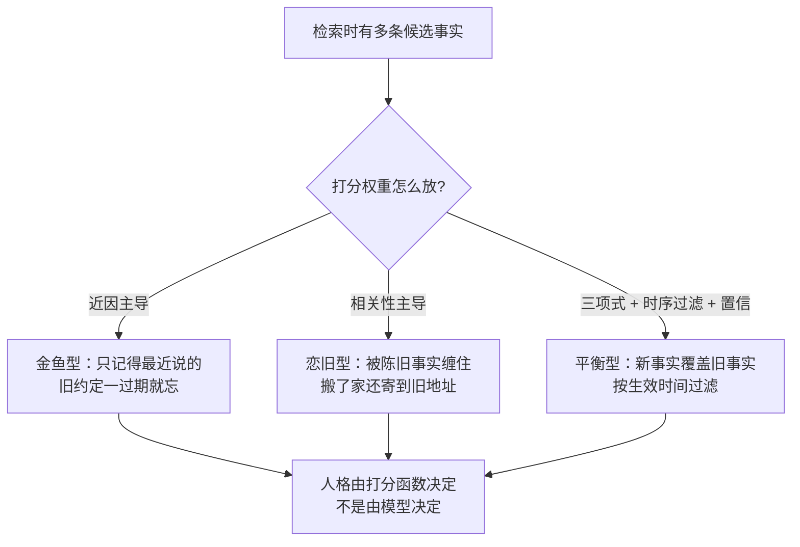

# 记忆系统的实现

记忆不是更大的窗口，是一套有写入时机、检索路径和过期策略的存储系统；窗口外的每个事实都要回答「何时进、何时出」。

<footer>—— 据 Packer 等，MemGPT（2023）；Park 等，Generative Agents，UIST 2023 整理</footer>

[上一课](/llm/agent-context-strategies)的压缩是有损管道：保住了未决状态，丢掉了细节。细节要有地方可去，且下次要用时取得回来——这是记忆系统。主干已有单点方法课（[MemGPT](/llm/memgpt) 的分页、[Mem0 记忆层](/llm/mem0-layer) 的两阶段提炼、[Zep / Graphiti 时序知识图谱记忆](/llm/zep-graphiti) 的双时间轴）；本课把它们装进同一张工程图纸：分层、写入、检索、过期。

## 问题

跨会话需求具体是四类：用户偏好（称呼、口味）、项目事实（架构决定、账号约定）、失败教训（哪种做法上一次错了）、程序性知识（怎么干活的流程）。直觉类比：这四类就是一个靠谱同事该记住的事——记得你叫他「老徐」不叫「徐工」（偏好）、记得这个项目的密码规则（事实）、记得上次这么干砸了（教训）、记得报销流程怎么走（程序）。新同事入职靠带教，代理的「带教」就是记忆系统。实现要过三道决策，每道都有对称的坑。**写入时机**：在线写（模型顺手调一个记忆工具）便宜但噪声大，模型顺手记的会错、会记 trivia；离线提炼（会话结束后批处理归纳）贵但可控，却有时效——提炼完之前下一场会话已经开始。**表示**：自由文本片段检索最省事，但事实更新时新旧两条并存，检索到旧的照错；结构化档案可覆盖，抽取器却成了新的失败点。**检索与注入**：不注入等于没记；全量注入等于把窗口问题原样买回来（回到[上下文管理策略](/llm/agent-context-strategies)）。漏掉过期与删除的记忆库是负债：用户改主意、行使删除权时，没有版本与时间戳的系统无从执行。

## 方法

按距窗口的远近分四层。**工作记忆**：上下文内，上一课的策略管。**情景记忆**：原始轨迹日志，只追加、带时间戳，是其他层的原料。**语义记忆**：从情景提炼的事实与画像，带置信与生效时间；[A-MEM 代理记忆](/llm/amem-agent-memory)强调笔记间组织与连边，[记忆写入与检索](/llm/agent-memory-write)写写入规则。**程序性记忆**：怎么做事的知识，落成 [AGENTS.md 项目规范](/llm/agents-md-spec)与 [Anthropic Agent Skills](/llm/agent-skills) 那类文件与技能，按需加载而非全量驻留。检索打分参考 [Generative Agents](/llm/generative-agents) 的三项式：近因、重要性、相关性加权；数字实例：给每条候选记忆算一个总分再排序。比如相关性 0.8、重要性 0.3、近因 0.6 的一条，按 $1\times 0.8 + 0.3\times 0.3 + 1\times 0.6 = 1.49$；另一条相关性 0.6、重要性 0.9、近因 0.1，得分 $0.6 + 0.27 + 0.1 = 0.97$——前者胜出，被注入窗口。权重就是旋钮：把「近因」的权重调大，代理就更「喜新厌旧」。时序过滤用 [Zep / Graphiti 时序知识图谱记忆](/llm/zep-graphiti)的双时间轴——事实的生效时间与写入时间分开记，「用户当时的住址」与「用户现在的住址」才不混。

## 机制

把记忆读成缓存层：检索注入等于把窗口外包给存储，外包的代价是检索错误的错误不可见——窗口里的错模型看得到，没被检回的遗漏在评测里表现为「忘了」。打分函数决定人格：近因主导的代理像金鱼，旧约定一过期就忘；相关性主导的代理被陈旧事实缠住，需要时序过滤来解。写入比读取更决定质量：在线写靠模型的判断力，离线提炼靠提炼提示的质量，两处的系统性错误都会固化成「代理坚信的错事实」。检索底座可以直接复用检索栈（[HippoRAG](/llm/hipporag) 的海马体式索引是其一），但底座对不对得起记忆任务，要看它对时序与覆盖的处理。

双时间轴是记忆系统最常被省掉的一列：只记写入时间，「上周学到的」与「上周生效的」混为一谈；只记生效时间，又无法回答「代理当时为何那样做」。故障复盘用的是摄入时间线，决策依据用的是生效时间线。

## 边界

本课程不承诺无限记忆：记忆库越大，检索与提炼的失败面越大，宁小而准。文档型知识走检索（RAG）不走记忆：两者的差别是「全局事实」与「可查文档」，混装会让代理背文档而不是查文档。常见误区：初学者容易以为「窗口够大就不用做记忆系统」。窗口解决的是「装得下」，解决不了「找得到」与「记得新」——100 万 token 里找一句话照样要检索，用户改了住址照样要覆盖旧事实。窗口是桌面大小，记忆系统是档案室的编目规则，两者不是一回事。用户反馈的留存与删除涉合规（[用户反馈的隐私与合规](/llm/continual-feedback-privacy)），脱敏在入库前做（[PII 脱敏](/llm/pii-redact)）。长视野上记忆是否真的提升任务成功率，要靠[评测：任务成功率与过程](/llm/agent-eval-success-process)的跨会话任务说话，不能靠演示。

## 小结

- 四层结构：工作、情景、语义、程序性；每层有各自的写入与失效语义。
- 写入时机先于检索调优：在线写有噪声，离线提炼有时滞，错误都会固化。
- 检索打分三项式（近因、重要性、相关性）之上要加时序过滤与置信。
- 双时间轴（生效与摄入）是过期、删除与复盘的基础。
- 检索遗漏不可见：记忆质量必须用跨会话任务评测，不能靠演示。
- 出处：据 Packer 等 MemGPT（2023）、Park 等 Generative Agents（UIST 2023）与各家记忆系统的公开口径整理。
