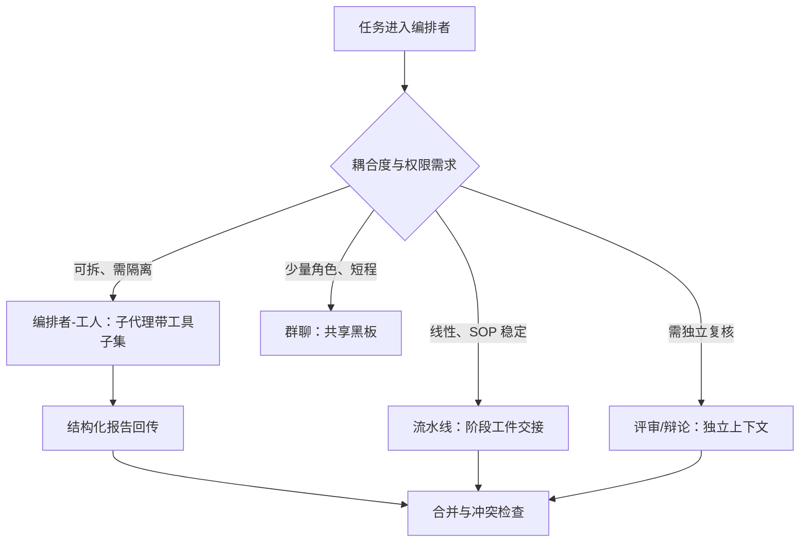
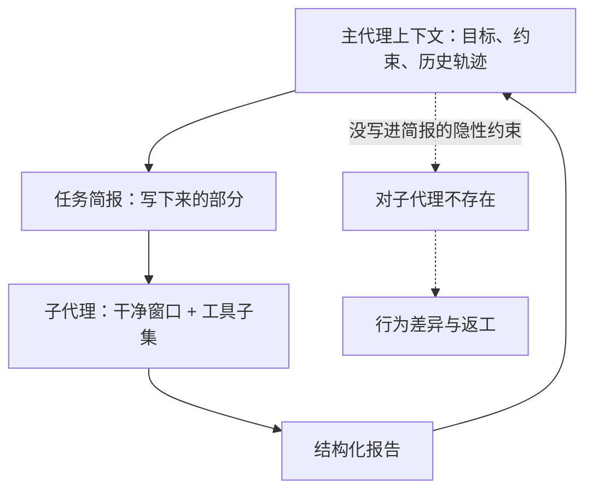

# 多 Agent 编排模式

多代理不是能力相加，是把上下文、权限和失败半径切开；切错了方向，得到的是几份账单和一个更难调试的系统。

<footer>—— 据 Wang 等，大模型自主代理综述，2024；以及多代理框架的公开工程口径整理</footer>

[上一课](/llm/agent-memory-implementation)把记忆外置之后，单环的最后一块短板也显形了：所有职责共用一个上下文、一套权限、一个失败半径。编排把控制流劈开。主干已有[多代理编排](/llm/multi-agent-orchestration)讲框架谱系（CAMEL、MetaGPT、AutoGen 的对话与 SOP 模式）；本课把编排当**生产决策**来写：什么时候值得拆、按什么切、拆完付什么税。

## 问题

拆分的收益有四项，对应四种痛：**上下文隔离**——子代理各带干净窗口，探索性阅读的噪声不回流主轨迹（机制见[多智能体上下文隔离](/llm/multi-agent-context-isolation)）；**权限隔离**——只有执行者握写权限，评审者只读，注入的损失上限随权限收窄；**并行**——读侧任务（多文件调研、多方案试写）天然可并行；**独立验证**——评审代理看不见作者的推理过程，锚定被切断。对应的税也有四项：**通信有损**——编排者只见子代理的报告，报告没写的细节对主代理不存在；**费用倍增**——每个子代理重付系统提示与任务简报；**一致性**——两个代理并发改同一文件，锁与合并要做；**终止**——互相等待或互相推诿的代理环需要超时与仲裁。拆错方向的典型：把强耦合的读写任务拆给两个并行代理，全部预算花在互相修复上。失败半径是工程术语：一个组件出事时能波及的最大范围。单代理里，一次误操作的写权限、一段被注入的指令、一个塞爆的上下文全在同一半径内；拆分后评审代理只读、执行者只拿子集工具，等于给可能的事故画了隔离墙。

## 方法

按信息流与权限流选模式。**流水线**：阶段工件交接，上游不见下游反馈，适合稳定 SOP；换任务域要重写流程。**编排者—工人**：主代理动态拆子任务、给每个子代理一份任务简报与工具子集，只收结构化报告；[Claude Agent SDK](/llm/claude-agent-sdk) 与 [server-based AgentLoop](/llm/agentloop-server) 把这做成一等原语，报告模板（结论、证据、不确定度、改动清单）是编排质量的第一瓶颈。**评审/辩论**：独立上下文的批评者对产出复核，何时反驳有价值见[辩论](/llm/debate-oversight)；注意评审者与作者同源时的[自我偏好](/llm/self-preference-bias)。**群聊/共享黑板**：全员可见全部消息，调试直观，费用随人数平方涨，适合少量角色短程协作。「平方」的数字实例：n 个角色互相都可能说话，通道数约 n×(n−1) 条——4 个角色 12 条，8 个角色 56 条。人数翻倍，消息量约翻四倍，还都要过模型理解一遍，所以群聊模式角色一多，账单先爆炸。跨组织边界、互不信任的代理之间，工具协议要换成服务协议（[A2A 协议](/llm/a2a-protocol)），那是信任模型不同，不是同一模式的远距离版。

## 机制

编排提升质量的机制是隔离与独立，不是人数：评审代理有用，是因为它没有作者的沉没成本与自我辩护链；子代理有用，是因为它的窗口不背主轨迹的历史。同一机制决定失败面：隔离切断的不只是噪声，还有上下文——子代理不知道主代理已知的约束，简报漏写就是行为差异。所以简报与报告模板要当接口协议管理（回指[工具协议深钻](/llm/agent-tool-protocol-deep)的 schema 纪律）：写明输入假设、输出结构、权限边界。一致性的机制解是所有权：同一时刻一个文件只归一个代理写，其余排队或申请，锁比事后合并便宜。

可以把它想象成给外包团队写需求文档：文档里没写的需求对方就真的不知道，做偏了不能全怪外包。初学者容易以为子代理「不听话」，实际上简报漏写约束导致的偏差，责任在接口协议这一层，补简报比换模型有效。

一得一失常被一起忽略：并行子代理把墙钟时间缩短，但每个子代理都要重付系统提示与工具说明——并行省时间不省钱；预算紧的任务，串行加缓存反而更便宜。

## 边界

任务可线性分解、上下文装得下时，单代理加好工具总是更便宜的选择：编排是给「装不下或权限必须分」的任务付的税。编排器本身也会成为单点：它选错模式、简报写偏，下游全错——编排者的决策要进轨迹（[可观测性](/llm/agent-observability)）才能复盘。编排的失败恢复不在本课：某条子环死了怎么办，是[错误恢复与重试](/llm/agent-error-recovery)的分级问题在多代理下的实例。把「多代理」当评测加分项是方向性错误：评测只认任务成败与过程（[评测：任务成功率与过程](/llm/agent-eval-success-process)），不认架构名头。

## 小结

- 拆分买四样：上下文隔离、权限隔离、并行、独立验证；付四税：通信有损、费用、一致性、终止。
- 编排者—工人是默认模式；简报与报告模板是接口协议，要按 schema 纪律管理。
- 群聊费用随人数平方涨；评审要防同源自我偏好。
- 一致性靠所有权与锁，不靠事后合并。
- 单代理够用时不要编排：编排是税，不是荣誉。
- 出处：据 Wang 等（2024）综述与主流多代理框架的公开口径整理。
