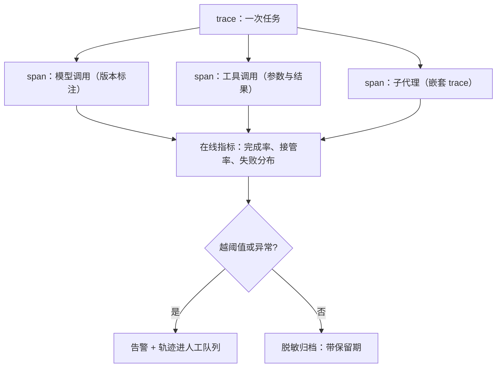

# 可观测性

服务可观测的对象是请求，代理可观测的对象是轨迹；少了带版本标注的轨迹账本，调试靠猜，回滚靠赌。

<footer>—— 据 OpenTelemetry GenAI 语义约定（草案口径）与部署后监控的工程实践整理</footer>

[上一课](/llm/agent-guardrails)的围栏要调平衡、[成本与延迟优化](/llm/agent-cost-latency)的账要审、后续回归要放样——三件事依赖同一件基础设施：每条轨迹被完整、带版本地记录下来。主干已有[部署后监控](/llm/deployment-monitoring)讲流量抽检与漂移、[服务指标 TTFT / TPOT / 吞吐](/llm/serving-metrics)讲单次调用的指标；本课把观测对象升级为轨迹：一次任务的完整因果树。

## 问题

观测不足的症状都很具体。线上失败无法归因：用户说「它把订单发错了」，你查不到那条轨迹死在哪一步、当时模型看到什么。成本对不上账：月账单除以任务数得到的均值毫无用处，长尾几条轨迹占了半数成本。围栏误杀无法复盘：拦截发生时若没存下完整输入，误杀与正确拦截永远分不清。回归没有靶子：想在新版本上重放上周的真实失败，却发现当时的 prompt 与工具清单没有版本标注，重放无从谈起。根因都一样：代理的可观测单元不是 HTTP 请求，而是「任务」——树状的因果结构，缺一处标注，整棵树就断了证据链。

## 方法

**数据模型**：trace 对应一次任务，span 对应一次模型调用、工具调用或子代理；父子关系即因果，重试是兄弟 span，恢复动作单独标记（[错误恢复与重试](/llm/agent-error-recovery)的四级失败直接成为 span 的分类字段）。**版本标注**：每个 span 记模型版本、系统提示版本、工具清单哈希、编排代码版本——这是轨迹能跨版本比较的前提，也是下一课回归测试的原材料。**记录内容**：完整的输入输出（含每步模型看到的确切上下文）、工具参数与结果、每步耗时与 token、结束语义（声明完成/预算/门禁）、围栏事件。**在线指标**：任务完成率、人工接管率、每步失败率分布、预算耗尽占比、围栏拦截与误杀、按任务的 token 与费用分位数。**抽样审计**：全量人审不可能，用 LLM 裁判初筛，但裁判偏差要先校准（[LLM 裁判偏差](/llm/llm-judge-bias)），裁判否决的轨迹进人工队列。

## 机制

为什么按因果树而不是日志行存：归因查询「死在门禁的轨迹里，上一步是什么」在树结构上是一次遍历，在平铺日志上是全表扫描加人工拼接——数据形状决定排障速度。为什么版本标注是第一字段：轨迹的每一条结论（这个版本失败率高、这次误杀是提示的锅）都是**关于某个版本组合**的陈述，没有标注的轨迹只能讲故事不能下结论。记录与合规的张力用两层解：入库前脱敏（[PII 脱敏](/llm/pii-redact)）划掉可以划掉的字段，保留期与访问控制管理剩下的；「完整记录」与「最小留存」的平衡点按业务的风险等级定，不追求一步到位。

一次模型调用的 span 要存「模型看到的确切内容」，不是「应用拼装的模板」：聊天模板渲染、截断与压缩发生在请求前——只存模板，回放时模型看到的可能已经不同，轨迹就成了不可复现的证据。

## 边界

观测不改变行为，只还原行为；把在线指标当优化目标会引入古德哈特效应——指标进奖励的问题在[评测：任务成功率与过程](/llm/agent-eval-success-process)已经警告过。全量记录有成本：token 详单、存储与查询都按量计费，采样策略（全量存失败与围栏事件、按比例存成功）是常规解。轨迹账本是下一课的输入：回归测试的重放集、回滚的触发证据都从这里来；与[部署后监控](/llm/deployment-monitoring)的分工是——监控回答「线上现在怎么样」，轨迹账本回答「为什么」。

## 小结

- 观测单元从请求升级为轨迹：trace 为根、span 为节点、父子即因果。
- 版本标注是第一字段：模型、提示、工具清单、编排代码缺一不可。
- 结束语义与失败分级作为 span 字段，归因查询才能自动化。
- LLM 裁判初筛要校准偏差，否决轨迹进人工队列。
- 脱敏与保留期在入库前定；存「模型看到的确切内容」才可回放。
- 出处：据 OpenTelemetry GenAI 语义约定草案与部署监控实践整理，非单篇论文口径。
