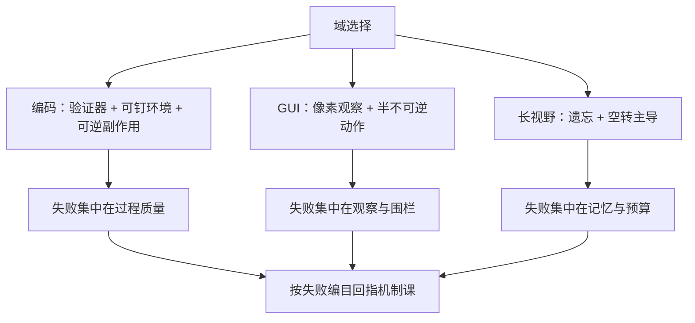

# 生产案例与失败模式

编码代理先成熟，不是模型偏爱代码，是代码域先凑齐了三件套——验证器便宜、环境可钉、副作用可逆；其他域照此补课。

<footer>—— 据各代理产品的公开工程复盘与长视野评测报告整理</footer>

[上一课](/llm/agent-regression-rollback)给变更立了守门；本课把镜头转向已经跑起来的真实系统，用案例与失败模式给全课程对账。案例带按域排：代理编码、计算机与浏览器代理、长视野任务——三个域的分数落差本身就是最大的发现。

## 问题

同一个模型在不同域的表现差距巨大，差距的来源不是智力而是环境结构。代理编码（[Cursor 类代理编码](/llm/agentic-coding)、[Claude Code](/llm/claude-code-cli)、[SWE-agent](/llm/swe-agent)、[OpenHands / OpenDevin](/llm/openhands)、[Aider 工作流](/llm/aider)）分数最高：测试是现成的验证器，仓库可装进容器钉住，git 让补丁可逆。[Computer Use / GUI 代理](/llm/computer-use)与浏览器代理（[Browser-use Agent](/llm/browser-use-agent)、[OpenAI Operator](/llm/openai-operator)）分数塌一层：观察通道是像素与 DOM，环境不可钉、动作半不可逆。长视野任务再塌一层：[Vending-Bench 2](/llm/vending-bench-2) 的年末余额显示，失败常常不是单步能力，而是数千万 token 时间轴上的遗忘与空转。跨域的失败不是随机的，可以编目——编目是本课的方法：每条失败回指一条机制，机制课给药。

## 方法

失败模式八条，每条带出处与解法。**过早声称完成**：任务没做完就宣布成功——解法是验证器门禁（[评测：任务成功率与过程](/llm/agent-eval-success-process)的结果复核）。**目标漂移**：长任务中途换了目标而不自知——解法是目标与未决状态外置（[记忆系统的实现](/llm/agent-memory-implementation)），周期性重述（[上下文管理策略](/llm/agent-context-strategies)）。**循环与空转**：同一调用反复、原地打转——解法是熔断与检查点（[错误恢复与重试](/llm/agent-error-recovery)）。**上下文腐烂遗忘**：早期约束在长轨迹中部失效——解法是压缩加重述，不是加大窗口。**注入劫持**：读了不可信内容后动作被改写——解法是四层围栏（[安全围栏](/llm/agent-guardrails)）。**权限过宽**：一次性授权全部工具，损失上限失控——解法是最小权限与任务级授权。**成本失控**：自由循环烧穿预算——解法是预算与三分结束语义（[Agent 循环的设计空间](/llm/agent-loop-design-space)）。**回归盲区**：改了提示以为没事，长尾翻车——解法是版本账本与影子比对（[回归测试与版本回滚](/llm/agent-regression-rollback)）。

## 机制

编码域先成熟的机制值得展开：它不是模型能力曲线的问题，是**验证器经济学**的问题。测试套件让「语义失败」（[错误恢复与重试](/llm/agent-error-recovery)）从不可见变成廉价可检测；容器让环境版本可钉，评测与回归才有了可重放的靶子；git 让副作用可逆，回滚（[回归测试与版本回滚](/llm/agent-regression-rollback)）的窗口永远敞开。三件套凑齐后，[Agent Harness 设计](/llm/agent-harness-design)的差异才直接反映到分数上——同一模型换工具面名次会掉，因为转移核变了。给其他域的启示按此倒推：上代理之前先找验证器；找不到验证器的域（开放网页、物理世界），先把观察通道与围栏补齐，再谈成功率。[METR Time Horizon](/llm/metr-time-horizon) 的视界曲线是这些域差的统一刻度：任务越长，遗忘、漂移与预算三类失败的复合概率越高。

早期通用框架（[AutoGPT 架构笔记](/llm/autogpt-arch)）的教训浓缩成一句：目标放在提示里会漂，放在循环里会空转——把目标、状态与预算外置成系统对象，是第一代代理用烧掉的 API 账单换来的结论。

## 边界

案例的半衰期很短：产品形态、模型换代、基准修订都会让具体数字过期（SWE-bench 的分数逐年重写）；失败模式编目比案例数字长寿，因为它挂在机制上。案例也不构成反事实证明：「编码代理成功」不推出「验证器是唯一因素」，模型在代码上的预训练密度同样在起作用。生产数字（接管率、成本、事故率）大多不公开，本课的口径以公开复盘与评测报告为限，不虚构内部数据。全课程的收束在下一课。

## 小结

- 域的分数落差来自环境结构：验证器、可钉环境、可逆副作用三件套，编码域先凑齐。
- 失败八条编目：早声称完成、目标漂移、空转、腐烂遗忘、注入劫持、权限过宽、成本失控、回归盲区。
- 每条失败回指一条机制课；编目是排查法的索引，不是案例集。
- 上代理先找验证器；没有验证器的域先补观察通道与围栏。
- 案例数字半衰期短，机制编目长寿。
- 出处：据各代理产品公开复盘、Vending-Bench 与 METR 等评测报告整理。
