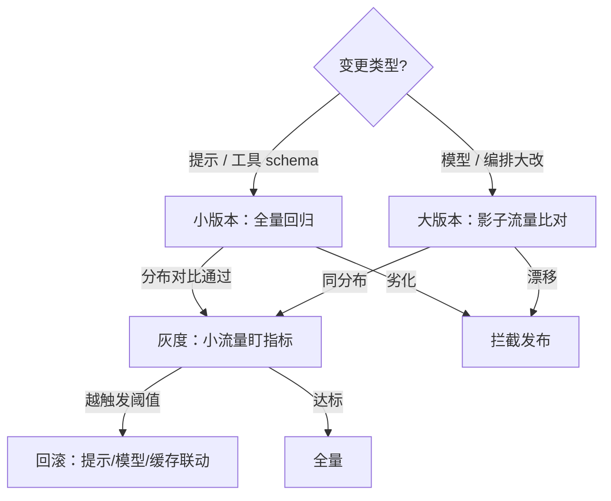
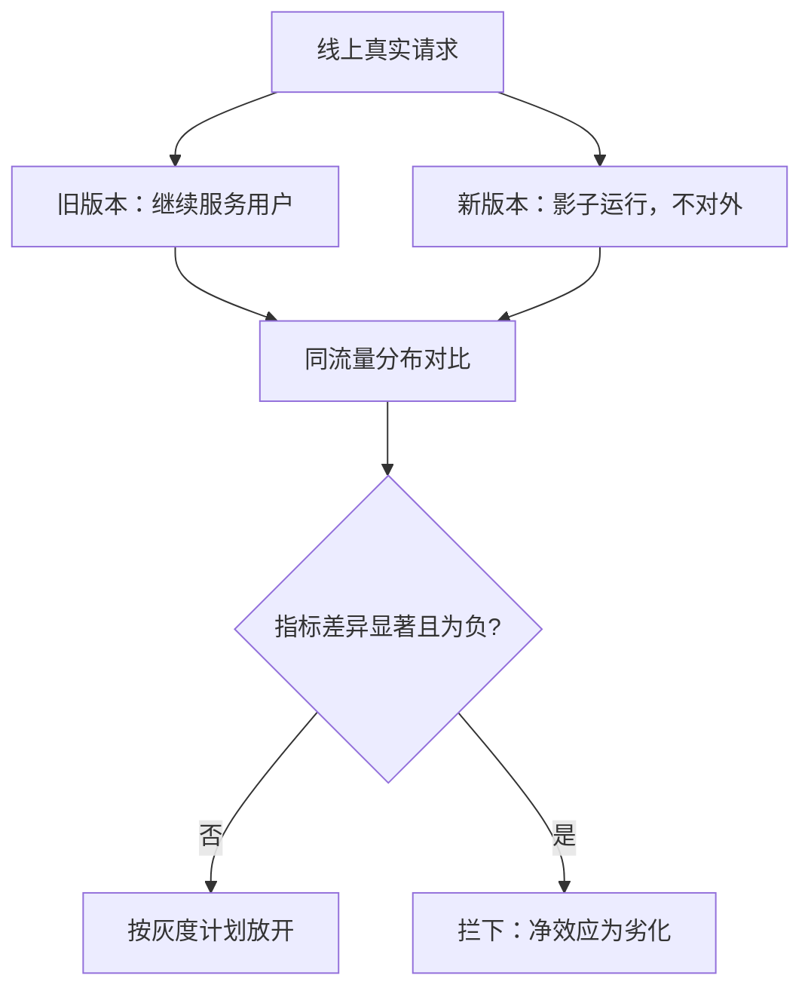

# 回归测试与版本回滚

代理没有行级 diff：提示换一个标点、供应商悄悄更新端点，行为就全域漂移；守门只能靠分布对比，回滚必须预先排练。

<footer>—— 据提示格式敏感性的实证与持续评测的工程口径整理</footer>

[上一课](/llm/agent-observability)把每条轨迹打上版本标注；本课用这些轨迹守门：变更要过回归，劣化要能回滚。代理是复合工件——系统提示、模型、工具 schema、工具实现、编排代码——任何一处漂移都改行为，而[提示格式敏感](/llm/prompt-format-sensitivity)已经证明：把冒号换成换行就能让分数跳几个点。

## 问题

传统软件的回归假设「变更可 diff、行为确定」，代理两条都不满足。回归测试通俗地说就是：改完东西后把旧用例重跑一遍，确认没把原来能用的改坏——「回归」指的是老问题又回来了。传统代码改一行，diff 能告诉你影响哪几行；代理改一个标点都可能全域变行为，所以老办法不够用。变更不可 diff：模型供应商把端点指向新快照，没有任何代码改动，行为全域变化；提示的一处改写影响所有下游轨迹。行为不确定：同一版本同一任务两次运行结果可能不同，单例对比的信噪比极低。于是没有回归资产的团队只剩一种策略——上线后等用户报警，而用户的报警是抽样偏差最大的信号源。回滚同样有坑：提示回滚容易，模型回滚要旧端点还在；更隐蔽的是状态不可逆——新版本已经发出的邮件、写入的数据库行，回滚代码撤销不了。

## 方法

**回归资产三层**。黄金任务集：从轨迹账本（[可观测性](/llm/agent-observability)）选有代表性的任务，连同钉住的环境（镜像、commit、数据快照，[智能体与工具评测协议](/llm/agent-eval-protocol)的协议原样适用）录成可重放用例。断言库：过程不变量比结果断言对回归更敏感——不该发的邮件没发、预算没爆、结束语义没有从「声明完成」漂成「预算耗尽」；批处理跑分用[评测框架 lm-eval / OpenCompass](/llm/eval-harness) 类工具组织。快照对比：新旧版本各跑同一批用例，做**分布对比**（成功率与过程指标的分位数、失败分桶的占比移动），不做逐例 diff。**变更流程**按风险分级：改提示或工具 schema 是小版本，全量回归必过；换模型是大版本，先影子流量——旧版本继续服务，新版本并排跑同一批真实请求，只比对不出服务。**灰度与回滚**：小流量放开后盯在线指标（完成率、接管率、成本、围栏误杀），触发阈值预先写死；回滚动作按单元排练——提示秒级回滚、模型回退到旧端点、缓存随版本作废（路由侧的灰度与摘流见[模型路由与级联](/llm/model-cascade-routing)，权重层面的原子换代见[适配器热更新](/llm/adapter-hot-swap)）。

## 机制

影子流量优于纯离线回归的机制是同分布：基准集再大也是录制的分布，线上请求才是真实分布；影子跑把新旧版本放进同一条流量，指标的差就是版本的净效应，环境漂移被差分掉。可以把它想象成医学里的对照试验：新旧两个版本「同时」接同一批真实请求，流量、时间、外部环境全一样，唯一差别是版本——于是指标的差就能干净地归到版本头上，而不是归到「今天用户变多了」这类环境因素上。

回滚的正确性条件是状态兼容：外部世界的副作用不可撤销，所以回滚设计从[安全围栏](/llm/agent-guardrails)的人工卡点就开了头——不可逆动作前置审批，等于给回滚保留了「外部状态还没变」的窗口。回归集自身会过拟合：对着黄金集反复调提示，等于把测试集当训练集，这是评测污染的另一种形式；对策是黄金集轮换加保留集不参与日常调试。

「模型没变」要按版本号验证而不是按信任：同一端点在供应商侧可以无公告换快照。每次发布前用固定探针任务集跑一遍，探针分数漂了，先查模型侧再查自己——这一条能省掉大半「灵异 bug」的排查时间。

## 边界

回归套件是抽检不是证明：通过只说明「这批用例没劣化」，长尾仍会翻车——在线指标与[部署后监控](/llm/deployment-monitoring)是回归的第二道网。版本账本要包含供应商侧的隐性变更，账目维护是持续成本。全量回归有算力账：黄金集规模与回归频率要进成本预算（[成本与延迟优化](/llm/agent-cost-latency)），用分层套件（冒烟集每次必跑、全集按周）折中。冒烟测试借自硬件行业：新电路板通电先看冒不冒烟——只验最基本的功能没坏。冒烟集就是几十条最关键任务，几分钟跑完，每次发布必过；全集几千条按周跑，兼顾速度与覆盖。生产部署的长期案例与失败模式，下一课用真实系统对账。

## 小结

- 代理变更不可 diff、行为不确定：守门靠分布对比，不靠逐例审查。
- 回归资产三层：可重放黄金集、过程断言库、新旧版本同流量影子比对。
- 触发阈值预先写死；回滚按单元排练，提示、模型、缓存联动失效。
- 不可逆动作前置审批是回滚设计的一部分：外部状态未变，回滚才有意义。
- 黄金集要轮换：对着回归集调提示是另一种污染。
- 出处：据提示格式敏感性实证与持续评测口径整理，非单篇论文。
