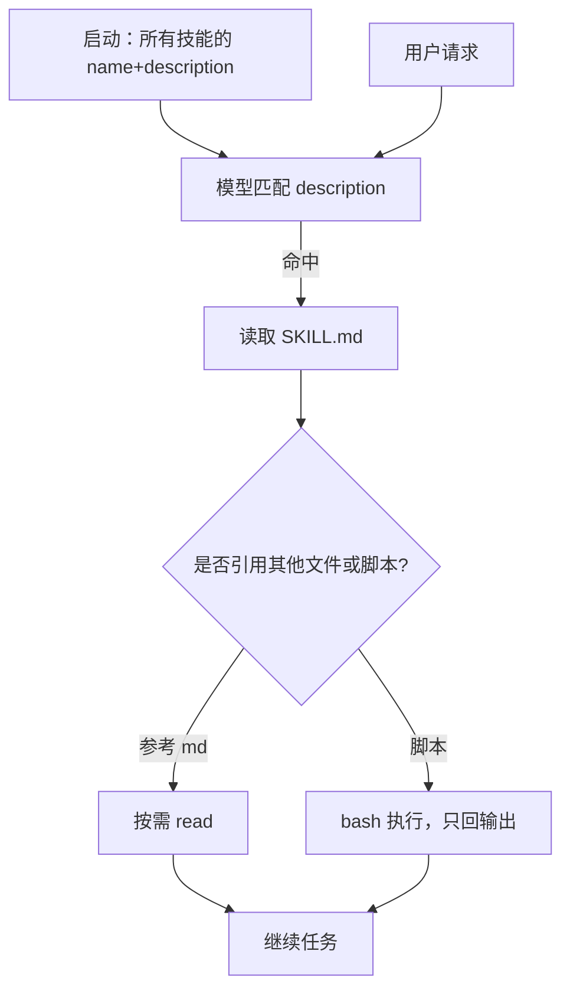

# Anthropic Agent Skills

    
技能是文件夹：YAML 里的名字与描述始终占系统提示；正文与脚本只在任务匹配时才读进上下文或拿去执行。

    <footer>—— Anthropic，Equipping agents for the real world with Agent Skills（2025-10-16）与平台 Agent Skills 概览</footer>

通用代理有文件系统与代码执行之后，缺的是**可组合的程序知识**：不是再写一个专用智能体，而是把「新员工入职手册」打成目录，让同一套循环按需加载。Anthropic 把这套格式叫做 **Agent Skills**：每个技能一个目录，根上必须有 `SKILL.md`。2025 年 12 月他们把它发布为跨平台的开放标准。Claude.ai、Claude API、Claude Code 与 Agent SDK 都支持，但发现与运行时约束不同。本篇写渐进披露与跨表面合同，不把第三方技能当可信代码来执行。

## 问题

把全部手册塞进系统提示，技能一多上下文先爆。把流程写进一次性提示，下次对话又要重贴。为每个部门 fork 一个代理，则工具循环、权限与记忆要维护 N 份。Skills 的主张是：元数据足够让模型决定「现在该不该打开哪本手册」；打开之后再读步骤；步骤提到的脚本用 bash 跑，**脚本源码不必进上下文**。这样捆绑内容在理论上几乎无上限，只要磁盘上有、任务用不到就不占 token。

这与 MCP 互补而不是替代。MCP 解决「能调用哪些外部工具」；Skills 解决「在这些工具上，我们组织的标准做法是什么」。工程博客写明后续会探索二者如何一起教更复杂的跨软件工作流。把技能理解成又一种 function calling schema，会错过文件系统这层：技能可以带参考文档、模板与确定性脚本，而不把它们全部变成工具参数。

### 发现靠 description，不靠用户记斜杠命令

`SKILL.md` 开头的 YAML 必须含 `name` 与 `description`。`name` 最长 64，仅小写字母、数字与连字符，不能含 XML，不能用保留词 `anthropic` / `claude`。`description` 非空、最长 1024，须同时写**做什么**和**何时用**——启动时只有这两项进系统提示，模型靠它做匹配。写得含糊，技能会永远不触发或乱触发。Claude Code 里也可以用 `/技能名` 显式调用，但 API 与 claude.ai 的主路径是自动匹配。

三级加载：Level 1 元数据始终加载，每个技能大约百 token；Level 2 在触发后读 `SKILL.md` 正文，官方建议控制在约 5k token 内；Level 3+ 的参考文件与脚本按需访问，未读时成本为零。脚本只把 stdout/stderr 送回模型。

## 方法

预置技能覆盖常见文档任务：`pptx`、`xlsx`、`docx`、`pdf`，在 claude.ai、Claude API、AWS 上的 Claude Platform 与 Microsoft Foundry（需 Hosted on Anthropic）可用。Claude Code **不**带这四套文档技能，但捆绑开源的 Claude API skill（多语言 SDK 与 API 参考）。自定义技能在 Code 里就是目录：个人 `~/.claude/skills/`，项目 `.claude/skills/`；API 走 `/v1/skills` 上传，Messages 里用 `container.skills[]` 声明 `type`、`skill_id`、可选 `version`，并启用代码执行工具；每请求最多 8 个技能。claude.ai 用 zip 在设置里上传，按用户隔离，管理员不能组织分发。

API 上 Anthropic 技能 `type` 为 `anthropic`、短 id；自定义为 `custom`、`skill_*` id。版本可钉死或 `latest`。代码执行容器没有网络、不能运行时装包，只能用预装依赖——文档技能能产出文件 id，再经 Files API 取回。Agent SDK / Managed Agents 则可从 GitHub 仓库的 `.claude/skills` 扫描加载，依赖 agent 工具集里的 `read`。跨表面**不会**自动同步：在网站上传的技能不会出现在 API，Code 的文件系统技能也不会出现在网站。

### 编写时从评测缺口往回长，而不是先写百科

官方建议：先在代表任务上跑代理，看它卡在哪、缺哪类上下文，再增量补技能。`SKILL.md` 臃肿就把互斥章节拆到旁路文件。代码既当工具也当文档：写清楚该直接执行还是读源作参考。从模型视角迭代：观察它是否过度依赖某一章、description 是否导致误触发。也可以在一次成功轨迹之后，让 Claude 把做法与常见错误写回技能——这是捕获真实需要的上下文，而不是作者预想的上下文。2025-10 博客把 PDF 填表技能当作例子：核心 `SKILL.md` 保持瘦，表单细节放 `forms.md`，抽字段用预写 Python，确定性且不把 PDF 整文件塞进 token。

## 机制

渐进披露把技能变成按需分页的手册。匹配发生在极小的元数据上，所以可以安装很多技能而不在每轮支付正文代价。文件系统使「未引用的附录」保持零成本；bash 使确定性算法不必由 token 生成。这依赖一个前提：运行时真的有一个带文件系统的虚拟机或本机工作区。没有代码执行，API 上的 Skills 容器不成立。

安全机制与能力同源。技能能指示模型调工具、跑代码、读敏感文件。官方要求只安装自己写的或来自 Anthropic 的技能；来源不明必须先审计所有捆绑文件、依赖与「是否叫模型去拉外部 URL」。外部内容可变成间接指令。企业可对 claude.ai / Cowork 上传做内容扫描，但扫描覆盖不到 Skills API 与 Console 上传。Agent Skills **不**在 ZDR 安排内，定义与执行数据按标准保留政策处理。

把技能当软件安装：看网络调用、文件访问是否与声称的用途一致。本篇不讨论如何把恶意指令藏进技能，只指出这是官方列出的风险类别。生产系统接技能前应走企业 vetting 文档。

### 运行时差异会改写你能捆绑什么

API 容器：无网、无动态装包——技能必须在预装环境里自洽。claude.ai：网络权限随用户/管理员设置变化。Claude Code：与用户机器相同的网络，但官方不鼓励全局装包以免弄脏环境。于是「一条 pip 依赖」在三个表面是三种故事。设计技能时按最严表面写，或显式分发多份。共享范围也不同：网站每人一份；API 工作区共享；Code 分个人与项目，还可通过 Plugins 分发。

## 边界与工程取舍

开放标准提高可移植性，不等于所有实现行为一致。触发质量几乎完全取决于 description；这是提示工程，没有编译器。每请求 8 个技能的上限迫使组合要克制。文档预置技能在 Code 里缺失，团队若把「生成 PPT」写进仓库技能，不要假设本机 CLI 已有同样能力。API 产出的 Office 文件要走 Files API，不能当本地路径。

Skills 不能替代权限模型：它改变模型**想**做什么，不缩小工具**能**做什么。与 Hooks 相比，Hooks 是确定性生命周期脚本，Skills 是模型可读的程序知识。与子代理相比，技能不新开一个身份，只扩展当前身份的手册。让代理自己写技能是博客里的远期方向，今天仍建议人审。

出处：Anthropic 工程博客 *Equipping agents for the real world with Agent Skills*，2025-10-16（开放标准更新 2025-12-18）；平台文档 Agent Skills overview、Using Agent Skills with the API、Skill authoring best practices；Claude Code Skills 页。Cookbook 与 github.com 上的 skills 仓库提供范例。

## 小结

- Agent Skills 用带 `SKILL.md` 的目录，按元数据 → 正文 → 资源三级渐进披露。
- description 同时写能力与触发条件；脚本跑在代码执行环境，源码默认不进上下文。
- 预置文档技能在 API / claude.ai；Claude Code 用文件系统自定义技能，不带 pptx 等四件套。
- 跨表面不同步；API 容器无网无动态装包。按最严运行时设计。
- 只从可信来源安装；当软件审计。不在 ZDR 覆盖范围内。
- 出处：Anthropic 工程博客与 platform.claude.com / code.claude.com 文档。
