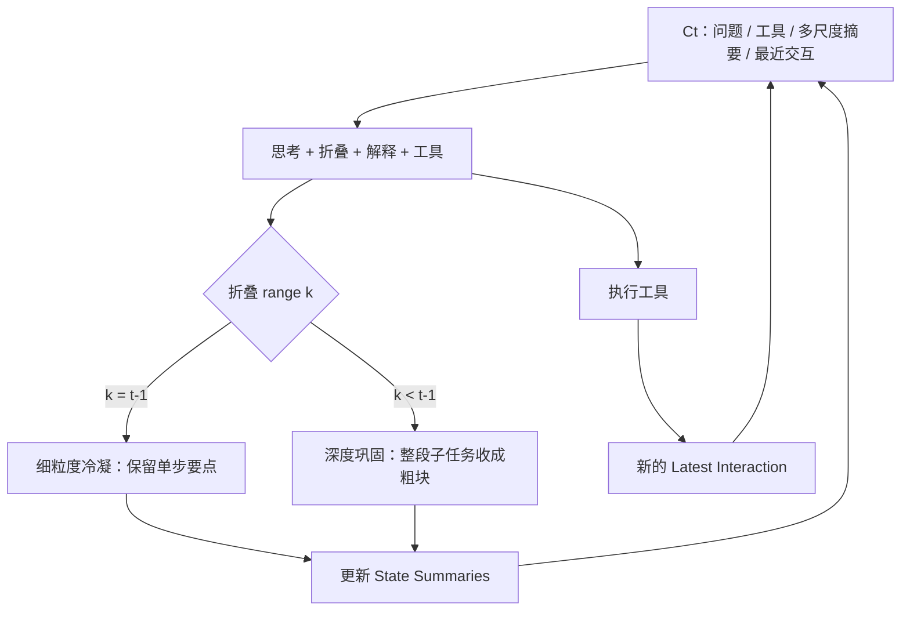

# AgentFold 上下文折叠

    
把上下文当成要主动雕刻的认知工作区，而不是只进不出的日志：每一步输出折叠指令，既可细粒度冷凝单步，也可把整段子任务深折成一条粗摘要。

    <footer>—— Ye、Zhang、Li、Yin 等，AgentFold: Long-Horizon Web Agents with Proactive Context Management，arXiv:2510.24699</footer>

通义实验室 Rui Ye、Zhongwang Zhang、Kuan Li、Huifeng Yin 等提出 **AgentFold**：Web 代理在长程信息寻求上被两条静态策略夹住——ReAct 追加全部原始轨迹导致饱和；逐步把全文再摘要则有不可逆细节损失。AgentFold 把上下文分成多尺度状态摘要（长期）与最近一次完整交互（工作记忆），每步同时产出折叠指令与工具调用。仅用监督微调（无继续预训练、无 RL），AgentFold-30B-A3B 在 BrowseComp 上 36.2%、BrowseComp-ZH 47.3%，超过 DeepSeek-V3.1-671B-A37B 的 30.0% BrowseComp，并与 o4-mini 等专有代理同级。本篇写折叠指令的两种尺度与 Fold-Generator，不把「fold」当成产品口号。

## 问题

ReAct（Yao 等）把思维—动作—观察三联一直追加。网页噪声、失败点击、重复 SERP 会把关键线索埋进中段，触发 [中间丢失](/llm/lost-in-middle) 与 [腐烂](/llm/context-rot)。另一极是 MEM1、MemAgent 一类逐步把**全部历史**再压缩：每压一次，早期细节以固定概率丢失。作者用粗算说明：若每次全文再摘要有 1% 概率丢掉某关键细节，该细节活到第 100 步只剩约 $0.99^{100}\approx 36.6\%$，500 步约 0.66%。需要一种**回顾式、可变尺度**的折叠：子任务未结束时保留细粒度；死胡同或已验证的子调查再一次性深折。

评测用 BrowseComp / BrowseComp-ZH（难找事实）、WideSearch（广搜 Item-F1）、GAIA 文本子集。训练问题集与 WebSailor 对齐以便对照。最大工具调用 100，超限强制停。骨干 Qwen3-30B-A3B-Instruct-2507，激活约 3B。信息寻求代理的失败经常是「线索曾出现过、后来被噪声盖住」，折叠要回答的正是这件事：线索一旦被判定仍有用，就应落在独立细块里，避免被后续全文再摘要反复碾压。

### 工作区不是一条日志

步 $t$ 的上下文 $C_t=(Q,T,S_{t-2},I_{t-1})$：$Q$ 用户问题，$T$ 工具 schema，多尺度摘要 $S$ 是覆盖到 $t-2$ 的块序列 $s_{x,y}$（可单步 $y=x$ 或多步 $y>x$），$I_{t-1}$ 是上一步解释、动作、观察的全文。第一步只有 $Q$。这样最近一步无损，更早的历史按效用存在不同分辨率。人的目标、巩固后的知识、易失工作记忆被显式拆开。

折叠发生在窗口内部，原文网页默认不另存。相对 [ACM](/llm/acm-context) 的磁盘卸载，AgentFold 是有损工作区雕刻：深折之后中间 SERP 回不去，除非当时细粒度块还留着。

## 方法

每步生成四块：思考 $th_t$、折叠指令 $f_t$、解释 $e_t$、动作 $a_t$。$f_t$ 为 JSON：`{"range":[k,t-1],"summary":"σ"}`。**细粒度冷凝** $k=t-1$：只把最近交互收成一块，例如「第 5 步发现候选 XYZ」。**深度巩固** $k<t-1$：把 $[k,t-1]$ 内已有摘要块收回，换成一条粗结论，例如「第 5–9 步确认 XYZ 不满足全部约束」。工作区更新后执行工具，观察与解释、动作组成新的 Latest Interaction。循环是感知 → 推理 → 折叠 → 行动，策展是一等动作。

Fold-Generator：先进模型也难靠提示稳定产出这套多段结构。管道做拒绝采样，丢掉格式不合或环境错误过多的步，得到 $\{(C_t,R_t^*)\}$，再 SFT 蒸馏到开源模型。作者强调：这把脆弱的提示技能内化成前向，并让推理期比「生成再过滤」便宜。代码与预览模型挂在阿里 DeepResearch 生态（AgentFold-30B-A3B-Preview）。

### 100 步仍约 7k token

文中称 100 轮交互后上下文约 7k，而 ReAct 同类可超 84k；并可扩到 500 轮、多数时候低于 20k，死胡同被巩固时块数非单调下降。WideSearch 总体 62.1%，作者称超过所列专有对照；GAIA 67.0%。这些是信息寻求代理数字，不是通用 SWE。SFT-only 是方法声明：对照「同一数据上 RL」未做，故不能说 RL 无用，只能说折叠范式在纯 SFT 下已经把 30B 稀疏模型推过更大 MoE 的 ReAct 代理。

## 机制

要求模型先写折叠范围，等于强制回顾：哪些步已闭环、哪些线索还要细。回顾信号与下一步工具选择共享同一段思考，形成自调节。细粒度块免除「每步重摘要」的复合损失；深折切除 ReAct 必然留下的失败点击。延迟巩固——等子任务结果明朗再折——避免过早丢掉仍可能有用的 URL。

与均匀摘要的差别是策略可变。与 [ReSum](/llm/resum-context) 的差别是：ReSum 用外部工具周期性重启，折叠尺度不在每步由策略选 $k$；AgentFold 的 $k$ 是学习出的。与 MEM1 的差别是：MEM1 每步把状态重写成单一内部状态并丢掉上一步原文；AgentFold 保留多块、多尺度。

JSON 解析失败即该步折叠无效，工作区可能膨胀。训练用拒绝采样压格式；生产要实现严格解析与回退（默认 $k=t-1$）。不要在未解析成功时继续追加原始观察。

### Fold-Generator 的数据偏置

问题集来自 WebSailor 同一批，折叠策略会偏向该类难搜题的节奏。迁到代码代理或办公工作流，需要重做轨迹，不能假设 $k$ 的语义可迁移。数据管道未像 ACM 那样完整开源时，复现成本在生成侧，不在公式侧。

## 边界与工程取舍

BrowseComp 36.2% 仍远低于任务饱和；赢的是「同范式更小模型 / 更大 MoE ReAct」。网页工具栈（搜索、Visit）与 WebSailor 系同源，换工具分布数字会动。深度巩固不可逆，关键原始引用应在细粒度块里显式留下 ID。500 轮是能力叙述，部署仍要工具与费用上限。

出处：Ye et al.，*AgentFold: Long-Horizon Web Agents with Proactive Context Management*，arXiv:2510.24699。对应作者 yr991129@sjtu.edu.cn；通义实验室。对照 Yao 等 ReAct、Wei 等 BrowseComp、Li 等 WebSailor。

## 小结

- AgentFold 用多尺度摘要 + 最近交互全文，每步学习折叠范围 $k$。
- 细粒度冷凝保线索，深度巩固剪子任务噪声；100 步上下文约 7k。
- 30B-A3B 仅 SFT：BrowseComp 36.2%，BrowseComp-ZH 47.3%。
- 折叠在窗口内有损；需要可回查原文时叠加外存方案。
- 出处：arXiv:2510.24699。
