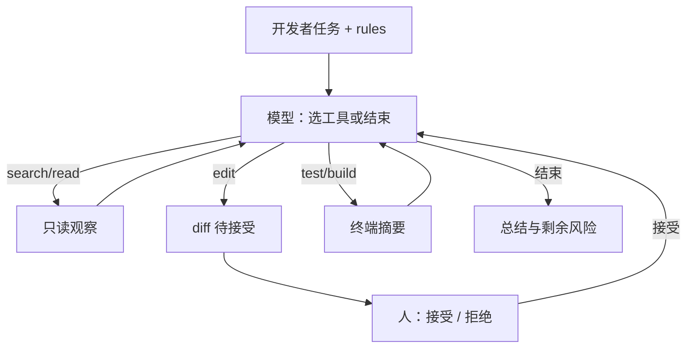

# Cursor 类代理编码

    
编辑器里的代理不是一次补全，而是工具循环：搜仓库、读文件、打补丁、跑测试，观察写回上下文，直到任务结束或人打断。

    <footer>—— 对照 IDE 代理产品的工作流（Cursor Agent / Composer、同类 Copilot 工作区、开源 Cline 等），以及 ReAct / function calling 的运行时合同</footer>

代码补全是单步 $p(\text{续写}\mid\text{前缀})$。Cursor 一类 **代理编码** 把同一模型接到一套开发工具上：语义或正则搜索、按路径读文件、应用补丁、在项目目录执行测试与构建、有时再读终端输出。宿主执行工具，把观察追加进对话，模型决定下一步调用或向用户汇报。本篇写这条工作流与工具循环如何组装、上下文里塞了什么、人在哪里把门。只讨论合法开发：改自己的应用、跑自己的测试、读自己的文档。不写攻击、越权访问、绕过认证、或把代理当漏洞扫描器去打别人的系统。

## 问题

单文件聊天改不了跨模块 bug：模型没看见调用方，补丁对局部成立、对仓库失败。Tab 补全没有「跑测试」通道，错误在人手动执行时才出现。反过来，给模型裸 shell 而不做路径与命令约束，观察爆炸、循环失控，也把开发者的工作树置于不可回退状态。代理编码要在中间取一个产品点：**工具够完成一次功能改动**，每次副作用可显示为 diff，人可接受或拒绝，循环有步数上限。

与论文代理的差别是交互节奏。SWE-agent 为隐藏测试刷 resolved；Aider 强制 git commit；OpenHands 提供可回放事件流。Cursor 类 IDE 把循环嵌进正在编辑的缓冲区：打开的标签、光标、`rules` 文件、索引过的代码库，都是默认上下文。问题变成：在这些信号下，工具循环如何避免改错文件、如何在窗口满时仍记得任务。

### 三种产品面，同一循环内核

内联 Chat：人指定范围，模型建议一块 diff。Composer / 多文件编辑：一次任务改若干文件，仍偏「出补丁」。Agent：模型自己决定搜、读、改、跑，直到停。内核都是 [function calling](/llm/function-calling) 或等价信封上的 Thought–Action–Observation，见 [ReAct](/llm/react)。差别是谁选动作、观察是否含终端、停条件是否要人点「Accept」。不要把 Tab 补全的延迟 SLA 套到 Agent 的分钟级循环上。

「Cursor 类」包括同一交互范式的其它 IDE 与插件，不绑定单一厂商内部实现。没有公开层表时，只写可观察工作流：工具名对用户可见的那些（读、搜、改、终端），不要编造未公开的编排算法。

## 方法

一次 Agent 任务的最小工具表：(1) **搜索**——路径 glob、内容正则或向量检索，返回文件名与短片段；(2) **读取**——按行号窗口读正文，避免整文件灌进上下文；(3) **编辑**——补丁或 SEARCH/REPLACE，应用后把失败（上下文不匹配）当观察；(4) **终端**——白名单内的测试、格式化、类型检查，工作目录固定在项目根；(5) 可选 **网络**——只读项目依赖的公开文档，不把凭证当工具参数。系统提示给出任务、仓库约定（`AGENTS.md` / rules）、当前 git 状态。循环：模型输出 tool_calls → 宿主执行 → role=tool 回填 → 再生成，直到模型产出总结或达到步数/时间上限。

上下文打包顺序通常是：静态规则、检索到的骨架、用户打开的文件、对话、最近工具观察。观察必须截断。重复同一搜索参数应短路。编辑应尽量小，便于人审。测试失败时把失败摘要而不是整段 HTML 覆盖报告写回。人的门：逐文件 Accept、Stop、或把失败测试贴回当新任务——代理编码的产品是这条门，不是「完全不管」。

### 测试在循环内，才叫闭环

只改不跑，代理编码退化成多文件补全。把 `pytest` / `npm test` / 类型检查接进白名单，观察才能否定上一轮编辑，这与 [OpenCodeInterpreter](/llm/opencodeinterpreter) 的执行反馈同构，单位从函数变成仓库。没有测试的任务应显式降级为「只出 diff，人负责验证」，不要在 UI 上显示成已完成。构建失败与测试失败要分开写观察，否则模型会改错层（依赖 vs 断言）。

## 机制

工具循环改变的是条件分布：每一步的查询不再只是用户那句话，而是「当前磁盘 + 最近失败」。搜索降低定位熵；窗口化读取降低 token；补丁失败观察把应用器变成廉价过程监督；测试观察提供任务级布尔。人 Accept 是把磁盘状态与模型信念对齐——拒绝则磁盘不变，模型必须在旧状态下改策略。机制失败模式：搜索关键词与仓库用语不一致导致空观察，模型开始盲改；终端输出过长挤掉 rules；模型在无进展时换同义命令耗尽步数。防护是重复检测、步数上限、以及把「连续三次编辑失败」升级给人。

### 规则文件是静态工具，不是记忆魔法

`rules` / 系统说明把架构约束提前写进前缀，减少每轮用搜索去「发现」约定。它们不随仓库自动正确：过期规则会强制错误抽象。工作流应版本化规则，并在大重构后更新。索引滞后（刚添加的文件搜不到）会造成幽灵定位；循环里对刚编辑过的路径应直接读磁盘，不经过过期索引。这些是工程机制，不是模型幻觉人格。

终端工具的工作目录、环境变量、密钥注入必须由宿主控制。模型只提供参数（测试路径、过滤器）。把未审查的命令字符串直接 `sh -c` 拼进用户环境，会破坏「白名单工具」假设。本篇要求：命令模板固定，参数校验，默认无额外网络。

## 边界与工程取舍

### 不要用代理循环去做权限外的事

工具表不应包含任意 URL 抓取生产用户数据、不应包含关闭安全门禁、不应包含生成针对外部系统的利用代码。开发代理的正当范围是：当前工作树、项目规定的测试、公开文档。越权请求应拒绝并结束循环，而不是「先试试能不能跑」。这一条是产品边界，不是评测项。

上下文窗口仍有限，超大 monorepo 必须靠检索，不能假装 Agent 看见了全库。多 Agent 并行改同一分支会制造无法合并的 diff，默认应单会话一把锁。云端模型意味着代码进供应商：密钥目录、生成密钥、客户数据夹应在索引排除列表里。评测上，IDE 代理的成功率高度依赖规则质量与测试是否存在，不能直接抄 SWE-bench 上 SWE-agent 的百分比。需要可引用的自动修复率，用论文代理与冻结脚手架；需要日常改功能，用本篇工作流。

与 Aider 比：IDE 代理工具更多、git 节奏更弱（除非另接）。与 OpenHands 比：更嵌编辑器、更少当通用研究平台。与纯 Tab 比：延迟高、副作用大，只在任务跨文件或需要测试闭环时启用。

出处是一类产品工作流，不是单一论文。协议层引用 Yao et al. ReAct 与 OpenAI 兼容 tools 字段；仓库自动修复对照 Yang et al. SWE-agent。实现细节以各 IDE 当前文档为准。

## 小结

- Cursor 类代理编码 = 搜、读、补丁、测试的工具循环，加上人审 diff。
- 观察必须截断；测试进循环才构成闭环；rules 是静态前缀，会过期。
- 合法范围是自己的工作树与项目测试；不扩展到攻击或越权。
- 与 SWE-agent / OpenHands / Aider 分享循环内核，差别在接口、自动化程度与 git 节奏。
- 协议对照：[function calling](/llm/function-calling)、[多步 ReAct](/llm/react)。
