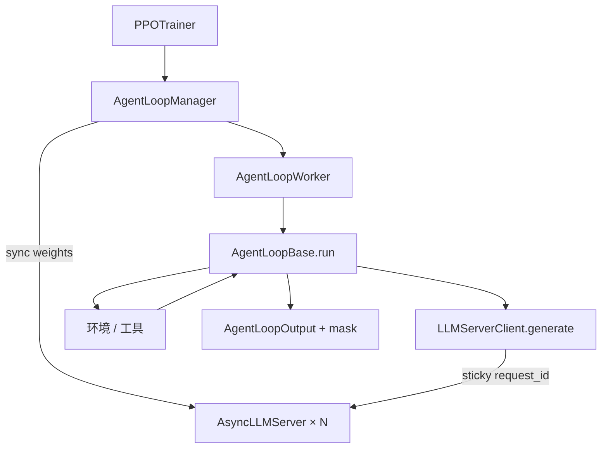

# server-based AgentLoop

    
Client 与 Server 之间不用 Chat Completions 的文本往返，而走 token 进出的 generate：工具文本再分词不可逆，训练必须用推理引擎当时吐出的 id。

    <footer>—— verl 文档 start/agentic_rl 与 advance/agent_loop：token-in/token-out API</footer>

VeRL 把 HybridFlow 落成可跑的库之后，多轮 agent 把旧的 **SPMD rollout** 撑破：一批请求长度和工具往返次数都不同，再按数据并行轴锁步生成，GPU 在工具 I/O 上齐步空转。v0.7 起默认改成 **rollout server**：推理引擎是在线服务，client 按样本发请求，引擎做动态组批。用户侧的扩展点是 **AgentLoop**——一个可实现的 `run` 协程，循环调用 `LLMServerClient.generate`，与环境交互，最后返回 `AgentLoopOutput`（`prompt_ids`、`response_ids`、`response_mask`）。本篇钉 server 模式要解决的两件事：负载与粘滞会话；以及为什么必须暴露 **token 级 API** 而不是 HTTPS 聊天接口。循环如何把 mask 写对，细节落到 [多轮 loss mask](/llm/multiturn-loss-mask)。

## 问题

SPMD 生成假设：同一时刻所有 DP rank 在做同构的 decode。多轮工具把这个假设毁掉——有的样本已经结束，有的卡在检索。asyncio 协程可以让 worker 在等工具时去跑别的请求，但若推理仍是「整批 tensor 进 `generate`」，协程救不了引擎内部的对齐。Server 模式把引擎换成在线服务：每条样本是独立请求，continuous batching 吸收长度差。

第二问题更隐蔽。Chat Completions 返回文本；下一步把历史文本再 `tokenizer.encode`。`<think>`、工具 JSON、前后空白在很多词表上**不是对合**的：模型生成的 token 序列，与「文本再编」的序列可以不同。训练时若用后者算 $\log\pi(a_t|s_t)$，重要性比是在错误动作上算的。verl 文档写明：Client/Server 之间用基于 Ray actor 的 `generate`，输入输出都是 token id，好让 client 把工具文本与模型 token 的关系自己维护，而不是把不可逆转换藏进 HTTP JSON。

### 默认两种 Loop 不够用就注册新的

`SingleTurnAgentLoop` 覆盖普通单轮 RLVR。`ToolAgentLoop` 覆盖 ReAct 式多轮工具，数据集需要 `agent_name` 字段以便分发。自定义环境（浏览器、IDE）应继承 `AgentLoopBase`，在 `run` 里写自己的状态机，而不是改 SGLang 内部的 `_async_rollout_a_request`。历史实现把工具状态塞在 SGLangRollout 里；AgentLoop 把状态提到框架层，引擎只做 token-in-token-out。这与 [VERLTool](/llm/verltool) 的工具服务器互补：一个管循环抽象，一个管工具进程。

v0.7 移除 SPMD rollout 是产品决策：维护两套多轮路径的成本高于迁移。旧脚本若仍调 SPMD API 会直接失效，不是「可开关的兼容层」。

## 方法

一步 PPO 仍分 rollout / train 两相（默认同步栅栏时）。Rollout 相：`PPOTrainer` 抽 batch，`AgentLoopManager.generate_sequences`；Manager `wake_up` 所有异步 LLM server，把训练引擎（FSDP / Megatron）权重同步到推理引擎（vLLM / SGLang）；batch 切块发给 `AgentLoopWorker`；每个 prompt 起一个用户定义的 Loop 协程直到结束。Loop 内部：`LLMServerClient.generate(prompt_ids)` → 解析动作 → 调环境 → 拼接 token → 再 generate。

`LLMServerClient` 做两件事。**负载均衡**：第一轮把请求打到当前 inflight 最少的 server。**粘滞会话**：同一 `request_id` 后续轮固定到同一实例，以便前缀缓存与 TP 组内 KV 还在。换实例等于丢掉 cache，多轮会变成反复 prefill。Server 实现上，SGLang 常在 TP 组的 0 号卡上经 Ray 调 `async_generate`；vLLM 可用 ZMQ 与 TP 组通信。都要实现同一套：文本 completion（可选）与 **token-in-token-out**。其他引擎实现 `AsyncServerBase` 即可插入。文档把两种 API 并列，是因为调试时人读文本方便，训练路径却绝不能只走文本。若某个插件只实现了 chat completion，多轮工具任务应视为未接通，而不是「先用着」。训练相仍用 FSDP 或 Megatron 在 token id 上算对数概率；rollout 相交出的 id 必须能直接拼进那次前向，中间不得经过 detokenize。

### Token API 的最小契约

输入：已编码的 `prompt_ids`（以及采样参数）。输出：新产生的 `response_ids`，**不得**在 server 内再 decode-encode 一轮。工具返回的文本由 Loop 在 client 侧编码成 observation ids，写入序列，并在 mask 上标 0。下一轮 `prompt_ids` 应是「上一轮完整 token 前缀 + 观察」，而不是「decode 成 messages 再 apply_chat_template」。后者会触发 Agent Lightning v1.0 描述的 retokenization drift。若产品必须走 HTTP 聊天接口，应在代理层保留原始 token（见 [Agent Lightning](/llm/agent-lightning)），不能只存文本日志。

粘滞会话与负载均衡有冲突：粘得太死，长尾请求会钉在同一 GPU。第一轮选最空的实例，之后粘住，是折中。极端长尾要用文档中的 stream_mode 调度配方，而不是关掉 sticky。

## 机制

Server 模式能加速，是因为引擎看到的是请求流而不是「必须等齐的 tensor 批」。这与 [异步 rollout](/llm/async-rollout-arch) 的训练–生成重叠是不同层：即使每步训练仍等所有 Loop 结束（同步 PPO），rollout 内部已经异步。Fully async 配方再把 Trainer 与 Rollouter 分节点、加 staleness。先把 AgentLoop 跑对，再开 fully async，否则版本混乱叠加 mask 错误无法调试。

`wake_up` 同步权重是正确性边界。若 Loop 跨一次训练步仍活着（partial rollout），必须定义中断或绑定旧权重，否则同一条 `request_id` 会在更新后继续 decode。默认同步实现里 Loop 在一步内起止，避免这个问题。打开跨步存活就要按 AReaL 的中断语义来。工具等待期间 GPU 不应被该请求独占：server 把这条请求从 running batch 里摘掉，把算力让给其他 prompt，这才是「为避免等工具而引入协程」的硬件含义。若实现上工具调用仍阻塞整个引擎线程，AgentLoop 只是把 Python 写漂亮了，吞吐不会变。

### 和「在推理引擎里写 agent」的差别

SGLang 的 program / OpenAI 工具调用可以在引擎内跑循环，训练框架看不到 token 边界。AgentLoop 把循环拉回 Python，引擎变纯生成器，便于打日志、接沙箱、写单元测试。代价是多一次 RPC。延迟敏感的单 token 工具（本地计算器）RPC 占比高；高延迟检索则可忽略。不要两者各写一半循环。

## 边界与工程取舍

不要用 Chat Completions 打分再拿文本训练。不要在 Loop 里 `decode` 后改几个字符再 `encode` 当模型输出。自定义 Loop 必须返回与训练 batch 对齐的 mask，否则 PPO 会在观察上更新。`agent_name` 配错会把工具任务送进 SingleTurn，表现为「从不调工具」而不是报错。多 server 的 tokenizer 必须与训练进程字节级一致，包括 special tokens。

完全异步、工具服务器、harness 代理都建立在「Loop 或等价物交出正确 token」之上。这层错了，上面的加速没有意义。

HybridFlow：Sheng 等 arXiv:2409.19256。实现与 API：verl.readthedocs.io `advance/agent_loop`、`start/agentic_rl`；代码 `volcengine/verl`。vLLM：Kwon 等。SGLang：Zheng 等。Retokenization 问题的展开见 He 等 Agent Lightning v1.0 arXiv:2608.17528。

## 小结

- Server-based AgentLoop 把推理做成在线服务，用协程跑每条样本的多轮循环，避免 SPMD 锁步。
- 必须提供 token-in-token-out；文本 API 再分词会破坏 logprob 与优势。
- Client 负责负载均衡与粘滞会话；Loop 负责环境与 mask。
- 出处：verl 文档与 HybridFlow 论文；发行说明 v0.7。
