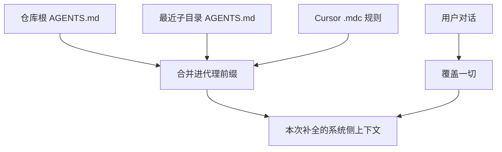

# AGENTS.md 项目规范

    
把它当成写给代理的 README：一个可预测的位置，放下构建步骤、测试命令与仓库约定，而不去污染给人类看的 README。

    <footer>—— agents.md，AGENTS.md 开放格式说明；由 Agentic AI Foundation（Linux Foundation）托管</footer>

**AGENTS.md** 不是模型卡，也不是另一套 YAML schema。它是仓库根上（以及按需嵌套在子目录里）的一份标准 Markdown：给编码代理写操作上下文。官方站点 [agents.md](https://agents.md) 把它说成「README for agents」。协作方包括 OpenAI Codex、Cursor、Google Jules、Amp、Factory 等；Cursor 文档把它列为四类规则之一，与 Project Rules、User Rules、Team Rules 并列。本篇写文件合同、解析优先级与它**不是**什么，不把「放一份 md」写成已经解决了记忆问题。

## 问题

人类 README 要短：快速开始、贡献指南、项目是干什么的。代理还需要另一层：`pnpm turbo run test --filter` 怎么跑、PR 标题格式、哪些目录禁止改、安全坑在哪。若把这些塞进 README，人类读者被淹没；若每个工具各自发明 `CLAUDE.md`、`.cursorrules`、`.aider.conf.yml`，同一仓库会出现互相矛盾的「系统提示」。AGENTS.md 的赌注是：**文件名即协议**。代理按约定去读，不必先学厂商私有 frontmatter。

没有强制字段。FAQ 写明：标准 Markdown，用任何标题都行，代理只解析你提供的文本。这既是优点也是税：没有 schema 就不能机检「Never」条款是否被遵守，也不能按 glob 只在改 API 时加载。Cursor 因此保留 `.cursor/rules/*.mdc`：需要 `description` / `globs` / `alwaysApply` 时走 Project Rules；需要跨工具共享、永远为真的仓库事实时走 AGENTS.md。

### 它解决的是提示放置，不是长期记忆

规则在每次补全时被拼进模型上下文的前部。Cursor 文档原话是：大模型在补全之间不保留记忆，规则提供提示级的可复用上下文。会话结束、换模型、子代理开一个新鲜窗口，AGENTS.md 仍要被重新加载。它不是 [MemGPT](/llm/memgpt) 的档案库，也不是 [Mem0](/llm/mem0-layer) 的抽取层。写进 AGENTS.md 的每一行都占用窗口；300 行的「永远加载」文件就是一条 Always Apply 规则，换了文件名而已。

官方没有字节上限，但 Codex CLI 一类实现会截断（社区记录约 32 KiB）。工程上应按注意力预算写：命令、禁区、测什么，而不是把架构图散文化。长流程应链到脚本或技能包，见 [渐进式披露](/llm/progressive-disclosure)。

## 方法

站点给出的落地步骤很短：在仓库根创建 `AGENTS.md` → 写对代理有用的节（概览、构建与测试、代码风格、安全）→ 需要时再加提交信息、数据集、部署。大型单体在每个包再放一份。解析规则：**距被编辑文件最近的 AGENTS.md 获胜**；显式用户对话覆盖一切。OpenAI 主仓在写作时有 88 份嵌套文件——这是规模证据，不是要求你复制 88 份。

Cursor 的嵌套语义略宽：子目录文件在处理该树内文件时自动应用，与父级**合并**，更具体者优先。根上写「用 pnpm」，`frontend/AGENTS.md` 写「组件用函数式」，两边都进上下文；冲突时前端文件赢。Cursor 不读 `~/.cursor/AGENTS.md`；跨项目偏好走 User Rules 或 Team Rules。CLI 还会在根上读 `AGENTS.md` 与 `CLAUDE.md`，与 `.cursor/rules` 一起生效。`.cursor/rules` 里的纯 `.md`（无 `.mdc` frontmatter）会被规则系统忽略——要纯 Markdown 就用根上的 AGENTS.md，不要丢进那个目录碰运气。

### 该写什么、不该写什么

写可执行、可证伪的约定：测试入口、包管理器、生成代码目录、禁止改的契约文件。站点示例用 pnpm filter、Vitest `-t`、PR 标题 `[project] Title`。安全节应写密钥位置、禁止提交的路径、必须先跑的检查；不要写「请注意安全」这类空话。Cursor 建议规则保持可执行、避免整本风格指南——代理已会常识风格，重复说明只烧 token。

迁移：把旧 `AGENT.md` / `.cursorrules` 改名为 AGENTS.md，必要时留符号链接。Aider 在 `.aider.conf.yml` 里 `read: AGENTS.md`；Gemini CLI 在 `.gemini/settings.json` 设 `context.fileName`。Claude Code 原生读 `CLAUDE.md`：常见做法是在 `CLAUDE.md` 首行 `@AGENTS.md` 导入，避免维护两份真相。

## 机制

加载顺序决定冲突结局。agents.md：最近文件赢。Cursor：Team Rules → Project Rules → User Rules，冲突时更早来源优先；AGENTS.md 作为项目级纯文本与 `.mdc` 并存。用户消息始终最高。这意味着你不能靠 AGENTS.md 禁止用户要求的危险操作——那是产品层的工具 ACL 与沙箱，不是 Markdown 能强制的。

嵌套的机制是**作用域叠加**。子代理若只收到任务字符串、不继承父会话，仍可能按工作目录重新发现最近的 AGENTS.md；这与 [多智能体上下文隔离](/llm/multi-agent-context-isolation) 正交：隔离切断的是对话史，不是仓库内的约定文件。若子代理的工作目录在 `frontend/`，它应看到前端约定，而不应看到后端「必须用 SQLAlchemy」除非父级也适用。

「一份文件走遍所有代理」是生态目标，不是保证。Claude Code 仍以 `CLAUDE.md` 为入口；部分工具只读根、不读嵌套。提交前用你实际使用的代理跑一次「按 AGENTS.md 测这个包」，比相信兼容列表有用。

### 与技能、MCP、私有规则的分工

AGENTS.md 放永远为真的项目事实。按文件类型才生效的约定放 `.mdc` glob。逐步展开的操作手册放技能包（描述常驻、正文按需）。工具接线上放 [MCP](/llm/mcp-design)。四层一起堆满窗口，等于没分层。官方强调与 README 分离，正是为了让人类文档保持短，让代理文档可以具体到命令行。

## 边界与工程取舍

没有 schema 意味着无法在 CI 里静态证明「Never」被遵守。若需要机检，把禁令写成 linter 或预提交钩子，AGENTS.md 只指向那条命令。Team Rules 可在 Cursor 仪表盘强制，那是厂商能力，不是 AGENTS.md 规范的一部分；引用时分开。全球 `~/.cursor/AGENTS.md` 不是文档承诺的位置。

把密钥、内部主机名、未公开漏洞写进 AGENTS.md 等于把它们提交进 git。安全节应指向密钥管理位置与「不要打印 `.env`」，而不是粘贴值。多租户或开源镜像要检查是否泄漏内部约定。

出处：<https://agents.md>；Cursor，*Rules* 文档中的 AGENTS.md 与嵌套说明。协作生态见站点 About：Codex、Amp、Jules、Cursor、Factory。托管：Agentic AI Foundation / Linux Foundation。不要把第三方「Complete Guide」里的未文档化上限写成规范条文。

## 小结

- AGENTS.md 是跨工具的纯 Markdown 项目说明书，补的是 README 不该承担的代理操作上下文。
- 无必填字段；最近文件优先，用户对话覆盖；Cursor 另与 `.mdc` 规则合并。
- 它占用窗口、不跨会话记忆；写短、写命令、写禁区。
- 嵌套服务单体仓库；技能与 MCP 承接按需正文与工具，不要全部常驻。
- 出处：agents.md；Cursor Rules 文档。
