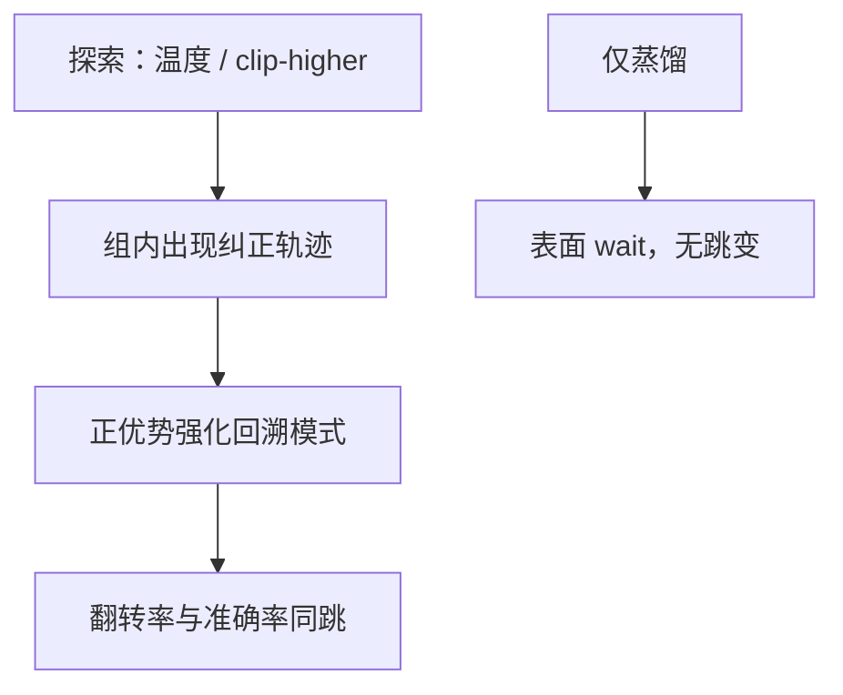

# aha moment

训练曲线上突然出现「等等」式转折，随后准确率跳升：那是探索碰到可强化的纠正策略，不是神秘顿悟模块。

<footer>—— DeepSeek-AI R1 报告对反思行为涌现的描述；对照强化学习里的策略突变</footer>

[上一课](/llm/reasoning-distill-small)会把「wait」当文本抄走。缺口是：R1-Zero 叙述里的 **aha moment** 指训练过程中反思行为突然增多、能力跳变。本课写如何测量与解释，避免神话化。接到语言混杂：同一阶段常一起出现。不重推 [GRPO](/llm/grpo)。

## 问题

报告用质性例子：模型写出相当于「啊，原来错了」的句子并改答案。科学问题是：是否存在可复现的训练步阈值？还是长度与多样性涨到某点后，纠正轨迹刚好进入组内上尾？后者更吻合稀疏 $R$ 的 RL：一旦某类 token 模式与 $R=1$ 相关，clip-higher 允许低频词涨权，行为像相变。

不要把单个 checkpoint 的漂亮例子当算法贡献。要时间序列：翻转率、特定标记频率、准确率是否同跳。跳变若只出现在训练题、探题上平滑，更像题库记忆而不是通用搜索启发式。

### 不是新的注意力结构

权重骨架仍是原基座。aha 是 decode 统计变化。写「涌现模块」会误导成架构课。本课程是强化学习进阶，解释应落在奖励、探索、组相对优势。

蒸馏学生可以有「wait」无跳变，因为 SFT 没有组内相对强化，只有模仿。

## 方法

日志：每 $k$ 步在固定探题上采 $G$ 条，算 $R$、平均长度、回溯翻转率、标记频率。对照关掉 Clip-Higher / 低温 / 有 KL 的消融，看跳变是否消失。若跳变与熵回升同时，更像探索阈值。把 aha 当监控指标可以，当损失项会刷词。

与 [自我验证](/llm/self-verification-backtrack) 是同一行为的训练动力学视角。本课强调相变叙事的证据标准。

## 机制

稀疏奖励下成功轨迹稀，梯度长期近零（全错组）。动态采样 + 足够探索使成功进入 batch，优势突然非零，相关特征（包括自然语言转折）被迅速抬升，看起来像 aha。语言混杂也可能被一起抬升，若中英混合轨迹碰巧更常得 $R$。下一课专门处理这个副作用。

人类的顿悟体验不是机制解释。不要用认知科学词汇替代曲线。

## 边界与工程取舍

不是所有配方都有明显跳变；平滑上升同样成功。追求 aha 不是目标，金标才是。下一课语言混杂：跳变期的常见负产物。

aha 用探题上的翻转率与准确率是否同跳来测。表面 wait 可被 SFT 抄走，不等于训练过程里的探索阈值。

## 小结

- aha 应测成翻转率与准确率的同跳，而不是单条炫酷日志。
- 机制上接近探索阈值后对纠正轨迹的相对强化。
- 蒸馏可模仿用语，不复制训练跳变。
- 不要把 aha 写进损失。
- 出处：DeepSeek-AI R1；Yu 等 DAPO 的熵/探索诊断作配套。
