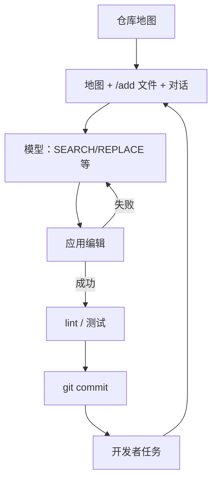

# Aider 工作流

    
结对发生在 git 仓库里：用地图告诉模型仓库长什么样，只把相关文件放进上下文，模型给出可应用的编辑，人确认后提交——每一步都留下可回退的历史。

    <footer>—— 对照 Paul Gauthier 的 Aider 文档与设计说明：仓库地图、编辑格式、以提交为节奏</footer>

Aider 是开源命令行结对程序员，不是一篇 NeurIPS 论文，也不是全自动 SWE-bench 代理。Paul Gauthier 把它做成一套**日常工作流**：在已有 git 仓库里对话，用 tree-sitter 一类解析器打出压缩的**仓库地图（repository map）**，用户 `/add` 文件进聊天，模型按约定格式改代码，工具应用编辑、跑 linter，然后 **git commit**。本篇写这条循环为什么省 token、编辑格式为什么演化、以及人和模型如何分工。不写把 Aider 接去扫未授权仓库或生成攻击载荷；默认场景是开发者在自己的项目里改功能与测试。

## 问题

把整仓塞进上下文既贵又吵。只贴当前文件，模型看不见调用方与类型。IDE 聊天若每次手动复制粘贴，没有「哪些文件在会话里」的状态，编辑会打到过期缓冲。全自动 agent 连续改二十个文件再一次性失败，git 历史无法归因。Aider 针对的是**单开发者、可回退、token 预算可见**的结对：模型要有全局骨架（地图），要有局部正文（加入的文件），要有原子提交（一次对话轮次一次 commit 的节奏，可配置），人要能拒绝补丁。

第二问题是模型输出的编辑经常无法应用：markdown 围栏缺行号、unified diff 对不上上下文、整文件重写把无关改动混进来。工作流必须把「可应用性」当成一等指标，而不是只看生成代码像不像。Aider 为此迭代了多种 edit format，并用测试与社区反馈选默认——这是工程论文式的贡献，即使没有 arXiv。

### 地图是检索，不是把仓库读进权重

仓库地图列出重要符号与文件关系的压缩视图，让模型决定还该 `/add` 什么。它不是 RAG 向量库的替代品，也不是 SWE-bench 的全文件读取。地图做错（解析失败、忽略生成代码目录）会导致模型点错文件。工作流里应把构建产物、锁文件、密钥目录排除在地图与 add 之外——这是卫生，不是能力。

Aider 没有单一「官方论文」。引用用项目文档、博客里对 repo map 与 architect/editor 的说明、以及你锁定的版本号。版本之间默认编辑格式会变，复现对话质量必须写 `aider --version`。

## 方法

典型循环：(1) 在仓库根启动，确认 git 干净或允许脏树；(2) 用户用自然语言描述任务，并可 `/add` `/drop` 文件；(3) 系统把系统提示、地图、已加文件、对话历史发给模型；(4) 模型输出指定格式的编辑（早期整文件，后来 SEARCH/REPLACE 块或 diff）；(5) Aider 解析并应用到磁盘，失败则把错误观察回给模型再试；(6) 可选 lint / 测试；(7) 生成提交说明并 commit。用户随时用 git 回退。后来的 architect/editor 模式把「规划用强模型、打补丁用便宜模型」拆成两次调用，降低在大上下文里既想又改的失败率。

编辑格式的工程要点：SEARCH 段必须精确匹配磁盘上的现有文本（含空白），REPLACE 是新文本。匹配失败是合法观察，不是静默跳过。整文件格式在小文件上稳，在大文件上贵且容易无关注入。Diff 格式对擅长 git 的模型友好，对弱模型更容易错行号。工作流应对不同骨干设不同默认格式，而不是道德上认定某一种「更正确」。

### 人在回路是方法，不是失败

相对 SWE-agent 的 submit 自动跑隐藏测试，Aider 默认让人看 diff、决定是否继续。这降低 resolved 率竞赛的可比性，但提高日常可用性：错误编辑在第一步就被拒绝，不会连 commit 十条后再 bisect。方法上可以把 Aider 当「单步 ACI + 强制人类门」：工具循环仍在（应用、lint、再问），只是每圈有审批。团队若要全自动，应显式关掉确认并接受 git 噪声，不要假装还是结对。

## 机制

地图压缩的是**符号层拓扑**，使注意力先落在相关文件名。`/add` 把那些文件的正文变成条件，编辑动作的 SEARCH 锚定在正文上，于是补丁与磁盘有共同子串，应用器可以确定性匹配。git commit 把每次成功循环变成可寻址状态，失败可以 `git reset` 而不必依赖 agent 的内部记忆。机制上这是把环境状态外置到版本控制——OpenHands 外置到事件流，Aider 外置到 git，SWE-agent 评测外置到隐藏测试脚本。

### 两次模型调用如何减错

Architect 只读地图与部分文件，输出计划与拟改文件列表；Editor 只拿计划与那些文件的正文打 SEARCH/REPLACE。拆开后，规划模型不必在同一生成里既遵守编辑语法又做长程设计；编辑模型不必在超长计划散文里找锚点。代价是墙钟与费用翻倍、两模型对计划的理解可能漂移。弱编辑模型会把计划理解错但仍产出「可应用」的错误补丁——可应用不等于正确，lint 过也不等于测试过。

密钥、`.env`、凭证文件不应 `/add`。模型上下文会进日志与供应商。工作流卫生比任何编辑格式重要。本篇不讨论如何从仓库里「找出秘密」；默认是排除它们。

## 边界与工程取舍

### 不是 SWE-bench 一等选手，也不该被那样用

Aider 可以接测试命令，但默认产品不是为隐藏测试刷 resolved 率调的。无 git 的目录不是一等公民。生成代码、vendor、超大锁文件会污染地图。多用户同时在同一分支上让 Aider 提交会制造推送冲突——它假定单人工作树。模型供应商的缓存与 token 计费对「每次带地图」很敏感，地图太大时要先收窄根目录。

与 Cursor 类 IDE：[代理编码](/llm/agentic-coding) 把循环嵌进编辑器与多工具（搜索、终端、浏览器）；Aider 更窄、更 git 中心、可脚本化。与 OpenHands：Aider 几乎总要人；OpenHands 可全自动评测。选型先问：要不要强制提交节奏。需要执行反馈修单文件函数，OCI 更贴；需要 issue 级自动定位，SWE-agent / OpenHands 更贴。

出处：Paul Gauthier，Aider 项目文档（aider.chat）与版本发行说明。仓库地图与 architect 模式以你使用的主版本为准。没有 arXiv 时不要伪造。

## 小结

- Aider 工作流：仓库地图 + 按需加文件 + 可应用编辑 + lint + git commit，人在回路。
- 编辑格式的一等指标是能应用，不是好看；失败观察要回给模型。
- Architect/editor 拆调用是费用换稳定，不是新的代码模型。
- 状态外置在 git，便于回退；不适合当 SWE-bench 自动刷分器来引用。
- 出处：Aider 文档；对照 SWE-agent / OpenHands / 代理编码分篇。
