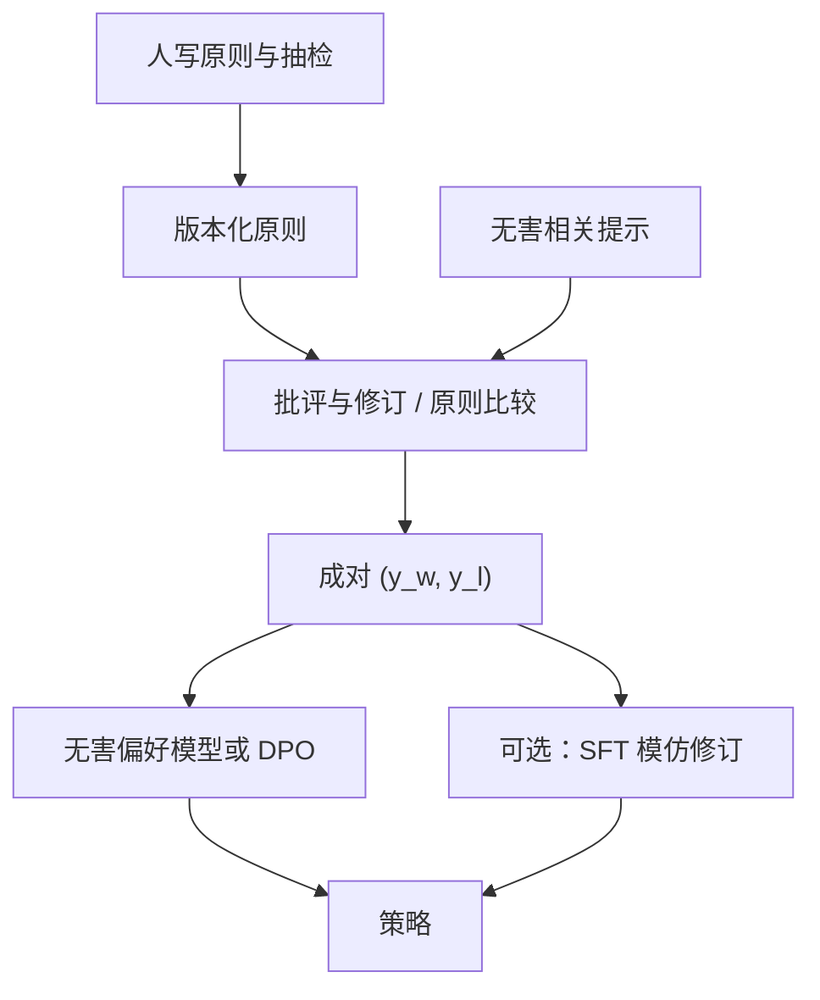

# AI 反馈作为偏好

用模型按书面原则批评、改写或成对打序，可以把无害偏好的规模从「人看有害全文」换成「人写原则与抽检」。它替代的是标注带宽，不是原则本身。

<footer>—— Bai et al., Constitutional AI: Harmlessness from AI Feedback, 2022；原则坐标系见 Askell 等 HHH，2021</footer>

人类比较贵，且让标注员长期阅读有害内容有伦理与疲劳成本。Bai 等人的 Constitutional AI（CAI）给出一条可操作的替代：人写一部自然语言「宪法」（原则列表），模型按原则对回答做批评与修订，再用这些成对或偏好数据做监督与 RL——即 RLAIF：Reinforcement Learning from AI Feedback。Askell 的 HHH 仍是轴：CAI 主要把无害轴的比较改成原则驱动的 AI 反馈，有用轴在原论文设定里仍可保留人类偏好。本篇写 AI 反馈的数据形态、它拟合的是哪一个生成器、以及评测时如何防止「教师与学生共享盲区」。不把原则写成可绕过的清单，也不把批评提示写成攻击说明书。

## 问题

无害比较的人标瓶颈有两层。一层是条数：红队题要覆盖类别与包装，人看不过来。一层是伤害：标注员暴露在有害文本里。CAI 要解决的是：能否用原则把无害判断程序化，让模型生成「更符合原则的 $y_w$」和「不符合的 $y_l$」，再训偏好模型或直接做策略更新。它不声称模型理解法哲学；它声称原则足够清晰时，模型的批评–修订循环能产生可用的成对监督。

风险是循环：教师若已经过拒绝，学生会更过拒绝；教师若在某类包装上配合，学生会把配合写成原则允许。AI 反馈的上限是教师在原则条件下的行为，加上原则的含糊地带。人从逐条比较退到写原则与抽检，劳动形态变了，责任没有消失。

### 批评–修订对不是普通教师蒸馏

普通蒸馏模仿教师的 $y$。CAI 的监督阶段是：同一 $x$ 上先有一份可能有问题的回答，再按原则生成批评，再生成修订，把修订当更无害的目标。成对形态是 $(y_{\mathrm{rev}}, y_{\mathrm{orig}})$ 或原则比较器给出的序。这与 [人写 vs 合成指令](/llm/human-vs-synthetic-instruct) 里「教师直接当金标准」不同：金标准是原则，教师是执行器。执行器换了，同一部宪法会得到不同的对。

宪法条目越像口号，AI 比较越会认关键词与道歉腔。条目需要允许的反例（新闻、安全研究、虚构），否则 RLAIF 会把无害推进 [过拒绝](/llm/over-refusal)。

## 方法

书面原则冻结版本。生成：对无害相关提示，采样或取出初始回答，要求模型列出违反的原则（若有）并改写；或直接让比较器按原则在两条候选里选赢。过滤：丢掉批评与修订明显矛盾的样本、丢掉只改文风不改内容的样本。人抽检边界类别。然后：SFT 模仿修订，或训无害 RM，或对修订–原稿做 [DPO](/llm/dpo)。Bai 等人的完整 CAI 是监督修订加 AI 偏好上的 RL；工程上可以只取其中一段，但必须写明。

有用轴不要默认交给同一宪法。原则擅长写「不要做什么」，不擅长写「这封邮件怎么更清楚」。混用会把有用头训成免责声明生成器。实践是：有用仍用人类或产品信号，无害用 RLAIF，组合规则与 [多轴偏好](/llm/hhh-axes) 相同。比较器模型应与策略异构，避免自己给自己打满分。

评测：无害配合率用公开套件的官方接口，不在文档里展开变换；过拒绝用表面敏感但应回答的探针；有用用日常指令集。消融：只 SFT 修订、只 RLAIF、人类无害比较、CAI+人类抽检。报告教师检查点，因为换教师等于换数据集。Constitutional classifiers 把同一思想用到护栏分类器，见 [宪法分类器](/llm/constitutional-classifiers)；本篇只谈生成策略的偏好。

### 原则比较器的校准

比较器输出的是离散序或分数差。要在专家金标子集上测准确率与校准，尤其是允许反例。准确率高但全部偏向拒的比较器，会系统性制造过拒绝对。校准方法包括：温度、强制在「不确定」时标平局、以及对边界题降权。不要用比较器去标有用轴的文采。专家–AI 交叉一致率应写入数据卡，过低则原则或教师不合格，而不是再加大合成量。

## 机制

CAI 把无害奖励的数据生成过程，从「人的 BT 噪声」换成「原则条件下教师的 BT 噪声」。策略优化的仍是代理目标。Goodhart 效应同样存在：策略会找教师比较器的漏洞——更长的原则复述、更重的道德腔、更少的具体信息——只要比较器给这些高分。这与人类 RM 的 [奖励黑客](/llm/reward-hacking-llm) 同构，只是漏洞形状随教师变。KL 拴在修订 SFT 附近，限制走多远，不纠正原则漏洞。

批评文本本身不进入用户可见策略时，线上延迟不变；若线上每轮都自评，延迟与谄媚式自我表扬会进来。Bai 等人把批评主要用于离线造数据，线上仍是普通助手，这是重要的工程选择。

RLAIF 不是「没有人类」。人写原则、选教师、抽检、定组合权重。省略这四步的「全自动宪法」只是把教师预训练里的隐含政策写成了学生。

### 与人类反馈如何接缝

接缝有三种。替换：无害对全部 AI 生成，人只抽检。混合：边界题人标，主体 AI 标。级联：AI 先标，人审 AI 低置信。HH-RLHF 的人类无害数据仍可当持有集，用来发现教师盲区。有用人类偏好不要被无害 RLAIF 覆盖：concat 时必须分头。Constitutional AI 论文的设定是无害走 AI、有用可保留人，不要简化成「全部反馈都用模型」。

## 边界与工程取舍

原则更新必须再生数据。改一条「允许讨论某类新闻」，旧修订对仍在惩罚该类，策略不会自己领会。数据要按原则版本分区，像代码一样 diff。教师被新越狱套件打穿时，旧 AI 对会过时，需重跑生成——这是运营成本，不是一次论文实验。

诚实轴：原则可以写「不要编造出处」，但比较器若不能查文献，仍会把流畅假引用标赢。AI 反馈不替代检索与答案键，见 [诚实性](/llm/honesty-citations)。谄媚：比较器若偏爱附和用户政治立场，RLAIF 会放大，见 [谄媚](/llm/sycophancy)。评测必须包含「用户持错见」类探针，且只报机制与错误率，不提供诱导话术。

把 CAI 与「用 GPT-4 当裁判刷排行榜」混为一谈会出事。后者常无书面原则、无抽检、与参赛模型同族。前者的可审计性在原则版本与人审，不在「有一个大模型打了分」。

## 小结

- Constitutional AI 用书面原则驱动批评–修订与 AI 成对比较，主要服务无害轴的规模与标注伦理。
- 替代的是人看有害全文的带宽；原则、抽检、教师选择仍是人的工作。
- 有用轴默认不要塞进同一宪法；分头组合与 HH-RLHF 一致。
- 学生会黑客比较器：道德腔、过拒绝、共享盲区；要用异构教师与人类持有集。
- 原则版本化等于数据版本化；线上不必每轮自评。
- 出处：Bai et al., *Constitutional AI: Harmlessness from AI Feedback*, 2022；Askell et al., 2021；人类分头偏好见 Bai et al., HH-RLHF, 2022。
