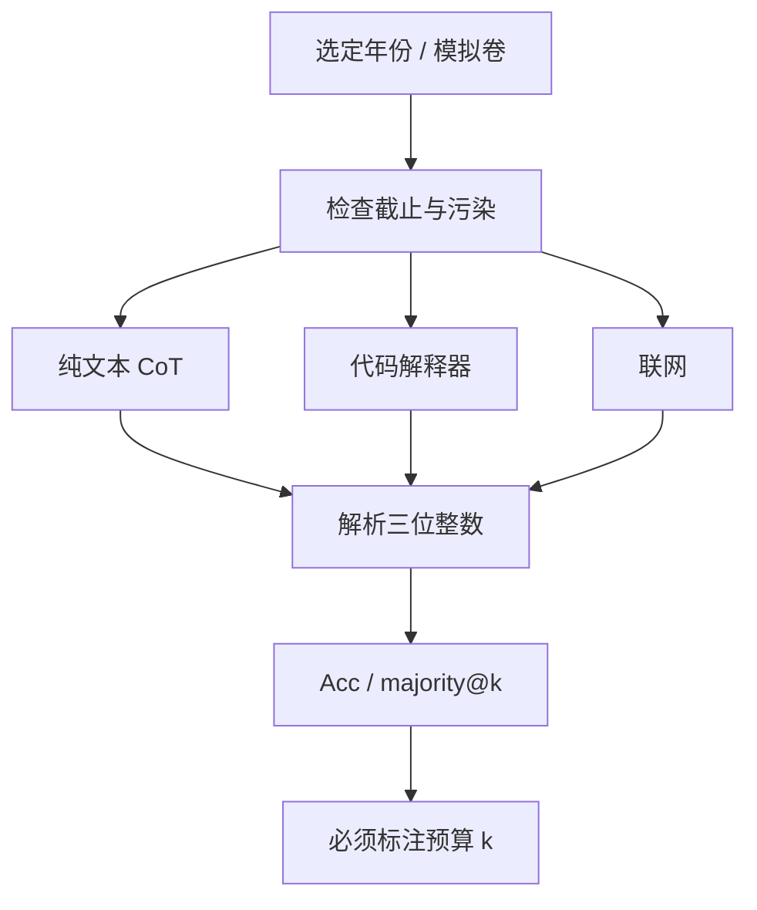

# AIME / 竞赛数学

答案是 000 到 999 的整数，猜对的机会只有千分之一；中间过程可以很长，但裁判只看最后那个数，于是长推理第一次有了一张不容易被选择题排除法撑起来的成绩单。

<footer>—— AIME 作为竞赛数学评测尺的理由</footer>

GSM8K 与 MATH 把小学到高中竞赛题引进语言模型评测之后，强模型迅速把短题做到接近饱和。剩余误差混杂算术马虎、格式失败和题面泄漏。美国数学邀请赛（AIME）提供另一档：每年十几到三十道题，难度在 AHSME/AMC 之上、USAMO 证明题之下，官方答案是三位整数。这使自动评分几乎没有模糊空间，又使随机猜测无意义。2024 年后，长思维链与测试时计算的报告大量引用 AIME，因为它对「再想一会儿」敏感。本篇讲这把尺量什么、如何防止把往年真题当训练目标，以及它与 [GPQA](/llm/mmlu-pro-gpqa) 在专家能力上的分工。

## 问题

开放生成的数学题，评分曾是瓶颈：等价形式、漏写单位、中间对最后错。竞赛填空把答案收成整数，回避了等价判定，但把「会证明」缩成「能算出那个数」。对语言模型这仍比四选一诚实：不能靠排除法，也不能靠选项字母记忆。问题在三处。第一，年份少、题量小，统计方差大。第二，往年真题与详细题解在网上完整存在，污染严重。第三，测试时计算把同一模型测成许多条曲线——pass@1 greedy、64 次自洽、带验证器的搜索——若不写预算，AIME 分会变成脚手架竞赛。

需要一种协议：钉死年份集合（例如 AIME 2024，确保多数基座的截止早于出题），钉死解码预算，分开报不同工具（计算器、代码解释器、联网）。否则「我们在 AIME 上超过人类及格线」无法解读。

### 整数答案不是证明能力

AIME 允许跳步、允许数值凑、允许用程序暴力搜索组合。USAMO 式证明评测才逼近数学家的工作。把 AIME 高分写成「达到奥赛水平」过满。它量的是：在高中竞赛难度的、有唯一数值答案的问题上，模型加工具加思考时间能否算对。这已经比 GSM8K 难一个数量级，仍不是研究级数学。AIME 每份试卷约 15 题，一份上的 1 题之差就是约 6.7 个百分数。报多年合计或多次采样均值，并给置信区间。用单年 8/15 对 9/15 宣布新 SOTA，多半是噪声。

## 方法

评测输入是题面全文（含图表的文字化描述，若原题有图则须声明如何处理）。输出解析出 0–999 的整数，与官方答案比。允许思维链时，只对最后的整数计分，中间错误不单独扣分——这会放过「过程胡写、答案碰巧对」，也是整数裁判的代价。更严的内部协议可以要求过程可执行（代码验算）或二次一致性。

$$
\mathrm{Acc}=\frac{1}{N}\sum_{i=1}^{N}\mathbf{1}\bigl[\mathrm{parse}(y_i)=a_i\bigr]
$$

$N$ 为题数。pass@$k$ 与 majority@k 必须写 $k$ 与温度。工具设定至少分三档：纯文本、可执行 Python、可检索网页。后两档对某些计数与几何计算是质变，应视为不同系统。

年份切分是去污的主手段：用训练截止日期之后的 AIME，或内部未公开的模拟卷。对历史年份，应做 [n-gram 重叠](/llm/contamination-ngram) 扫描题解站。把 MATH 训练集里同源竞赛题剔除，并不能自动清洁 AIME，因为题解博客独立传播。

### 与 MATH、GSM8K 的难度阶梯

GSM8K 是小学应用题，模板化强，易被合成数据刷高。MATH 覆盖竞赛与教材混合，难度带宽大，部分小题已饱和。AIME 位于 MATH 中高段且答案形式统一，适合当「还没饱和的数值竞赛」探针。阶梯应一起报：GSM8K 已满不值得当发布门禁；MATH 子集仍可看失败类型；AIME 看前沿推理。不要用 GSM8K 涨分证明 AIME 协议下的进步。

## 机制

AIME 对测试时计算敏感，是因为题目需要多步规划：构造辅助量、分情况、估计后再精确。短解码往往在某步丢符号。加长思维链等于增加中间状态带宽；多次采样再多数票，等于在解空间里投点。验证器（过程分或代码回算）再把票投向可执行一致的路径。这与 Snell 等人讨论的测试时缩放同一机制，AIME 只是一个区分度尚存的任务族。

整数答案压缩了证明，却也提供了便宜的自洽信号：两个长过程若落到同一三位整数，比两个开放式证明更容易自动对齐。这鼓励 majority voting，也可能鼓励「很多条错误路径撞上同一错误整数」。补救是独立验算：用代码重算关键等式，或换参数再解一次看是否同解。

### 图形与语言化是隐藏难度

不少 AIME 题含几何图。评测若只给文字，等于把识图从任务里删掉，剩下的是已翻译好的几何关系；若给图，则变成多模态。两种协议分数不可比。纯文本版测的是符号推理，多模态版还测读图。论文必须声明。对只有文字的模型，使用官方文字复述是合理的，但应承认这比人类考生更容易——人类要自己读图。竞赛培训网把往年题按知识点打上标签。微调若吃了这些标签化题解，AIME 分测的是课程记忆。动态模拟卷或当年刚结束、题解尚未铺开的短暂窗口，更接近无污染能力，半衰期以周计。

## 边界与工程取舍

小样本是结构性的。即便合计十年 AIME，也不过数百题，且风格缓慢漂移。用它做强化学习奖励会很快过拟合到竞赛套路，泛化到证明或应用数学不明。奖励模型应混合同步推导数据，而不是只拿 AIME 对错当 RL 信号。

工具公平性：允许 Python 后，组合计数与大数运算不再区分「会不会算」，而区分「会不会把问题程序化」。这是有价值的能力，但与闭卷笔试不是同一比赛。人类 AIME 不允许编程；模型报告若要对齐人类分数线，必须闭卷。产品报告若要对齐工程师助手，应开解释器。两张表。

污染与公开讨论几乎无法根除。考试结束当天，论坛就开始写题解。把「AIME 2024」写进模型卡评测，对 2025 年才训练完的模型可能已是泄漏集。更干净的做法接近[动态基准](/llm/live-benchmarks)：用新一年的试卷做一次性公开评测，之后降级为污染对照。内部保留未发布模拟题做门禁。

它不覆盖：证明严谨性、研究级问题、统计建模、以及小学应用题里的语言理解。与 GPQA 相比，AIME 更偏高中竞赛技巧，GPQA 更偏大学理科概念。剖面应两科都看，避免只训练奥赛合成数据把 GPQA 扔下。解析器必须处理「答案是 042」与「42」的等价，也必须拒绝从长过程里误抓到的中间整数。把第一个三位数字当答案，会把草稿里的年份和编号算成提交。应用显式标记（如 `Final answer:`）并在协议里冻结。

## 小结

- AIME 用 000–999 整数答案提供低猜测率、可自动评分的竞赛数学尺。
- 题量小、方差大，必须合计多年或多次采样，并写明测试时预算。
- 闭卷、解释器、联网是三种系统，分数不可混列。
- 整数裁判不测证明；过满宣传「奥赛水平」不成立。
- 往年题解污染严重，新试卷窗口短，内部模拟卷更适合门禁。
- 与 GSM8K/MATH 成阶梯，与 GPQA 成学科剖面，不要互相替代。
- 出处：AIME 公开试卷作为评测实践；长推理与测试时计算文献对其区分度的使用。
