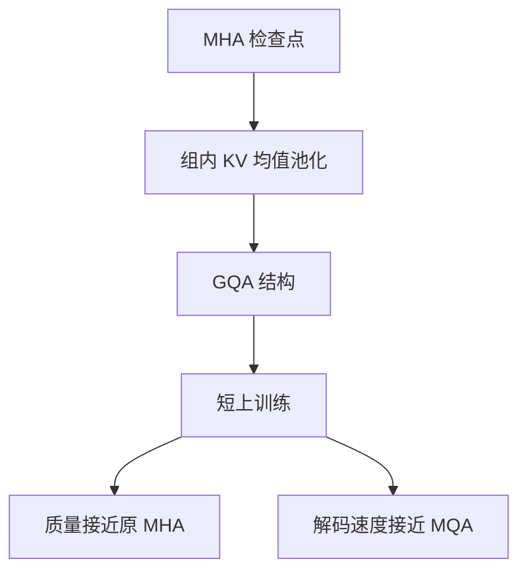

# GQA 论文

分组查询注意力把多头检查点转化成一种介于多头与多查询之间的结构：若干查询头共享一组键值，再用远短于预训练的上训练把质量拉回来。

<footer>—— Ainslie et al., GQA: Training Generalized Multi-Query Transformer Models from Multi-Head Checkpoints, 2023</footer>

Ainslie、Lee-Thorp、de Jong 等人 2023 年的 GQA 论文，要解决的不是「注意力还能不能再稀疏」，而是已经训好的多头 Transformer 怎样改成可服务的解码器。Shazeer 2019 年的 [MQA](/llm/shazeer-mqa) 把键值头压到 1，解码带宽最低，质量掉一截，而且从多头检查点硬折过去偏移很大。这篇工作给出中间结构——Grouped-Query Attention——以及一条检查点迁移工序：按组对 $W^K,W^V$ 做均值池化，再上训练（uptraining）。实验主体是 T5 族编码器-解码器，结论随后被解码器-only 的大模型直接采用。本篇写论文里的转化协议、插值主张和上训练证据，机制细节见 [GQA](/llm/gqa)。

## 问题

自回归解码的瓶颈是反复读历史 KV，不是当场算新的查询。多头注意力（MHA）为每个查询头存独立的键和值，缓存字节随头数线性涨；服务 70B 级生成时，并发和上下文先被容量卡住。MQA 只留一套 KV，读量降到约 $1/h$，但所有查询头挤在同一个键几何里，翻译、摘要一类需要对齐的任务上质量缺口明显。业界需要一个离散旋钮，而不是在「质量」和「能上线」之间二选一。

Ainslie 等人还面对一条更具体的工程约束：Google 已经为 T5 花掉了预训练计算。若 GQA 只能从随机初始化重训，论文主张就弱得多。他们要证明两件事同时成立：分组结构本身质量接近 MHA；并且可以从现成 MHA 检查点出发，用原预训练步数的一小部分完成迁移。后者把 GQA 从「一种新架构」变成「一种检查点手术」。

### 插值，而不是又一个稀疏核

论文把 GQA 明确写成 MHA 与 MQA 的插值。查询头数 $h_q$ 不变，键值头数 $h_{kv}$ 取能整除 $h_q$ 的整数，组大小 $g=h_q/h_{kv}$。$h_{kv}=h_q$ 退回 MHA，$h_{kv}=1$ 退回 MQA。中间取值（实验里常见 8 组）被用来画质量-速度曲线。它不改 softmax 对序列长度的二次打分，也不引入窗口或低秩潜变量；唯一被改的是「有几套可被查询的内容库」。

标题里的 Generalized Multi-Query 容易读成「MQA 的推广理论」。正文更务实：把 MQA 的共享从「全体查询头」放松到「一组查询头」。广义之处在组数可调，不在提出新的相容性函数。

## 方法

转化协议分三步。第一，把原 MHA 检查点里即将合并的那些 KV 头投影做均值池化，得到 GQA 的 $W^K,W^V$；查询投影 $W^Q$ 与输出投影 $W^O$ 原样保留。第二，网络前向改成组内广播：第 $g$ 组的查询头共享 $K_g,V_g$，

$$
\mathrm{head}_i=\mathrm{softmax}\bigl(Q_i K_g^\top/\sqrt{d_k}\bigr)V_g.
$$

第三，在原预训练分布上继续训练一段，步数远小于从头预训练。论文称这段为上训练。均值池化是结构对齐，上训练是分布对齐：查询头必须学会在被平均过的键上重新打分。

在 T5 上，他们把 GQA 接到解码器自注意力和交叉注意力——服务时真正反复读缓存的是这两处。编码器仍可保持 MHA，因为编码器一次算完、没有逐步读历史的问题。这一不对称是论文实验设计的一部分，后来解码器-only 模型没有编码器可保留，于是整网都用 GQA。

### 上训练预算相对预训练是小头

论文的关键数字不是某个下游分数，而是上训练相对原预训练的比例：用原计算的一个很小切片，就能让池化后的模型回到可用区。若把 MHA 直接压成 MQA（全体头平均成一套 KV），同样预算下恢复更差，因为瞬时偏移发生在整层而不是组内。分组把创伤局部化，这是「先有 GQA 再上训练」优于「先有 MQA 再上训练」的理由。从随机 GQA 训到同等水平，仍然要付接近完整预训练的账单。

## 机制

组内像 MQA：多条查询竞争同一份 $K,V$，差异只能来自 $Q_i$ 与 $W^O$ 的对应块。组间像 MHA：不同组保留不同的键几何和值子空间。质量-带宽曲线因此通常是凸的——从 MHA 减掉一半 KV 头，损失很小；减到 1 头，最后一段掉得陡。论文用 T5 的若干组数把这条曲线画出来，给后来 Llama 2 70B 选用 8 个 KV 头提供了直接先例。

均值池化假设组内 KV 头已经大致指向同一区域。若某组里两头接近正交，平均得到范数偏小、方向含糊的键，softmax 暂时变平。上训练主要把 $W^Q$ 转到新 $K$ 上，并让被平均后的 $W^K,W^V$ 重新拉开组间差异。组内独立记忆一旦被合并，短训无法恢复；若任务真依赖那两头的差异，应把它们分到不同组。论文默认按相邻头编号切块，不按相似度聚类——实现简单，把修补交给上训练。

T5 是编码器-解码器，交叉注意力的 KV 来自编码器输出。GQA 压缩的是「解码器侧有几套去读编码器的头」，不是编码器自己的表示宽度。把论文数字直接抄到解码器-only 模型上时，应只对比解码器自注意力那一项。

### 速度收益发生在逐步解码

前填阶段 $K,V$ 现场算，MQA/GQA 只减少投影矩阵宽度，加速有限。逐步解码时历史只读不写，读取量与 $h_{kv}$ 成正比。论文报告的加速，指的是自回归生成，不是训练吞吐。这也解释了为何实验把改动放在解码器：编码器没有「每步读全部历史 KV」这一项。

## 边界与工程取舍

GQA 不能表达组内值子空间的差异。若评测集依赖同一层里很多互不相关的记忆通道，应增大 $h_{kv}$，而不是只加查询头。长上下文下缓存仍随长度线性增长，分组只改斜率；百万 token 级仍要靠窗口或外置记忆。论文没有声称 GQA 是长序列方案。

上训练不是零成本。过短会留下池化创伤：某些组键范数偏小、该层注意力过平。过长且学习率过大，可能冲掉已经学好的查询头。论文给出的是「远短于预训练」这一量级，不是一条与模型无关的步数公式。新模型若没有 MHA 检查点，从随机初始化直接训 GQA 更干净，省掉池化这一步。

张量并行是相对 MQA 的工程加分。MQA 仅一头 KV，无法按 KV 头切卡；GQA 只要 $h_{kv}$ 能被张量并行度整除，就可以沿 KV 头切开。论文本身的 T5 实验并不以 Megatron 切分为中心，但结构上已经比 MQA 更容易落入现有切分。后来的大模型报告把这一点写进了系统侧，而不是写进 GQA 原文。

不要用论文里的 T5 翻译/摘要分数去证明 Llama 一类解码器-only 的 GQA 一定无损。证据链是：T5 上插值曲线成立，随后独立工作在解码器-only 上复现了「8 个 KV 头」这一甜点。跨架构只能迁移结构，不能迁移绝对值。

## 小结

- GQA 论文把查询头分组、组内共享 KV，写成 MHA 与 MQA 之间的可调插值。
- 核心贡献是检查点转化：组内均值池化加短上训练，不必从零重训。
- 上训练远短于预训练；压成 MQA 再恢复，同样预算下更差。
- 质量-速度曲线在中等组数处出现甜点，这是后来约 8 个 KV 头的来源。
- 实验主体是 T5 解码器自注意力与交叉注意力；编码器不必改。
- 组内是硬共享，短训不能恢复被合并头之间的独立记忆。
- 出处：Ainslie et al., *GQA: Training Generalized Multi-Query Transformer Models from Multi-Head Checkpoints*, 2023。
