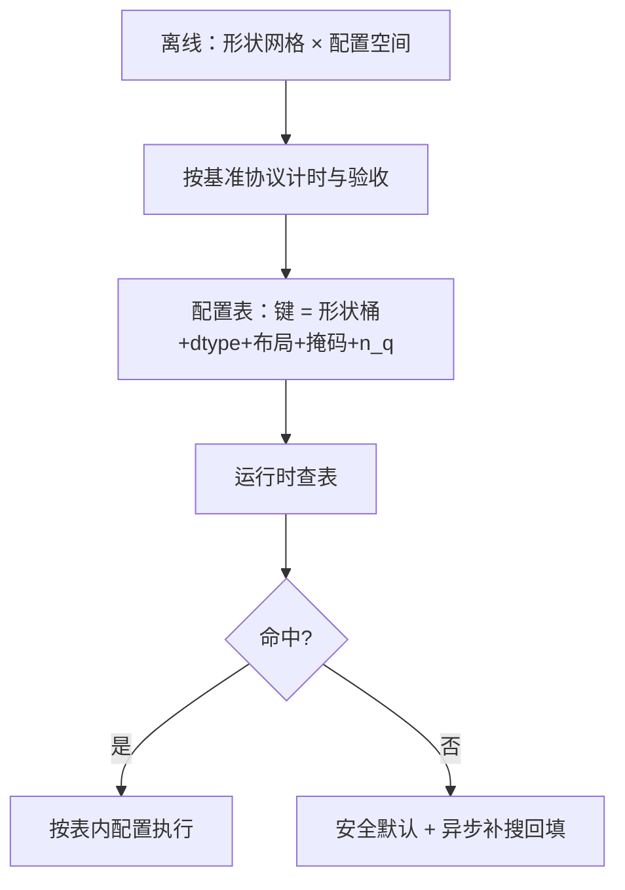
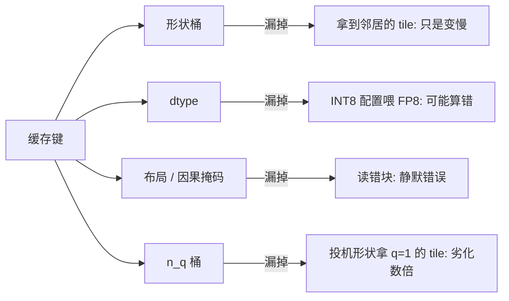

# autotuning 实践

调参表是一份合同：形状桶是条款，缓存键是签名；漏一条，运行时就会拿错配置还理直气壮。

<footer>—— 据 Tillet et al., Triton, 2019；内核自动调优与 vLLM 实现口径整理</footer>

[上一课](/llm/ak-benchmark-methodology)立了测量的规矩。本课把测量变成搜索：autotuning 实践。[内核自动调优](/llm/kernel-autotuning)定过「tile 与占用率是离散搜索、按形状桶离线调、热路径查表」的原则；本课落到注意力内核的完整实践：搜什么、什么时候搜、缓存什么、拿错了怎么办。

## 问题

注意力内核的配置空间不小：`BLOCK_M`、`BLOCK_N`、`num_warps`、`num_stages`、沿 KV 的切段数、量化开关，组合上百。每个形状的最优不同：解码与前填的最优配置常差数倍，第一单元预算表里的每一个自由度都是搜索维。麻烦在时机：在线逐形状 JIT 调优会把所有候选配置全跑一遍，首个撞到新形状的请求付出整个搜索的延迟——服务里不可接受；离线又搜不全：部署形状永远比基准网格多。缺口是一份「离线尽量搜全、在线兜底不卡顿」的合同。

术语翻译：tile 就是把大矩阵切成小块、一小块一小块地算，`BLOCK_M`/`BLOCK_N` 决定每块多大；`num_warps` 是给一块派多少个线程束干活，`num_stages` 是流水线提前搬运几层数据。块太大装不进片上小仓库，太小则搬运太频繁——好值取决于矩阵形状，所以只能搜，不能拍脑袋定死。

### 搜索目标跟着部署目标走

解码核按延迟调，前填核按吞吐调，同一个内核在两个目标下可以选出不同赢家。搜索时若目标与部署错位，表里的名次就是另一个问题的答案。

## 方法

两级方案。第一级，离线：按上一课的协议扫形状网格乘配置空间，计时加数值验收，把每格的最优配置落成表。第二级，在线：缓存键取（形状桶、dtype、布局、因果与否、分页与否、$n_q$ 桶——投机会把它从 1 变 $\gamma+1$），命中查表，未命中回退到安全默认配置并异步补搜、回填表格。服务启动与图捕获阶段按预期形状预热，让真实请求永远不做第一个付学费的人。验收除时间外带占用率与 spill 计数：防止选出「快但贴着预算边缘」的脆弱配置——换个 batch 就溢出的赢家不值得要。

直觉类比：两级方案像餐厅备菜。开餐前（离线）按预估订单把常见菜配好；来了没备过的菜（缓存未命中），先按标准做法稳稳出一份（安全默认），同时让后厨研究最优做法写进菜谱（异步补搜回填）——客人从不需要站在灶台前等试验。

## 机制

为什么缓存键要这么长，逐条看漏一条的后果。形状漏了：相邻形状拿到别人的 tile，慢但不错。dtype 漏了：INT8 的配置喂给 FP8 内核，指令路径不同，轻则慢重则错。因果或树掩码漏了：掩码图不是键的一部分，动态稀疏内核可能拿到上一张图的块索引——读错块，输出错且静默。$n_q$ 漏了：投机把解码形状变成短而宽，q=1 的最优 tile 对 $n_q=5$ 常常劣化数倍。错法两型：全形状一份「通用最优」——各形状平均劣化、甜点之外全面失守；或者搜索时频率没锁、剖析器开着——上一课的每条规矩在搜索里都要重申一遍，因为搜索就是几百次基准。

Triton 的 `@autotune` 常扫 8–32 组配置、每组 warmup 加重复计时；推理引擎在启动与 CUDA 图捕获前预热候选形状——生产里首 token 延迟尖刺，多半是某个形状漏进了「运行时现搜」的名单。

表的维护是机制的后半段。配置表随硬件换代作废：额度表变了（第 3 课）、原语变了（第 13 课），名次就变了，表要随版本重出。频率与功耗漂移让离线名次抖动，关键场景以在线实测复核；表格本身要有版本号与硬件指纹，回滚时整表回滚。autotune 修不了算法错误：掩码写错的内核，搜出来的只会是「稳定地错」——正确性验收在前，时间搜索在后，次序不能反。

为什么重要：配置表过期不会报错，只会悄悄变慢或溢出。所以换 GPU 型号、升内核版本时，要把配置表当成和模型权重一样的资产——重新生成、带版本号发布、能整表回滚，而不是拿旧表凑合着跑。

## 边界

本课谈的是单内核、单设备的配置搜索；跨请求的调度级参数（批大小、配额）是服务课程的题。跨后端的配置表各出各的、验收口径统一，归到多后端一课。搜索开销本身（离线扫网格的机时）是工程预算的一部分：空间 sampled 而不是穷举，靠第一单元的账本先砍掉必输的候选——预算表不过关的配置不进搜索。

## 小结

- 配置搜索分两级：离线按网格搜全、落表；在线查表、未命中走安全默认并异步补搜。
- 缓存键至少含形状桶、dtype、布局、掩码与 $n_q$；漏任何一条都可能静默拿错配置。
- 搜索目标与部署目标一致：解码按延迟、前填按吞吐，别用别人的考题选你的答案。
- 验收带占用率与 spill 计数，不选贴着预算边缘的脆弱赢家。
- 表随硬件与版本重出，带指纹与版本号；正确性验收先于时间搜索。
- 出处：Tillet et al., *Triton*, MAPL 2019；据 Triton autotune 与 vLLM 预热实现整理。
