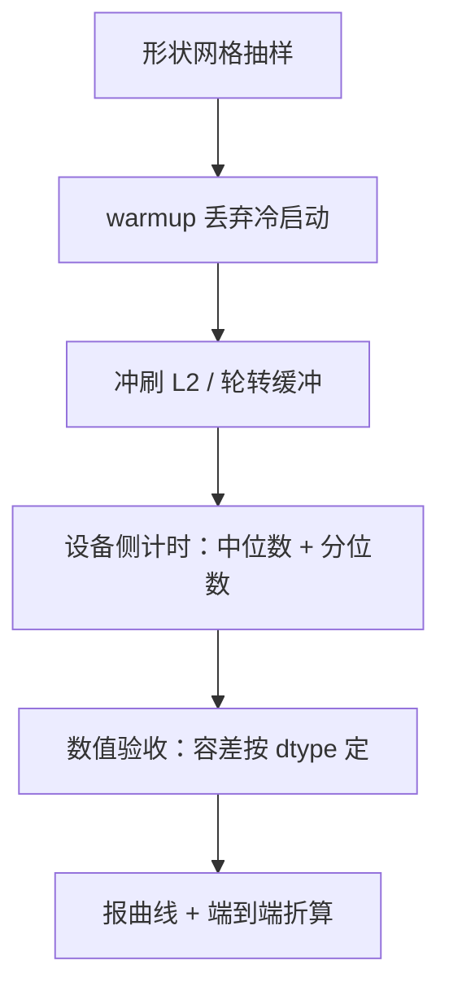

# 内核基准测试方法论

测不准的内核优化是轶事：先钉死计时器、存储状态与形状网格，再谈快了多少。

<footer>—— 据 Williams et al., Roofline, 2009；CUDA 计时与剖析工具文档整理</footer>

[上一课](/llm/ak-longsequence-kernels)把长序列的并行度排满，工程化单元过半。本课立规矩：内核基准测试方法论。它不是工程化的一件杂务，而是后面调优与移植的地基——那两课的每一张配置表、每一个跨后端的倍数，都是从这套规矩里读出来的数。

## 问题

内核成绩单最容易在三处失真，而且多半是无意的。其一，计时含了冷启动：首次调用带着 JIT 编译、指令加载与页分配，把它算进均值，「优化」可能只是第二次跑 warmed-up 的代码。其二，存储状态失真：反复测同一组小张量，K、V 常驻 L2，带宽读数虚高，能「优化」出超过 HBM 物理上限的加速比——账面上赚，部署后赔。其三，形状抽样失真：只测一个甜点形状（比如 batch=8、$n=4096$ 的方阵前填），而部署里真正占时间的解码 $n_q=1$、变长、分页形状一个都不在成绩单上。缺口是：一套让数字可信、可复现、可对比的测量协议。

### 三个失真一个对策

冷启动、L2 驻留、形状偏样本，共同点是都让被测系统偏离部署时的真实状态。对策因此统一：让每次测量都从部署会经历的状态起步——编译已完成、缓存已冲刷、形状覆盖生产分布。

## 方法

四步协议。第一，计时用设备侧事件或核时长统计，不用墙钟；剖析器只在归因时开，测量时关——开着剖析器测时间是串行化测量，数字整体偏大。第二，稳态：若干次 warmup 丢弃，再取中位数与分位数；只报均值会被长尾刷分，报散布才知道数字的信用。第三，存储状态：轮转缓冲区或显式冲刷 L2，让每次测量都从 HBM 起步；除非你要测的就是 L2 命中场景，那要作为独立场景声明。第四，形状网格：在（batch、$h_q$、$h_{kv}$、$n_q$、$n_{kv}$、$d$、dtype、布局、因果与否、连续或分页）上抽样，每格配数值验收——与参考实现比容差，容差按 dtype 与归约顺序定：归并顺序不同就不能要求逐位相同（第 7 课的分块、第 10 课的切段都换了顺序），但统计上不得有漂移。

## 机制

为什么 L2 是第一大坑，算一笔就明白：$n=4096$、$d=128$、fp16 时单层 8 个 KV 头的 K+V 只有 $16\,\mathrm{MiB}$，A100 的 $40\,\mathrm{MiB}$ L2 装得下两层多——不冲刷，测的就全是 L2 而不是 HBM，第一单元的带宽账整个失效。为什么必须端到端折算：内核占推理步三成时间，再省一半也只值一成五；Amdahl 定律要落到服务指标上才是结论，内核层报时间、系统层报占比，两层各归各。错法对照：用框架级端到端延迟评内核，噪声盖过差异，比了个寂寞；用均值挑配置，被一次长尾拖进错误的赢家；换卡不锁频率，同一个内核在两张表上名次不同，还以为是移植引入的回归。

数值验收的容差不是越严越好：fp16 参考下要求 $10^{-3}$ 相对误差会把正确的分块实现全判死——归约顺序换了舍入就换。口径是「与 FP32 参考比、按 dtype 分级」，而不是「与上一个实现逐位比」。

## 边界

微基准不代表服务：调度开销、内核选择、批处理交互都在内核之外，系统级问题由服务课程的压测接手。低精度内核的容差更宽，但验收步骤一步不少（第 8 课的口径在这里执行）。跨设备的对比还要锁频率与功耗、统一形状与版本——那是多后端一课的验收合同。本课只立内核层的规矩：计时、稳态、存储状态、形状网格、数值验收，五件套齐了，数字才有资格进配置表。

## 小结

- 计时用设备侧事件、关剖析器；warmup 丢冷启动，报中位数与分位数。
- 不冲刷 L2 的内核基准是假的：$16\,\mathrm{MiB}$ 的 KV 正好埋进 L2，带宽读数全部虚高。
- 形状网格必须覆盖生产的解码与变长形状，甜点形状的成绩单代表不了部署。
- 数值验收与时间测量同权：容差按 dtype 与归约顺序定，分级执行。
- 内核层报时间，系统层做 Amdahl 折算，两层不混。
- 出处：Williams et al., *Roofline*, CACM 2009；据 CUDA events 与 nsight 文档口径整理。
