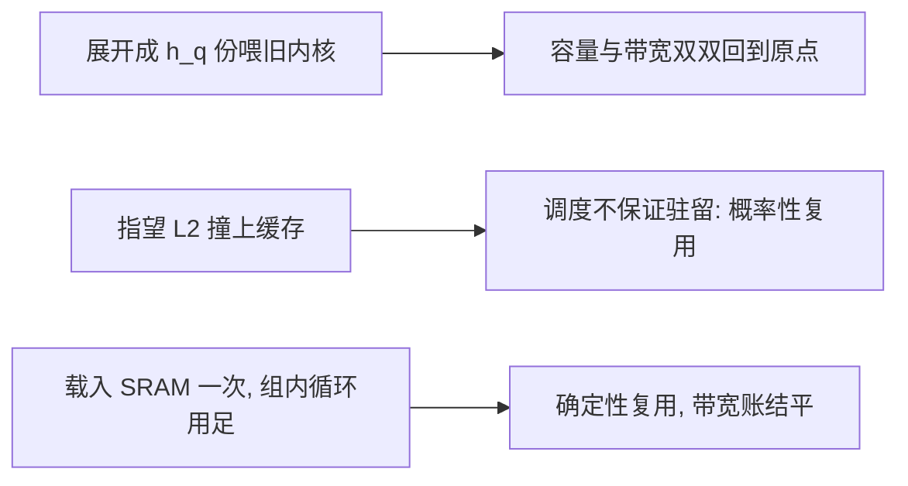
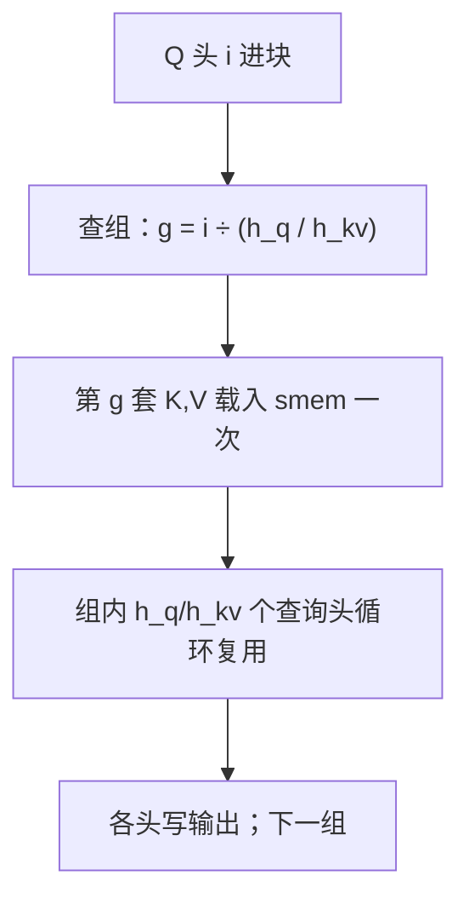

# GQA 与 MQA 的内核差异

少几套 KV 头省下的字节，要靠内核里真正被复用才兑现；结构省了、内核照旧，账就落空。

<footer>—— 据 Shazeer, 2019；Ainslie et al., 2023 整理</footer>

[上一课](/llm/ak-smem-register-budget)把片上预算钉住，基础机制三课收束。本课进入变体的内核单元，第一个变体动的是头这一维。[GQA](/llm/gqa) 与 [MQA](/llm/mqa) 在结构课里定过 $h_{kv}$ 的谱系：$h_{kv}=h_q$ 即 MHA，$h_{kv}=1$ 即 MQA，中间是分组共享。本课只站在内核这一侧问：$h_q$ 个查询头共享 $h_{kv}$ 套键值，这层共享在核内怎么落地，才把省下的字节真的兑成时间。

## 问题

结构把 KV 字节除以 $h_q/h_{kv}$，那是缓存容量的账；带宽的账要内核来结。若每查询头仍按 MHA 代码独立去读「自己的」K 和 V，同一段 KV 就要从 HBM 被搬 $h_q/h_{kv}$ 遍，带宽一分未省；若在模型层把 KV 沿头维展开成 $h_q$ 份再喂旧内核，容量与带宽双双回到原点，还多占了显存。共享必须在加载路径上发生一次、被用足 $h_q/h_{kv}$ 次，账才算平。

术语翻译：$h_q$ 是查询头的个数，$h_{kv}$ 是键值头的个数，$h_q/h_{kv}$ 就是「几个查询头共用一套键值」，也叫组大小。Llama-2-70B 是 64 个查询头配 8 套键值——每组 8 个查询头，排队用同一份 K、V。

### 共享发生在哪一层

候选层级有三个：HBM 之后、L2 之中、SRAM 之内。L2 是芯片级共享，多个块读同一段 KV 有机会命中，但调度不保证同时驻留，复用是概率性的；SRAM 里的复用是确定性的——载一次、用足，这恰好是上一课预算表腾出来的地方。

## 方法

内核侧两个动作。第一，头映射：网格按查询头展开，第 $i$ 个查询头对应 KV 组 $g=\lfloor i/(h_q/h_{kv})\rfloor$；载入第 $g$ 套 K、V 进 smem 一次，组内 $h_q/h_{kv}$ 个查询头循环复用，输出各写各的。第二，解码的极端情形：$h_{kv}=1$ 时整套 KV 与批内所有请求、所有头共享，加载可以沿批与头合并，跨请求共享前缀还能级联成一段公共读加各请求的私有读，见 [FlashInfer 内核库](/llm/flashinfer)的级联口径。前填侧的账不同：FLOPs 仍按 $h_q$ 算，几乎不减，省在写出 KV 与缓存容量上。

## 机制

为什么这个循环买得起带宽账：解码一步的 KV 读量从 $h_q$ 套降到 $h_{kv}$ 套，每字节被组内循环用足；KV 读正是[解码的算术强度](/llm/arithmetic-intensity-decode)里压垮小 batch 的那本账，把它除以 8，decode 的每步时间近似也除以 8。组内循环的代价是 smem 里多驻一份 K、V——上一课的双缓冲与 tile 权衡在这里直接接上：$d$ 与 $B_c$ 不变，份额够了，占用率不掉。

数字实例：batch=32 的解码步，MHA（$h_q=64$）每步要读 $32\times64$ 套 KV，GQA（$h_{kv}=8$）只读 $32\times8$ 套——读量正好除以 8。解码是「读得多、算得少」的活，小 batch 下读量砍八倍，每步时间就近似快八倍。

错法有两种，都在生产代码里常见。其一，内核不支持组映射，于是给每个 KV 组起一个独立内核调用、组内头串行：共享退化为时间上的先后读，HBM 字节数回到 MHA。其二，用张量展开假装共享：`expand` 出 $h_q$ 份视图再广播——若下游内核按视图具象化，显存与带宽立刻翻回；视图必须活到加载指令那一层才作数。

初学者容易以为「`expand` 一下就算共享了」——它只是造出一张「看起来有 64 份」的账面视图，内存里仍是那一份。可只要下游内核真按 64 份去读，或实现把视图物化成真拷贝，省下的字节就全赔回去。共享要落在加载指令那一层才算数。

Llama-2-70B 取 $h_q=64$、$h_{kv}=8$：解码每步 KV 字节相对 MHA 除以 8。这笔账是内核里那段组内循环买来的，不是结构自己买来的——同样的权重，配一个不识组的内核，一分钱都省不下。

## 边界

组内是硬共享，池化加短训转 GQA 的质量代价与 $h_{kv}$ 的甜点选择是结构课的题目；[GQA 论文](/llm/ainslie-gqa)与 [MQA 论文](/llm/shazeer-mqa)的口径本课不重复。张量并行要求 $h_{kv}$ 可被切分整除，那是分片布局问题，落点在并行课程。跨请求共享 KV 的地址问题——页表与引用计数——是下一课的主题：本课的共享发生在头之间，下一课发生在请求之间。

## 小结

- 结构省的是 KV 字节与容量，带宽的账由内核的组映射与 smem 复用来结。
- 头映射 $g=\lfloor i/(h_q/h_{kv})\rfloor$：K、V 按组载入一次，组内循环用足。
- MQA 的 $h_{kv}=1$ 把共享推到批与请求级，解锁级联与合并加载。
- 展开视图不等于共享：必须活到加载路径，否则显存带宽双双翻回。
- 前填侧几乎不省 FLOPs，省的是 KV 写出与缓存。
- 出处：Shazeer, *Fast Transformer Decoding*, 2019；Ainslie et al., *GQA*, 2023。
