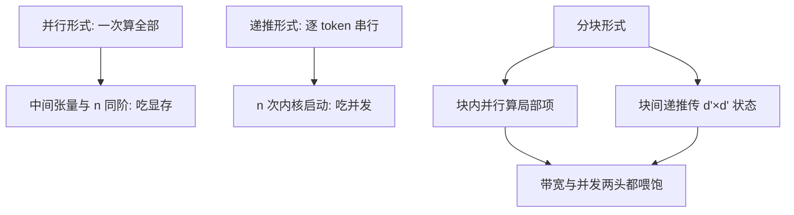
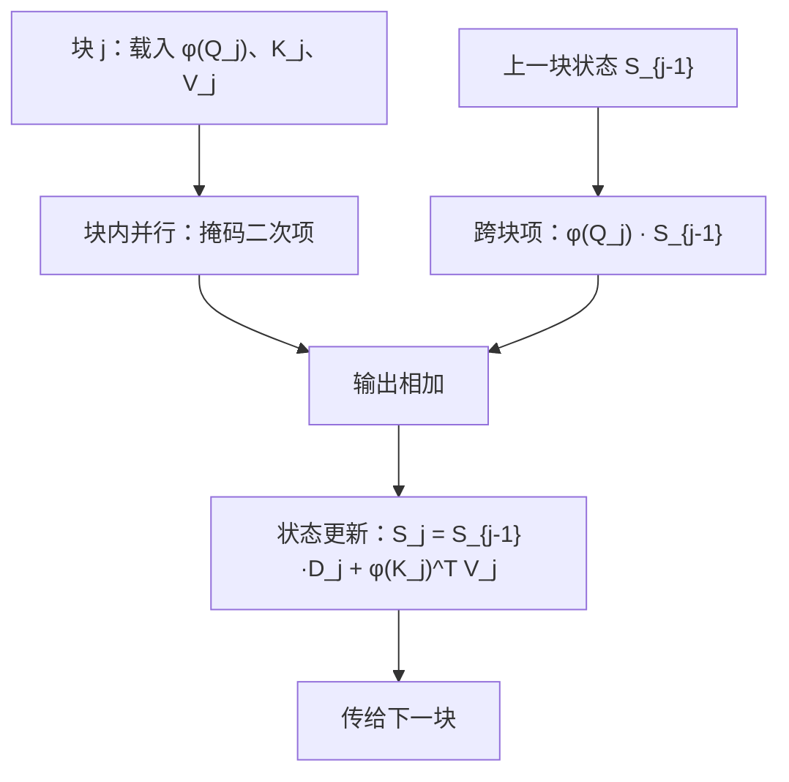

# 线性注意力的内核化

线性注意力把 $n\times n$ 换成一个 $d\times d$ 状态；这个状态住在哪一层存储，决定它是省内存的数学还是省时间的内核。

<footer>—— 据 Katharopoulos et al., 2020；门控线性注意力（2023）实现整理</footer>

[上一课](/llm/ak-sparse-kernel-strategy)让图跳块省算。本课是变体单元的最后一课，动得更深：把 $n\times n$ 本身换掉。[Linear Attention](/llm/linear-attention) 在数学侧给过核特征、并行形式与状态递推，[门控线性注意力 GLA](/llm/gated-linear-attention) 加了衰减门；本课只问内核化：并行、递推、分块三种形式各落在哪一层存储，哪一种才真的快。

## 问题

并行形式先算 $\phi(Q)\phi(K)^\top$ 再乘 $V$：中间要么是 $n\times d'$ 的特征张量、要么是 $d'\times d'$ 逐位置的秩一项，总之把要省掉的与 $n$ 同阶的东西换了个名字存进 HBM，省内存与省时间都没兑现。递推形式 $S_t=S_{t-1}+\phi(k_t)^\top v_t$ 逐 token 更新，状态虽是常数大小，但每步一次核调用、串行 $n$ 次，GPU 利用率崩掉。两头都对、两头都不可用——同一份数学在内核上变成了两难。缺口是一个能同时喂饱带宽与并发的形式。

直觉类比：递推状态 $S$ 像一本固定大小的笔记——每读一个新 token 就把要点记进去，旧记录被融合覆盖。所以不管文章多长，本子始终只有 $d'\times d'$ 那么大；代价是没法像 KV 缓存那样逐字回看原文，重点一旦被压缩就回不来了。

### 三种形式，一张表

并行形式吃显存、递推形式吃并发，分块形式各取一半：块内用并行形式算局部二次项，块间用递推传状态。它对 FlashAttention 的骨架似是而非——外层都扫块——但传的东西不同：FA 传的是每行三个统计量，这里传的是整张 $d'\times d'$ 状态矩阵。

术语翻译：分块形式就是「块内并行、块间串行」。同一块内部的计算互不依赖，可以大规模铺开并行算；只有块与块之间要按顺序交接状态。和 FlashAttention 外表像，但 FA 块间只传每行的三个统计量，这里传的是整张状态矩阵。

## 方法

分块内核的写法。块 $j$ 内：先算局部项 $(\phi(Q_j)\phi(K_j)^\top\odot M_j)V_j$（块内掩码），再算跨块项 $\phi(Q_j)S_{j-1}$——历史状态与当前查询的一次矩阵乘；输出两项相加。块间：$S_j=S_{j-1}\cdot D_j+\phi(K_j)^\top V_j$，$D_j$ 是门控衰减（无门时是单位阵）。训练时状态链有前缀和结构，块内输出全并行、状态链按结合律合并，SM 排得满；解码时 $S$ 常驻显存，每步读 $\phi(q),v$、写 $\Delta S$，带宽 $O(d^2)$、与 $n$ 无关——「常数状态」的内核含义就是这条带宽。

## 机制

把两难拆开看，就懂分块为什么成立：二次项只在块内出现，块大小 $B$ 固定，中间张量是 $B\times B$ 而不是 $n\times n$；状态是块间的唯一通道，$d'=128$、fp16 时每头 $32\,\mathrm{KiB}$，驻在 smem 或寄存器里都放得下——第一单元的预算表原样适用，只是住户从 Q、K、V 块换成了状态与特征块。错法回到两头：天真并行形式把 $\phi(Q)\phi(K)^\top$ 物化成 $n\times d'$ 与 $d'\times n$ 相乘，显存与流量回到与 $n$ 同阶；递推写成逐 token 内核，$n$ 次启动的固定开销与每次都冷的缓存，让纸面上的 $O(n)$ 在墙钟上输给二次的 FlashAttention。

$d'=128$、fp16：每头状态 $32\,\mathrm{KiB}$；$n=32\mathrm{k}$ 时 MHA 每头的 K+V 约 $16\,\mathrm{MiB}$——同一头缓存容量差约五百倍，解码带宽从随 $n$ 线性变成常数。这就是「线性」在系统层的真实含义。

## 边界

核特征不逼近 softmax：精确拷贝弱、尖峰打不出来，这是[线性注意力](/llm/linear-attention)数学课的边界，内核不负责救质量。门控衰减 $D_j$ 若逐头不同，状态更新多一组标量通道，扫描的结合律仍在，只是合并公式多乘一项。与 MHA 混层、混合架构是模型设计的题目；训练侧的反向（状态链的伴随）本课不展开。质量之争到此为止：本课程的立场是——任何变体先要能被写快，才轮到比较质量。

常见误区：初学者容易以为「线性复杂度一定比二次快」。若把递推写成逐 token 的小内核，几百次启动开销加冷缓存，纸面的 $O(n)$ 在实际墙钟上会输给写得好的二次 FlashAttention。复杂度是渐近账，墙钟才是结账单。

## 小结

- 并行形式吃显存、递推形式吃并发；分块形式块内并行、块间传状态，两头都活。
- 与 FA 的骨架同构但通道不同：传的是 $d'\times d'$ 状态矩阵，不是标量统计量。
- 解码收益的内核含义：状态常驻，每步带宽 $O(d^2)$ 与上下文长度无关。
- 物化特征外积或逐 token 启动内核，是两头都赔回去的典型错法。
- 预算表换个住户继续用：状态与特征块同样要在 smem 与寄存器额度里安家。
- 出处：Katharopoulos et al., *Transformers are RNNs*, ICML 2020；据 GLA 与 Lightning Attention 实现整理。
