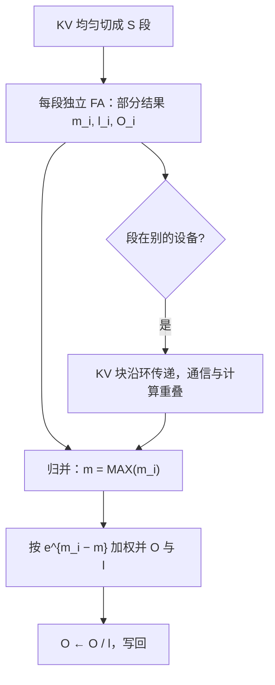

# 长序列的内核策略

序列变长不改变注意力的公式，改变的是并行度从哪来：KV 轴切开后，softmax 的结合律就是你的归并器。

<footer>—— 据 Dao et al., 2022；Liu et al., 2023（Ring Attention）整理</footer>

[上一课](/llm/ak-speculative-interaction)处理了投机带来的形状冲击。本课把 $n$ 推到十万级。[FlashDecoding](/llm/flashdecoding) 定过沿 KV 切分与二层 LSE 归并，[Ring Attention](/llm/ring-attention) 定过跨设备的序列分片；本课把它们当作同一套内核策略收拢：并行度从哪来、部分结果怎么归并、掩码在长序列下要多管什么。

## 问题

三个缺口同一个来源。其一，前填 $n=128\mathrm{k}$ 时 FlashAttention 的内层循环有上千个 KV 块，但网格并行度仍按 $\mathrm{batch}\times h_q$ 展开：单请求、8 个查询头就是只有 8 个线程块，上百个 SM 大半闲置。其二，解码时 KV 读随 $n$ 线性增长，单请求下算术强度贴地，[解码的算术强度](/llm/arithmetic-intensity-decode)那本账在长上下文里被放大到难看。其三，显存装不下：$128\mathrm{k}$ 上下文的整段 KV 本身就超出单卡容量。查询轴没得切（就一行或几行），能切的只剩 KV 轴。

### 切了 KV，softmax 怎么办

第一课说过每行携带 $(m,l,O)$ 三个统计量、且合并满足结合律——沿 KV 切段正是把这条结合律从「块间」用到「段间」：每段独立算出部分结果，再用同一个合并式归并。精确性不丢，因为合并是恒等变换换了个执行顺序。

## 方法

沿 KV 切分四步。第一，把 KV 均匀切成 $S$ 段，段数按占用算：让 $\mathrm{batch}\times h_q\times S$ 盖过 SM 数。第二，每段独立跑一遍 FA 循环，产出 $(m_i,l_i,O_i)$。第三，归并：$m=\max_i m_i$，$O=\sum_i e^{m_i-m}O_i$，$l=\sum_i e^{m_i-m}l_i$，最后 $O/l$——数值上与一遍算等价，只是舍入顺序不同。第四，跨设备时段间走点对点环传递 KV 块，通信与段计算重叠，单卡显存不再是上限（Ring Attention 的口径）。服务端还有一路：把 128k 的前填切成若干 4k 段逐段做，与第 5 课的变长接口咬合，首 token 延迟从「全部算完」变成「逐段出活」。

## 机制

为什么段数有甜点：切分解决的是并行度，付出的是部分结果的写读与归并——$O_i$ 是 $n_q\times d$ 的张量，段数翻倍它也翻倍，但相对 KV 流量通常可忽略；段太碎则归并占比上升、每段循环的启动开销显形。所以段数由 SM 数与形状算出，不拍脑袋。错法有三种。把 tile 开小去「多开块」：第一单元的预算表说过这会溢出，方向就错了。用滑窗硬切长序列：那是改语义不是改策略，感受野有损接力是模型课的决定，见 [Sliding Window Attention](/llm/sliding-window-attention)。滚动窗口挤掉开头：许多头的权重质量沉在初始 token 上，它们是归一化的锚，切掉锚窗口内权重重新放大、输出崩，见 [Attention Sink](/llm/attention-sink)——长序列的掩码策略与数值策略要一起定。

单请求、$h_q=8$、A100 有 108 个 SM：不切分时 8 个块占不到一成 SM；沿 KV 切 64 段得 512 块，SM 排满。代价只是多写读一遍 $O$（$n_q\times d$）与统计量——相对 KV 流量不足百分之一。

## 边界

Ring Attention 的通信量、拓扑与重叠效率属于并行训练课程；本课只认「段间可以走设备」这个接口。位置编码与外推、上下文扩展是模型课题目。KV 装不下时的驱逐与压缩是 KV 管理课程的题目，本课的前提是段都在某个地方存着。策略层面的结论只有一句：长序列的内核手段是同一精确算法换并行度与归并，谁要用近似换速度，先在边界里声明。

## 小结

- 长序列的第一缺口是并行度：查询轴切不动，沿 KV 轴切段，段数按 SM 数算。
- 段间归并用第一课的结合律：$\max$ 并 $m$、指数加权并 $l$ 与 $O$，精确无近似。
- 部分结果的写读是切分的代价，段太碎归并占比上升，甜点由占用算出。
- 跨设备切段即 Ring Attention 的接口：KV 块点对点传递，通信与计算重叠。
- 掩码与数值要一起定：滑窗是语义决定，attention sink 的锚不能被滚动挤掉。
- 出处：Dao et al., 2022；Flash-Decoding, 2023；Liu et al., *Ring Attention*, 2023。
