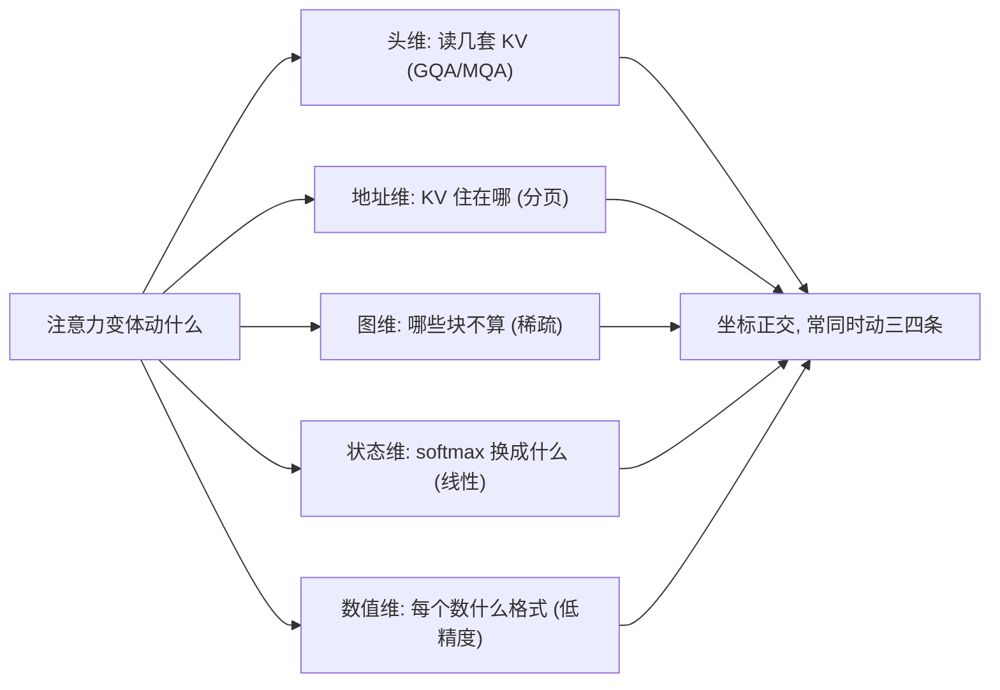
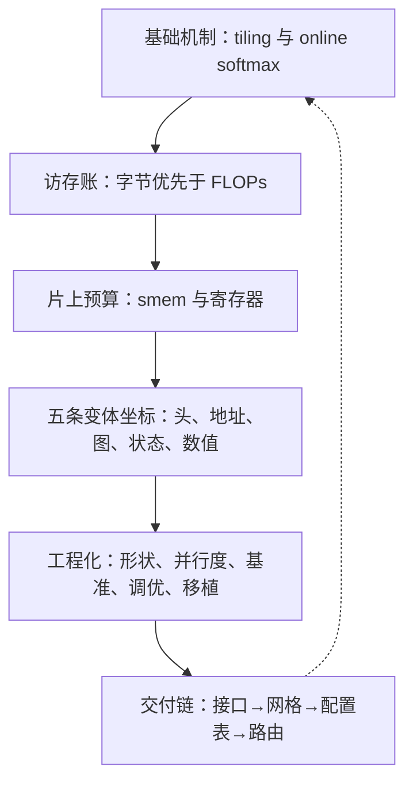

# 内核工程收束

一套精确的数学、一份片上预算、一群在块上做文章的变体、一把测量的尺——注意力内核工程的全部家当。

<footer>—— 据 Dao et al., 2022；Dao, 2023；Kwon et al., 2023 整理</footer>

[上一课](/llm/ak-multi-backend)把内核送上不同硬件，交付链接完。本课是全课程的地图与收束：把三个单元十三课收成一张能带走的清单，并交代本课程没有覆盖的邻接地带。本课程到此收束。

## 问题

十三课散在机制、变体、工程三个单元里，离开时要回答三个问题。不变量是什么——变体满天飞，哪些东西一动就不是注意力内核了。变体动了什么——新论文层出不穷，它们在共享坐标系的哪条轴上。拿到新任务先做什么——新形状、新硬件、新变体进门时的操作顺序。收束课的任务不是重复，是把十三课压成可执行的判断。

为什么重要：拿到一篇「新注意力」论文时，最贵的错误是从零重读它的内核推导。先对坐标系：它动的是头、地址、图、状态、数值哪一条，然后直接翻那一课的机制账——大多数「新」结构只是旧坐标上的新值，十分钟就能预判它的性能形状。

### 五条坐标一张图

变体单元的五课各动一条坐标：头维（GQA/MQA 改读哪几套 KV）、地址维（分页改 KV 住在哪）、图维（稀疏改哪些块不算）、状态维（线性改 softmax 本身成什么）、数值维（低精度改每步数是什么格式）。坐标互相正交：一个现代长上下文模型常常同时动三四条。工程化单元的四课不动坐标，动的是形状（投机）、并行度（长序列）、尺（基准）与分发（调优、移植）。

## 方法

带走一份操作顺序。新形状进门：先记[内存访问模式](/llm/ak-memory-access)的账，判断带宽还是算力绑定；再查 [shared memory 与寄存器预算](/llm/ak-smem-register-budget)定 tile 候选；接口先钉——头映射、页表、掩码图、变长，参照 [分页 KV 的内核接口](/llm/ak-paged-kv-kernel)与投机的变长 $q$；然后进 [内核基准测试方法论](/llm/ak-benchmark-methodology)的网格，验收与计时同权；赢家进 [autotuning 实践](/llm/ak-autotuning)的配置表，缓存键把形状桶与 $n_q$ 记全；换硬件时按[多后端移植](/llm/ak-multi-backend)分层走。新变体进门：先判断它动的是五条坐标里的哪一条，再沿那一课的机制读它的内核账——新稀疏是图维的新图，新量化是数值维的新格式，新 KV 布局是地址维的新译址。

## 机制

为什么这套清单能复用：因为变体多而坐标少。五条坐标加上「精确 softmax 的结合律合并」这条不变量，构成了一个足够小的封闭集——新工作要么在坐标上取新值，要么把坐标组合，要么（罕见地）换不变量，比如线性注意力把归一化从行内 softmax 换成状态递推，那是状态维的极值点。内核库的 API 形状恰好印证：FlashInfer 的对象是分页、变长、共享前缀，FlexAttention 的对象是掩码图与分数修改——库的接口分裂就是坐标的接口化。而第一课的 $(m,l,O)$ 三元组从块间走到段间、从单卡走到多卡，全程未改——这是「不变量」一词的工程含义：它不是没被碰到，是被碰到时按同一条结合律合并。

一条自检链：访存账 → 预算表 → 接口合同 → 数值容差 → 冲刷 L2 的基准 → 缓存键是否记全。六步省掉任何一步，问题都会在生产形状上回来——而且回来的形态是延迟或正确性，不是报错。

## 边界

本课程没有覆盖的地带要交代清楚。反向与训练内核只借了一角（重算与 attention backward），训练期的调度与显存换入换出是训练系统的题。KV 的压缩、量化与驱逐是 KV 管理课程的题目——本课只负责把它们读得快，不决定它们存什么。请求调度、批处理与多租户在服务课程。硬件微架构的细节（流水、互连、缓存层次）归体系结构。这些课程接的正是本课程交出的接口：页表、变长、坐标化的变体、可复现的数字。

常见误区：以为「内核写完就交付了」。实际上页表、变长、头映射这些接口一旦被引擎和框架依赖，就比内核本身活得久——换硬件只需重写核，接口一动却要整个生态跟着改。所以接口要比实现更谨慎，这也是交付链「接口先行」的原因。

## 小结

- 不变量是精确 softmax 的结合律合并：$(m,l,O)$ 从块间、段间到设备间一路未改。
- 变体收进五条坐标：头、地址、图、状态、数值；新工作多半是坐标上的新值或新组合。
- 快来自字节不过 HBM；每一步优化先过访存账与片上预算，再谈指令。
- 交付链固定：接口先行、基准网格与验收同权、配置表带键、路由按后端能力。
- 接口比内核活得久：页表、变长与头映射进接口后，硬件换了合同仍在。
- 出处：Dao et al., 2022；Dao, *FlashAttention-2*, 2023；Kwon et al., SOSP 2023；其余各课口径随课标注。
