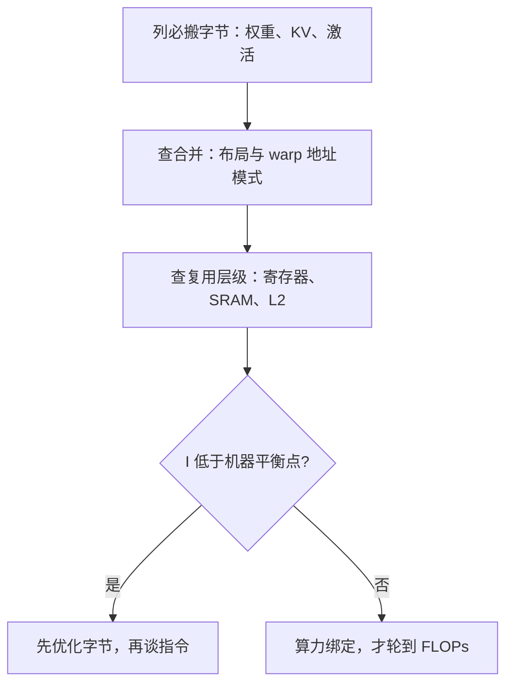

# 内存访问模式分析

内核快慢的账本记在字节上：谁在什么时候从哪一层存储搬了多少字节，比 FLOPs 表更接近真相。

<footer>—— 据 Williams et al., Roofline, 2009；Dao et al., FlashAttention, 2022 整理</footer>

[上一课](/llm/ak-flashattention-reread)把 tiling 与 online softmax 装进了内核骨架，收在「省的是字节」。本课把这句直觉拆成可测量的账：访存模式分析。后面谈片上预算、各路变体的内核与基准方法论，都要先会记这本账——记错账的优化，到测速那天全是事故。

## 问题

同一个注意力内核，前填八千 tokens 是算力活，小 batch 解码却是搬运活。判据是算术强度 $I=\mathrm{FLOPs}/\mathrm{bytes}$ 对上机器的平衡点：低于它，计算单元在等数据，减 FLOPs 的任何努力都兑不成时间，见[解码的算术强度](/llm/arithmetic-intensity-decode)。缺口有两层。第一层是账目：这个内核每跑一步，逻辑上必须移动哪些字节。第二层是质量：同样一个字节，合并访问一次搬走与拆成三十二条事务，在带宽表上差出一个数量级。只看 FLOPs 或只看代码逻辑，两层的错都看不出来。

### 必搬、合并、复用：三本账

必搬的账按算法定：权重、激活、KV，与实现无关。合并的账按布局定：warp 内三十二个线程若触到连续地址，硬件并成一次事务；跨步、转置、逐头散布的布局把它拆碎。复用的账按层级定：一个数据被用第二次时，它驻在寄存器、SRAM 还是 L2，决定要不要再过 HBM。

## 方法

三步记账法。第一步列必搬字节：解码一步至少要读全部权重与全部 KV，写出 $n_q\times d$ 的输出；前填还要读写激活。第二步检查合并：KV 沿序列维顺序读时，$[\mathrm{batch},h,n,d]$ 与 $[n,h,d]$ 两种布局的地址模式完全不同，解码内核偏爱后者；载入 $K,V$ 块时按 $d$ 维连续，warp 内相邻线程触相邻元素。第三步检查复用层级：FlashAttention 的核心就是让 $Q$ 块驻留片上、被整组 KV 块复用，复用发生在 SRAM 而不是碰运气的 L2。

## 机制

把账算一次。解码单请求、三十二层、$h_{kv}=8$、$d=128$、fp16、上下文 $n=8192$：每个新 token 要读的 KV 是 $32\times 2\times 8\times 128\times 2\,\mathrm{B}\times 8192\approx 1\,\mathrm{GiB}$，按 $2\,\mathrm{TB/s}$ 折算就是半毫秒级的纯搬运——这还没算权重。此时任何「少算一遍乘法」的改法在延迟表上都看不出来，因为瓶颈在 KV 的字节上；把 $h_{kv}$ 从 8 压到 4，比把 GEMM 调快一倍有用得多。反过来，前填大 batch 时权重与 KV 都摊到大量 FLOPs 上，$I$ 高过平衡点，同一份账指向完全不同的优化。这就是为什么内核调优的第一动作是记账，不是动手。

错法有两个典型。一是拿着 MHA 时代的解码内核直接跑：每个查询头各自去读「自己的」K 和 V，同一段 KV 被 HBM 搬了好几遍，带宽账白花。二是以为合并访问只是「风格问题」：布局一转，一条事务拆成三十二条，实测带宽掉到峰值的一成——代码一行没错，速度全错。这两类错都藏在 FLOPs 表看不到的地方。

A100 的账：HBM 约 $1.5$–$2\,\mathrm{TB/s}$，L2 约 $40\,\mathrm{MiB}$、带宽高数倍，SM 内 SRAM 约 $19\,\mathrm{TB/s}$。上一课的 $O(n^2d^2/M)$ 里的 $M$ 就是这份 SRAM，快慢的数量级差全部来自层级。

## 边界

记账给的是上界与方向，不给出数：占用率、流水线深度、延迟链都会让实测低于账面，基准方法论一课再立测量的规矩。L2 会骗人——小张量反复测时 KV 常驻 L2，带宽读数虚高，那也是基准课的题目；本课只负责把「数据应该住在哪一层」问对。访存模式随 batch、头数、布局与分页而翻转，账要按形状分别记，一张全局账本不存在。解码与前填的分工是调度器的活，本课只管内核这一段。

## 小结

- 算术强度对上机器平衡点，先判断是带宽绑定还是算力绑定，再决定优化哪头。
- 三本账：必搬字节按算法定，合并访问按布局定，复用层级按驻留位置定。
- 解码小 batch 是 KV 字节的账；$h_{kv}$ 减半胜过 GEMM 快一倍。
- 布局决定合并访问能否成立，转置布局能让带宽掉一个数量级。
- 复用要落在确定性层级（寄存器、SRAM），不赌 L2。
- 出处：Williams et al., *Roofline*, CACM 2009；IO 分析口径据 Dao et al., *FlashAttention*, 2022。
