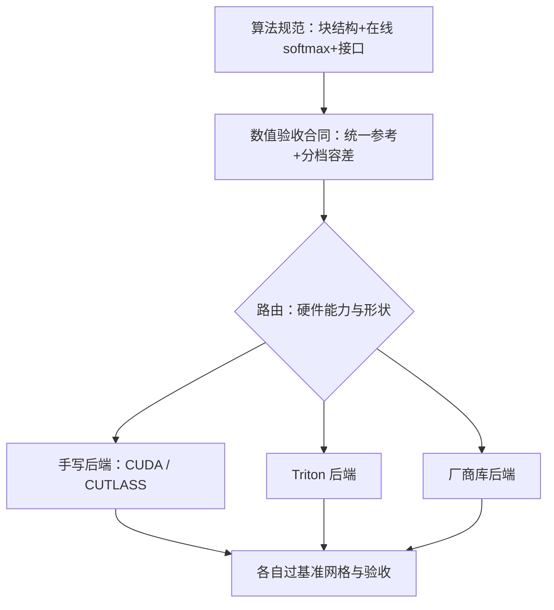

# 多后端移植

算法是一份，内核是很多份；移植的真正工件不是翻译代码，而是先把不变式与验收口径钉死。

<footer>—— 据 CUTLASS 与 FlashInfer 文档、Tillet et al., 2019（Triton）整理</footer>

[上一课](/llm/ak-autotuning)把配置表立成合同。本课处理换硬件：多后端移植。同一份 tiling 加 online softmax，在 A100、Hopper、AMD 与国产加速器上是几套不同的代码；本课讲分层、路由与跨后端的验收——移植做错，错误通常不在「搬不动」，而在「搬过去以后谁也不确定它对不对」。

## 问题

两条路都通向坏结局。把 CUDA 源码当规范逐行翻译：warp shuffle、异步拷贝、TMA、矩阵指令这些原语在别的后端要么不存在要么语义不同，翻译半途而废；只维护一份「最慢公分母」的实现（比如纯 Triton 版）：在每家硬件上都拿不到该拿的份额，移植成了降级。更隐蔽的是数值：各后端的默认归约顺序、累加宽度、数学库不同，同一容差下结果漂移——上游把它当 bug 报，下游把它当正常吞，两边都没有口径。缺口是：算法层、调度层、验收层分开，各自有各自的合同。

### 分层的依据是「什么随硬件变」

随硬件变的是原语与额度：smem 大小、异步搬运、矩阵指令、流水深度。不随硬件变的是算法：块结构、在线 softmax 的统计量更新、掩码语义、变长与分页接口。把变的和不变的拆开，移植就有了分工。

## 方法

三层移植法。第一层，算法规范：块结构、统计量合并、掩码与接口写成文档与参考实现（FP32 逐块参考），这是所有后端共享的合同。第二层，调度实现：每后端按自身原语重排——A100 用异步拷贝双缓冲，Hopper 用 TMA 加 warp 特化（[FlashAttention-3](/llm/flashattention-3) 的口径），Triton 让编译器生成（[Triton 写注意力核](/llm/triton-attention-kernel)），成熟厂商库（[FlashInfer 内核库](/llm/flashinfer)、cuDNN）直接接管整段。第三层，路由：前端按硬件能力、形状桶与后端可用性查表选路，未命中回退到保底实现。每个后端过同一套基准网格与数值验收，报告按后端分列，倍数不跨卡平移。

## 机制

为什么验收必须跨后端同一口径：数值差异主要来自归约顺序与累加宽度，这些是合法差异；但合法差异必须可见才能与真 bug 区分。统一参考加每后端分档容差，漂移就从「玄学」变成「表里的一项」。为什么算法层要先钉死：移植中最贵的错误是每家对算法的理解略有不同——之后每个 bug 要修 N 份，而且修的顺序互相踩。错法从最快后端反向理解算法：把它的调度技巧当成数学的一部分，换到没有该原语的硬件上就写出错的「等价物」。还有一个静默坑：某后端不支持某条量化或稀疏路径时，路由若静默换成别的路径，用户拿到的数值与延迟都变了却不知情——正确做法是显式降级并在响应元数据里标注。

同一份 FlashAttention 的相对加速不可跨卡平移：Hopper 的收益来自 TMA 与 warp 特化，A100 没有这些原语，AMD 的矩阵指令形状又不同。对外只承诺「接口一致、各自验收达标」，不承诺倍数一致——承诺倍数的移植文档，第一页就错了。

## 边界

移植不改语义：任何后端都不该为了性能改掩码、改精度路径、改归并结构，除非改动能通过同一份验收并写进差异表。性能可移植性（一份代码到处快）是编译器研究的题目，本课做的是工程可移植：分层、路由、验收。新硬件到手，第一件事是重跑第 3 课的预算表——smem、寄存器、矩阵原子全是新数，旧 tile 直接搬过去等于没移植。预算、基准、调优、移植四课连起来，才是内核工程的完整交付链。

## 小结

- 移植分三层：算法规范共享、调度实现各自重排、路由按能力与形状查表。
- 数值验收用统一参考加分档容差，让合法漂移可见、真 bug 无处藏。
- 别把最快后端的调度技巧当数学：从原语反推算法是移植的第一错误源。
- 后端能力缺失要显式降级并标注，不静默换路径。
- 新硬件先重跑预算表，再谈移植；倍数不跨卡承诺。
- 出处：据 NVIDIA CUTLASS 与 FlashInfer 文档、Tillet et al., *Triton*, MAPL 2019 整理。
