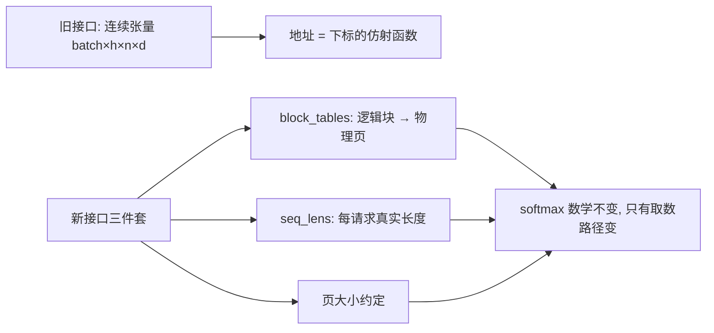
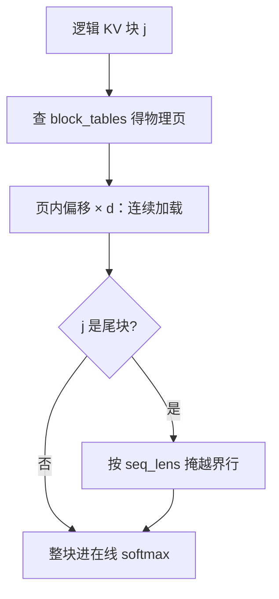

# 分页 KV 的内核接口

内核不再拿到一块连续显存，而拿到一张页表；地址翻译进了热路径，softmax 一个字没变。

<footer>—— 据 Kwon et al., PagedAttention, SOSP 2023 整理</footer>

[上一课](/llm/ak-gqa-mqa-kernels)把头的共享落进核内。本课处理第二个变体，动的是地址这一维。[PagedAttention](/llm/paged-attention) 在系统侧定过页与页表、碎片与引用计数，[vLLM 与 PagedAttention](/llm/vllm-paged) 定过它与调度器的分工；本课站在内核接口这一侧：当 KV 不再连续、长度不再齐整，tiling 循环怎么改，地址翻译怎么不拖垮热路径。

## 问题

传统内核假设 K、V 是 $[\mathrm{batch},h,n,d]$ 的连续张量，元素地址是下标的仿射函数，编译器与硬件都按这个假设做合并访问。服务里每个请求的 KV 散布在物理页上——页表与块大小见[分页 KV 与块大小](/llm/paged-kv-block-size)，而且批内长度各异。缺口因此有两个：其一，tiling 的外层循环本来扫逻辑位置，现在每一步要先经块表翻成物理地址，翻译若掉出热路径、变成一次回读元数据的往返，内核就慢得不讲道理；其二，变长带来的尾块要按真实长度掩掉，掩码必须与同一循环咬合。

直觉类比：连续 KV 像把书按顺序码满一整面墙，取第 k 本直接算位置；分页 KV 像书分散在图书馆各层书架——取书前先查索引卡（块表）知道在哪架，再在架内按位置拿。多了一步查表，换来的是空间能见缝插针地用。

### 接口三件套

内核收到的不再是张量，而是三样东西：块表 `block_tables`（每请求的逻辑块号到物理块号）、长度表 `seq_lens`（每个请求的真实 token 数）、以及页大小的约定。数学没有任何变化：softmax 仍在完整合法前缀上精确计算，变的只是取数的路径。

## 方法

循环改成两级译址。外层按逻辑块 $j$ 从 $0$ 扫到 $\lceil n/B\rceil$：查块表得物理页号，页内偏移乘 $d$ 得元素地址；页内连续，所以 warp 的合并访问保得住。尾块按 `seq_lens` 掩掉越界行，掩码落在线上 softmax 之前，与因果掩码按位或。前填侧同一条路径反向走：新算出的 K、V 按当前页表写进零散页，写出粒度也是页。页大小与 tile 对齐时，每个 tile 恰好查一次表；错开时，一个 tile 跨两页，行级译址把合并访问拆碎。

常见误区：尾块的「多余行」不是可以顺手一起算的部分——批内各请求长度不一，页内最后几个槽位是未初始化的。不按 `seq_lens` 掩掉，softmax 会把页里的垃圾当合法 KV 算进去，输出悄悄错掉，还不会报任何错。

## 机制

为什么页大小要与 KV tile 对齐：页与 tile 同大（工程上页取 16 的倍数、tile 取 64 或 128），查表开销摊到整个 tile，每 tile 一次表读、一次地址基址更新；页太小，查表次数涨到每 tile 多次，页太碎则每行都要单独译址。两头的账在[分页 KV 与块大小](/llm/paged-kv-block-size)里有解析式：内部碎片期望约 $B/2$ 个槽位，查找约 $\lceil n/B\rceil$ 次——容量省了，内核的译址成本涨了，取点是工程决定。错法里最危险的一种是「事后修补」：内核仍按连续写，调度器再来挪数据补页表——不仅多一遍全量搬运，还在挪动的窗口里读到大面积脏数据，输出错得悄无声息。地址翻译属于内核合同的一部分，写进接口，不写在补丁里。

数字实例：页与 tile 对齐时，128 行的 tile 只查 1 次表；错开到行级译址，同样 128 行要查 128 次——对齐把译址开销摊薄了上百倍。页取大又会让每个请求平均浪费约 $B/2$ 个槽位（页 16 时约 8 槽），两头取点是工程权衡。

vLLM 默认块 16 token：内部碎片期望约 8 槽/请求；$n=2048$ 时每请求约 128 次查表——对齐 tile 后每次查表是一次 smem 内的基址更新，不是一次 HBM 往返，这笔账才能算平。

## 边界

本课的页表服务精确注意力：跳过的块、共享的页都仍按页粒度进循环。引用计数与前缀共享的写时复制是调度器与 KV 管理的事，内核只认页号合法。KV 的压缩与驱逐不在本课，那是 KV 管理课程的题目。与上一课的组映射是正交坐标：头共享决定读哪一套 KV，页表决定那一套住在哪，两者叠在同一个循环里，谁也不替代谁。

## 小结

- 内核接口从连续张量换成块表加长度表，softmax 数学不变，地址路径全变。
- 两级译址：逻辑块查表、页内仿射寻址；页内连续是合并访问的底线。
- 页大小与 tile 对齐，查表摊薄成每 tile 一次；错开就把译址成本放大到行级。
- 尾块掩码与因果掩码在同一个循环里咬合，变长不是特例而是常态。
- 事后挪数据补页表是错的：翻译必须写进接口，不能写在补丁里。
- 出处：Kwon et al., *Efficient Memory Management for LLM Serving with PagedAttention*, SOSP 2023。
