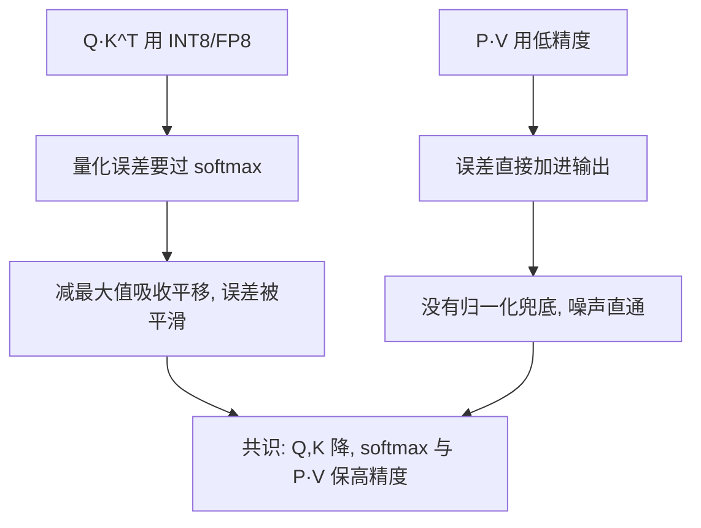
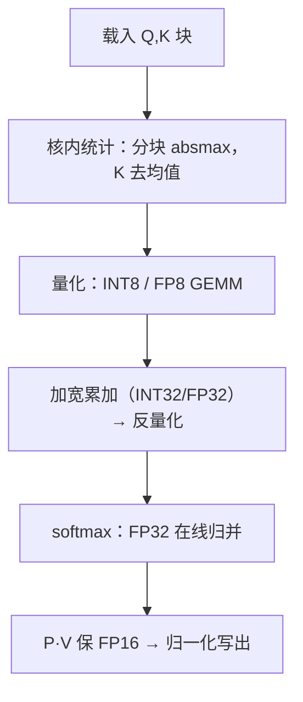

# 低精度注意力的内核

注意力打 8 位不是换一个 dtype：统计量在哪算、累加器保多宽，比格式本身更决定数值死活。

<footer>—— 据 Micikevicius et al., 2022（FP8）；SageAttention（2024）整理</footer>

[上一课](/llm/ak-linear-attention-kernel)把 $n\times n$ 换成状态，变体单元收束。本课进入工程化单元前先补一条数值坐标：把 Q、K、P、V 打进低精度。[SageAttention](/llm/sageattention) 定过分块 INT8 与 $K$ 去均值的做法，[FlashAttention-3](/llm/flashattention-3) 展示了 FP8 加异步的收益；本课从内核侧整理：低精度在核内怎么排布，误差从哪里进账，吞吐从哪里兑现。

## 问题

最省事的写法是把整个 Q、K 一次性 cast 成 INT8 再跑 GEMM。两处死穴。其一，注意力的张量里有通道离群值：少数维度的数值远大于其余，全局 scale 被它们顶到极小，多数值被压进低位，误差爆炸。其二，全局 absmax 要先扫一遍 Q、K——正好多出一整趟 HBM 读，第一单元辛苦省下的字节在这里原路还回去，带宽收益被统计成本吃穿。缺口是：量化必须发生在核内、按块就地完成，不能变成内核之前的一道预处理工序。

术语翻译：量化就是「把数按比例压进小格子」——先用这批数的最大绝对值定一个比例（scale），每个数除以它再取整，装进 8 位整数；用时乘回 scale 近似还原。scale 定大了浪费格子，定小了大数装不下——所以 scale 怎么定是精度的第一道关。

### 谁降、谁不降

不是四个张量一视同仁。$QK^\top$ 的误差要过 softmax：logit 的整体平移会被减最大值吸收，误差被部分平滑；$P\cdot V$ 的误差直接加进输出，没有归一化兜底。所以工程共识是 Q、K 降，softmax 与 $P\cdot V$ 保高精度。

直觉类比：全局量化像全班合影按最高的人调相机高度——一个离群值把 scale 顶上去，其他人全被压成小点。分块量化等于分组拍照，各组按自己的身高调整；K 沿序列减去均值，则是先把「站歪的队」扶正再拍。

## 方法

分块统计加分类施策。第一步，$Q,K$ 按 tile 量化：每个（块，通道）在核内就地归约出 absmax，顺手把 $K$ 沿序列维减去均值压通道离群——SageAttention 点名的精度关键步；统计量活在寄存器与 smem 里，不落 HBM、不二次扫描。第二步，GEMM 走 INT8 或 FP8 tensor core，累加器加宽到 INT32 或 FP32，结果反量化回高精度再进 softmax。第三步，softmax 用 FP32 在线归并，$P\cdot V$ 保 FP16。FP8 路线用 $e4m3$ 存数，按 tile 配延迟缩放，Hopper 上吞吐约为 FP16 的两倍。

## 机制

为什么统计必须分块：离群分布随位置与通道剧烈变化，一个全局 scale 要么被离群值压废、要么放弃保护；分块统计把尺度对齐到数据的局部真实分布，成本是每块几条归约指令，不是带宽。为什么 $QK^\top$ 的误差可以容忍：softmax 对 logit 的常数偏移不敏感，减最大值那一步顺手吸收了量化偏移的主要部分；而 $V$ 侧误差是加性的，量化噪声直通输出。错法也各有一型：一刀切全 INT8——精度崩了还以为只是掉了点分；量化写成前处理——scale 与布局被钉死，换个序列长度或换分页布局就失配；INT8 GEMM 忘了加宽累加器——逐项累加的舍入把省下的精度在求和里输光。

常见误区：初学者容易以为「输入 8 位，结果就自动 8 位」。实际上 GEMM 的累加器必须加宽到 INT32 或 FP32——窄累加器装几次部分和就被溢出或舍入吃光精度。加宽累加器不产生额外带宽，是把量化省下的比特保住的关键一步。

Hopper 上 FP8 与 INT8 tensor core 的吞吐都约为 FP16 的两倍。但兑现取决于非 GEMM 段：softmax 归一、反量化与掩码若成了新瓶颈，两倍的核只跑出约一点三倍的内核——FlashAttention-2 课里「加速两倍而非四倍」的原因同源。

## 边界

容差口径变了：低精度内核的数值验收要按 dtype 与分块方案单独定，基准方法论一课的验收步骤在这里必须收紧执行。训练期低精度还牵动反向与优化器状态，是量化训练的题目。逐层逐头的敏感度差异、哪些层能降哪些不能，属于量化课程。本课只立内核侧的两条底线：统计不产生第二趟访存，高精度保在 softmax 与 $P\cdot V$。

## 小结

- 低精度是核内工程：分块统计、就地量化，统计量不落 HBM、不做二次扫描。
- $K$ 沿序列去均值压通道离群，是 INT8 注意力的精度关键步。
- Q、K 降、softmax 与 $P\cdot V$ 保：误差过 softmax 被平滑，加进 $V$ 直通输出。
- 累加器必须加宽（INT32/FP32），否则舍入在求和里失守。
- 吞吐两倍是 tensor core 的数，内核能不能吃到看非 GEMM 段。
- 出处：Micikevicius et al., *FP8 Formats for Deep Learning*, 2022；据 SageAttention, 2024 与 FA3 实现整理。
