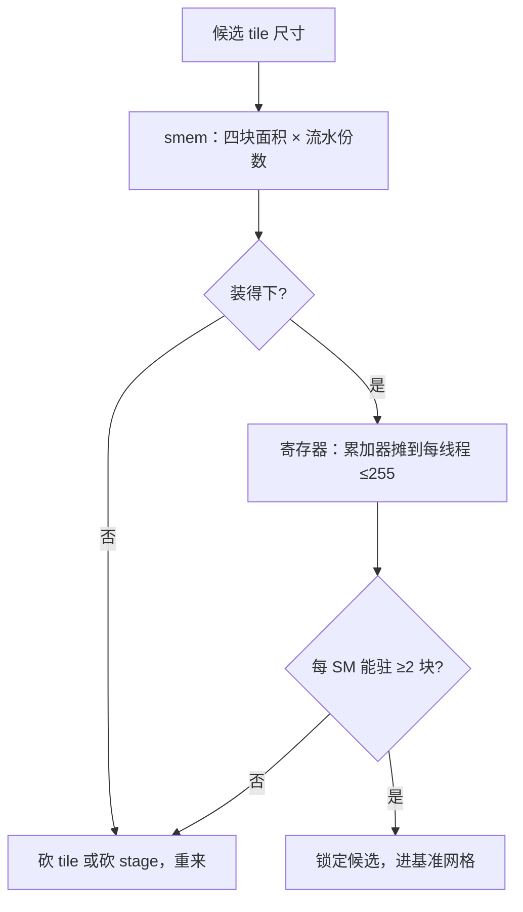

# shared memory 与寄存器预算

片上存储是一份签了额度的预算：smem 与寄存器每多要一块，能同时驻留的线程块就少一个。

<footer>—— 据 NVIDIA CUDA C++ 编程指南与 CUTLASS 文档整理</footer>

[上一课](/llm/ak-memory-access)把快慢记成了字节账，收在「复用要落在确定性层级」。本课进到片上，把 tile 多大才装得下、装下之后还剩多少并发算清楚。这一步不做，tile 一开大就溢出、一开小就挨饿，前两课省下的字节全在片上这一层赔回去。基础机制单元到此三课：骨架、账本、预算。

## 问题

上一课的 $O(n^2d^2/M)$ 里，$M$ 是片上 SRAM 容量；但 $M$ 不是给你一个人的。A100 每个 SM 有 $192\,\mathrm{KB}$ smem 与 $64\mathrm{K}$ 个 32 位寄存器，能同时驻留的线程块由每个块要走的份额决定。tile 开太大，smem 超限，编译器把放不下的数据溢出到 local memory——物理上就是 HBM，上一课省掉的来回原路吐回，而且是在最疼的路径上。tile 装得下、但份额大到每个 SM 只住得进一个块，占用率就掉到谷底：访存延迟数百周期，没有别的块顶上来盖住，SM 一半时间在干等。缺口是：tile 尺寸不是性能参数，是预算约束下的解。

### 两本预算表

smem 的住户是 Q、K、V、O 四个块，加上流水线的缓冲份数；寄存器的住户是输出累加器与中间分数矩阵，摊到 warp 内每个线程头上。两本表都要乘上并发块数，再对上每 SM 的额度。

## 方法

预算三步。第一步数 smem：四个块的面积约 $(B_r+B_c+B_c+B_r)\,d$ 个元素，fp16 每个两字节；取 $B_r=B_c=128$、$d=128$，单份就是 $128\,\mathrm{KB}$，A100 上双缓冲根本装不下——要么砍 tile，要么砍流水级数。第二步数寄存器：累加器 $O$（$B_r\times d$）与分数块 $S$（$B_r\times B_c$）分摊到线程，每线程不超过 255 个寄存器，整 SM 不超过 $64\mathrm{K}$。第三步算占用率：每块的 smem 与寄存器份额决定每 SM 驻几个块，目标通常是至少两个，让一个块的访存段被另一个块的计算段盖住。

## 机制

为什么占用率是注意力内核的命门：内核的循环是「载入 KV 块（纯访存）→ 算 GEMM 与 softmax（纯计算）」交替的，单块视角下两段互相干等；靠的是同 SM 上的另一块在错开的相位上互补。块数掉到一，流水就断成串行。错法因此都长一个样：把 $B_c$ 开到 512 追求「一次多搬点」，smem 爆掉、local memory 流量在剖析器里暴涨；或者三级流水占三份缓冲，一个 SM 只剩一个块，尾部排水把收益吃光。寄存器一侧同样：为了让 softmax 归约少走 smem 而把手写内联堆上去，每线程寄存器顶格，占用率照样塌。

Hopper 把每 SM 的 smem 提到 $228\,\mathrm{KB}$，寄存器仍是 $64\mathrm{K}$——FlashAttention-3 的 warp 特化与异步搬运，正是拿着这份更大的预算重排流水，见 [FlashAttention-3](/llm/flashattention-3)。换架构要重跑一遍本课的预算，不是常数平移。

## 边界

预算是静态约束，给出的是候选集合；谁是候选里的赢家要靠基准说话，那是后面测量与调优两课的事。寄存器怎么分是编译器的裁决，源码一样、编译选项不同，分配结果就会翻盘，剖析器里的 spill 与 occupancy 计数要当成验收项看。warp 内怎么归约、MMA 原子怎么对齐，属于体系结构与 CUTLASS 的细节，本课只把它们当作 tile 尺寸的下界约束。不同硬件的额度表不同，这里先记住流程，移植一课再谈表怎么换。

## 小结

- tile 尺寸是预算约束下的解：smem 面积、寄存器份额、占用率三本表联立。
- 溢出到 local memory 就是溢出到 HBM，访存优化的成果原路返还。
- 占用率掉到每 SM 一个块，流水断成串行，访存延迟没人盖。
- 流水份数与块面积共抢 smem，双缓冲不是免费的。
- 换架构要重跑预算流程：Hopper 的 $228\,\mathrm{KB}$ 与 A100 的 $192\,\mathrm{KB}$ 是两张表。
- 出处：NVIDIA CUDA C++ Programming Guide（smem 与寄存器上限）；CUTLASS 文档口径。
